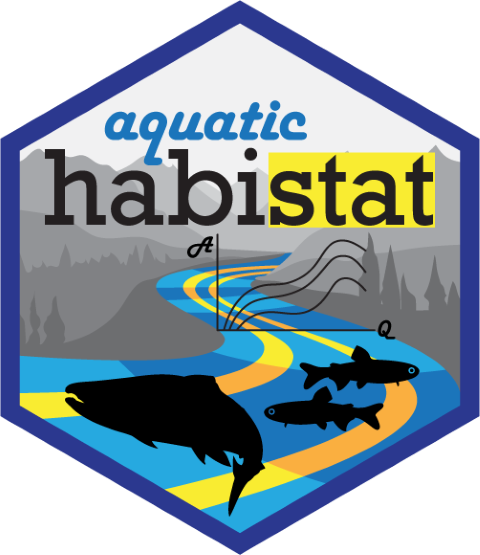

# habistat
<!-- rebuild logo using pkgdown::build_favicons(overwrite=T) -->

<!-- badges: start -->
<!-- badges: end -->



FlowWest is working with Trout Unlimited on an innovative method called HabiStat to quantify the relationship between flow and suitable habitat for salmonids, including spawning habitat and juvenile rearing habitat. The impetus for this project was the [Reorienting to Recovery](https://csamp.baydeltalive.com/recovery/reorienting-to-recovery) project, which in its early phase needed current/baseline estimates of available salmonid habitat in the Central Valley watershed to model and predict the changes that suites of actions would have on existing habitat. However, there was little to no data on available salmonid habitat within Central Valley rivers. The HabiStat project was created to fill in this data gap and to give scientists and managers the ability to better understand and predict how much-needed restoration actions will impact habitat availability, and thus salmon and trout populations.

HabiStat leverages existing hydraulic models and river-specific geospatial characteristics to predict ideal spawning and rearing habitats by training a statistical model with available data and extrapolating from there using the most conservative assumptions possible.

## Geographic Range

HabiStat is currently being developed for both mainstem rivers and tributaries in the Central Valley of California (Sacramento and San Joaquin basins).

## Background

Restoration decision-making for salmonids commonly requires data quantifying existing available  habitat at a range of flows. Available habitat data, however,  is generally of poor quality, often outdated, and highly variable across watersheds. HabiStat leverages available hydraulic models and a wide array of remotely sensed environmental data as inputs to a statistical model to predict suitable spawning and rearing habitat for salmonids. The method is being developed with engaged community representatives, and uses prior work within the Central Valley of California. The HabiStat approach will produce transparent, consistent, and easily updatable suitable habitat datasets that are readily available for a wide range of applications and will greatly improve the effectiveness of restoration decision-making processes.

## Resources

Habistat documentation is located at [flowwest.github.io/habistat](https://flowwest.github.io/habistat)

  * Methods and analysis are described in a series of **[Articles](https://flowwest.github.io/habistat/articles/index.html)**.

  * Refer to the **[Reference](https://flowwest.github.io/habistat/reference)** section for details on packaged datasets and R functions. 

Use the **[Interactive Map](https://flowwest.shinyapps.io/habistat)** published at [flowwest.shinyapps.io/habistat](https://flowwest.shinyapps.io/habistat) to explore results by reach, mainstem, and watershed.

***Tools, methods, results, and documentation are currently incomplete and under active development.***

## Getting Started with the R Package

You can install the development version of habistat from [GitHub](https://github.com/) with:

``` r
# install.packages("devtools")
devtools::install_github("FlowWest/habistat")
```

Load the package:

``` r
library(habistat)
```

Pull a flow-to-suitable-area curve:
``` r
habitat_fsa(mainstem = "American River", 
            habitat_type = "rearing",
            units = "ac")
```

Predict suitable habitat area, using statistical model trained on depth/velocity data, for a particular stream:

``` r
flows <- c(100, 300, 1000, 3000)

flows |> habitat_predict(mainstem = "American River", 
                         habitat_type = "rearing",
                         units = "ac")
```

Pull an inundation duration curve from a selection of CDEC streamgages:

``` r
habitat_drc(streamgage = "AFO",
            habitat_type = "rearing",
            run = "fall",
            wy_group = "Dry")
```

Pull a flow-to-suitable-area curve that incorporates this inundation duration criteria:

``` r
habitat_fsa(mainstem = "American River", 
            habitat_type = "rearing",
            units = "ac",
            streamgage = "AFO",
            run = "fall",
            wy_group = "Dry")
```

Predict suitable habitat area, applying the inundation duration criteria:

``` r
flows |> habitat_predict(mainstem = "American River", 
                         habitat_type = "rearing",
                         units = "ac",
                         streamgage = "AFO",
                         run = "fall",
                         wy_group = "Dry")
```

View all mainstem options

``` r
pillar::glimpse(cv_mainstems)
```

View all streamgage options

``` r
pillar::glimpse(streamgage_attr)
```

Access the raw predictor variables dataset

``` r
pillar::glimpse(flowline_attr)
```

Access the raw prediction outputs

``` r
pillar::glimpse(wua_predicted)
```

## Partners

* Trout Unlimited (Rene Henery, Natalie Stauffer-Olsen, Mia Van Docto)

* FlowWest (Maddee Rubenson, Skyler Lewis, Mark Tompkins)

## Funding

* State Water Contractors
