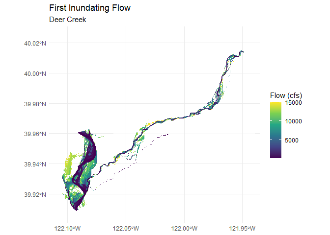
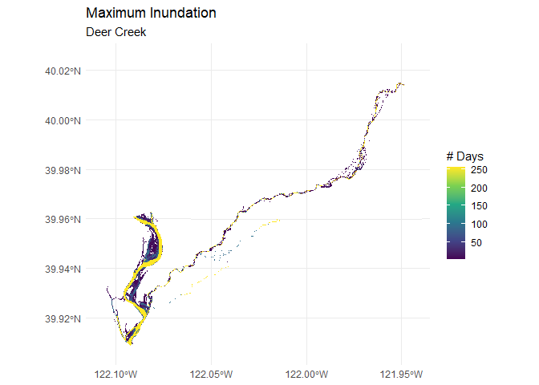

Duration Figure for Documentation - Deer Creek Example
================
[Skyler Lewis](mailto:slewis@flowwest.com)
2024-10-27

``` r
library(tidyverse)
```

    ## ── Attaching core tidyverse packages ──────────────────────── tidyverse 2.0.0 ──
    ## ✔ dplyr     1.1.4     ✔ readr     2.1.5
    ## ✔ forcats   1.0.0     ✔ stringr   1.5.1
    ## ✔ ggplot2   3.5.1     ✔ tibble    3.2.1
    ## ✔ lubridate 1.9.3     ✔ tidyr     1.3.1
    ## ✔ purrr     1.0.2     
    ## ── Conflicts ────────────────────────────────────────── tidyverse_conflicts() ──
    ## ✖ dplyr::filter() masks stats::filter()
    ## ✖ dplyr::lag()    masks stats::lag()
    ## ℹ Use the conflicted package (<http://conflicted.r-lib.org/>) to force all conflicts to become errors

``` r
library(sf)
```

    ## Linking to GEOS 3.12.1, GDAL 3.8.4, PROJ 9.3.1; sf_use_s2() is TRUE

``` r
library(terra)
```

    ## terra 1.7.78
    ## 
    ## Attaching package: 'terra'
    ## 
    ## The following object is masked from 'package:tidyr':
    ## 
    ##     extract

``` r
library(tidyterra)
```

    ## 
    ## Attaching package: 'tidyterra'
    ## 
    ## The following object is masked from 'package:stats':
    ## 
    ##     filter

``` r
library(ggspatial)
theme_set(theme_minimal())

# import duration info from inundation-duration.Rmd
durhsi_by_first_inundating_flow <- readRDS(here::here("data-raw", "results", "durhsi_by_model_q.Rds"))
```

Calculate and plot first inundating flow

``` r
if(!file.exists(here::here("data-raw", "results", "deer_first_inundating_flow.tif"))) {
  
  dir.create(here::here("data-raw", "temp", "deer_model_output"), recursive = TRUE)
  
  drive_file_by_id("1rmMw6PXJGS0-ui52eaotABCSlJsZOzvr", dir=here::here("data-raw", "temp", "deer_model_output")) |>
    archive::archive_extract(dir=here::here("data-raw", "temp", "deer_model_output"))
  
  filenames <- tribble(~flow_cfs, ~timestep,
          100, "15NOV2018 06 00 00",
          250, "15NOV2018 16 00 00",
          300, "16NOV2018 02 00 00",
          400, "16NOV2018 12 00 00",
          500, "16NOV2018 22 00 00",
          600, "17NOV2018 08 00 00",
         1000, "17NOV2018 18 00 00",
         3000, "18NOV2018 04 00 00",
         5000, "18NOV2018 14 00 00",
         6000, "19NOV2018 00 00 00",
         7000, "19NOV2018 10 00 00",
         9000, "19NOV2018 20 00 00",
        10000, "20NOV2018 06 00 00",
        11000, "20NOV2018 16 00 00",
        12000, "21NOV2018 02 00 00",
        13000, "21NOV2018 12 00 00",
        14000, "21NOV2018 22 00 00",
        15000, "22NOV2018 08 00 00") |>
    mutate(depth =    here::here("data-raw", paste0("temp/deer_model_output/Depth (",timestep,").vrt")),
           velocity = here::here("data-raw", paste0("temp/deer_model_output/Velocity (",timestep,").vrt")))
  
  depth_rasters <- filenames |> 
    select(flow_cfs, depth) |>
    deframe()

  first_inundating_flow <- 
    names(depth_rasters) |>
    lapply(function(q) (terra::ifel(terra::rast(depth_rasters[[q]]) > 0, 1, NA) * as.numeric(q))) |>
    terra::rast() |>
    terra::app(fun = "min", na.rm=TRUE) 
  
  first_inundating_flow |>
    terra::writeRaster(here::here("data-raw", "results", "deer_first_inundating_flow.tif"), overwrite=T)
  
} else {
  
    first_inundating_flow <-
    terra::rast(here::here("data-raw", "results", "deer_first_inundating_flow.tif"))

}

first_inundating_flow |> terra::set.names("flow_cfs")

ggplot() + 
  geom_spatraster(data=first_inundating_flow, aes(fill = flow_cfs)) + 
  scale_fill_viridis_c(name = "Flow (cfs)", 
                       na.value = NA) +
  labs(title = "First Inundating Flow",
       subtitle = "Deer Creek")
```

    ## <SpatRaster> resampled to 500688 cells.

<!-- -->

``` r
ggsave(here::here("vignettes", "figures", "duration_deer_fif.png"))
```

    ## Saving 7 x 5 in image

Max inundated

``` r
if(!file.exists(here::here("data-raw", "results", "deer_max_days_inundated.tif"))) {

  deer_max_days_inundated <-
    durhsi_by_first_inundating_flow |> 
    filter(river=="Deer Creek") |>
    select(model_q, max_days_inundated) |>
    deframe()
  
  max_days_inundated <- 
    first_inundating_flow |> 
    terra::app(function(x) deer_max_days_inundated[as.character(x)])
  
  max_days_inundated |>
    terra::writeRaster(here::here("data-raw", "results", "deer_max_days_inundated.tif"), overwrite=T)

} else {
  
  max_days_inundated <-
    terra::rast(here::here("data-raw", "results", "deer_max_days_inundated.tif"))

}

max_days_inundated |> terra::set.names("n_days")

ggplot() + 
  geom_spatraster(data=max_days_inundated, aes(fill = n_days)) + 
  scale_fill_viridis_c(name = "# Days",
                       na.value = NA) +
  labs(title = "Maximum Inundation",
       subtitle = "Deer Creek")
```

    ## <SpatRaster> resampled to 500688 cells.

<!-- -->

``` r
ggsave(here::here("vignettes", "figures", "duration_deer_max.png"))
```

    ## Saving 7 x 5 in image

``` r
knitr::knit_exit()
```
