Flow Data Analysis for Inundation Duration HSI Component
================
[Skyler Lewis](mailto:slewis@flowwest.com)
2024-05-14

- [Import Flow Time Series Data](#import-flow-time-series-data)
- [Flow Exceedence Calculation](#flow-exceedence-calculation)
  - [Version 1: Overall Inundation
    Stats](#version-1-overall-inundation-stats)
  - [Revised Version 2: Max Contiguous Days Inundated by Water
    Year](#revised-version-2-max-contiguous-days-inundated-by-water-year)
- [Approach 1: Average/typical inundation durations by
  flow](#approach-1-averagetypical-inundation-durations-by-flow)
- [Approach 2: Post-hoc application of a duration-vs-flow curve to a
  flow-to-suitable-area
  curve](#approach-2-post-hoc-application-of-a-duration-vs-flow-curve-to-a-flow-to-suitable-area-curve)
  - [Version 1 (skip down to “Revised Version
    2”)](#version-1-skip-down-to-revised-version-2)
  - [Revised Version 2](#revised-version-2)
- [Baseflow Elimination](#baseflow-elimination)
- [Floodplain-Instream Split](#floodplain-instream-split)

Duration suitability criteria from the CBEC LYR analysis and HQT are:

**Valley Lowland**

- 0 days: 0
- 1 to 17 days: 0.66
- 18 to 24 days: 1.00
- 25+ days: 0.66

**Valley Foothill**

- 0 days: 0
- 1 to 9 days: 1.00
- 10+ days: 0.66

Additionally, we modify such that \>=100 days is suitability 0, to
effectively exclude the baseflow channel.

``` r
library(tidyverse)
library(sf)
library(stars)
library(lubridate)

knitr::opts_chunk$set(eval=TRUE, fig.width=6.5, fig.height=4, dpi=300)

theme_set(theme_minimal())

source(here::here("data-raw", "scripts", "data-functions.R"))
source(here::here("data-raw", "scripts", "inundation-duration-functions.R"))

test_comids <- c(12071016, 12071090, 12071178, 12071286, 12075424, 7981730, 7981752, 7981808, 7981872, 7981878, 7981882, 7982794, 7982804, 7982810, 7982884, 7982886, 2819792, 2819796, 2819800, 2819818, 2819824, 2819862, 2821822, 2821824, 2821830, 2821832, 2821836)
```

``` r
flowlines <- readRDS(here::here("data-raw", "results", "flowline_geometries.Rds")) |>
  st_transform("ESRI:102039")

flowline_attributes <- readRDS(here::here("data-raw", "results", "flowline_attributes.Rds"))

flow_to_suitable_area <- readRDS(here::here("data-raw", "results", "fsa_combined.Rds"))
```

``` r
# Water type indices from  https://cdec.water.ca.gov/reportapp/javareports?name=WSIHIST
water_year_types <- read_csv(here::here("data-raw", "source", "water_year_type", "water_year_type.csv")) |>
  mutate(wy_type = factor(wy_type, 
                          levels=c("C", "D", "BN", "N", "AN", "W"), 
                          labels=c("Critical", "Dry", "Below Normal", "Normal", "Above Normal", "Wet"))) |>
  mutate(wy_group = factor(case_when(wy_type %in% c("Critical","Dry") ~ "Dry", 
                                     wy_type %in% c("Below Normal", "Normal", "Above Normal") ~ "Normal", 
                                     wy_type %in% c("Wet") ~ "Wet")))
```

    ## Rows: 239 Columns: 9
    ## ── Column specification ────────────────────────────────────────────────────────
    ## Delimiter: ","
    ## chr (3): location, wy_type, wy_type_official
    ## dbl (6): water_year, runoff_maf_oct_mar, runoff_maf_apr_jul, runoff_maf_wy_s...
    ## 
    ## ℹ Use `spec()` to retrieve the full column specification for this data.
    ## ℹ Specify the column types or set `show_col_types = FALSE` to quiet this message.

## Import Flow Time Series Data

``` r
# refer to https://cdec.water.ca.gov/webgis/?appid=cdecstation
# refer to https://docs.google.com/spreadsheets/d/1OaohqeYbp-dTyIim3mFDYP11GEqIZWqSYIfT67b5-eE/edit

# select a representative best flow gage to use for each reach, ideally available 25+ years
# refer to https://cdec.water.ca.gov/dynamicapp/staMeta?station_id=### start 10/1/1997 - 09/30/2023
# drainage areas from StreamStats gage-pages
# mean annual flow is joined in based on the comid that the gage is located in

# get list of modelled flows for each dataset
training_flows <- flow_to_suitable_area |>
  select(dataset, comid, flow_cfs) |>
  group_by(dataset, flow_cfs) |> 
  summarize() %>%
  split(.$dataset) |>
  lapply(function(df) df |> pull(flow_cfs))

# get flow information for gaged reaches, and download cdec flow time series
training_reach_gages <- tribble(
  ~river, ~usgs_id, ~cdec_sta, ~cdec_sen, ~cdec_dur, ~start_date, ~end_date, ~da_gauge_sq_mi, ~gauge_comid, ~flows,
  "Deer Creek",       11383500, "DVD", 20, "E", mdy("10/1/1997"), mdy("9/30/2023"), 208, 8020924, training_flows[["Deer Creek"]],
  "Lower Yuba River", 11421000, "MRY", 20, "E", mdy("10/1/1997"), mdy("9/30/2023"), 1339, 7981844, training_flows[["Lower Yuba River"]],
  "Stanislaus River", 11303000, "RIP", 20, "E", mdy("10/1/1997"), mdy("9/30/2023"), 1075, 2819818, training_flows[["Stanislaus River"]]
) |>
  mutate(da_gauge_sq_km = da_gauge_sq_mi * 1.609344^2) |>
  mutate(filename = pmap_chr(list(cdec_sta, cdec_sen, cdec_dur), 
                             function(x, y, z) retrieve_cdec_csv(sta=x, sen=y, dur=z))) |>
  left_join(flowline_attributes |> 
              transmute(comid, maf_gauge = erom_q_ma_cfs), by=join_by(gauge_comid == comid))

# get historical mean daily flow for gages
training_cdec_data <- training_reach_gages |> 
  select(river, filename) |> 
  deframe() |>
  lapply(parse_cdec_csv) |>
  bind_rows(.id = "river") |>
  mutate(q_gauge = as.numeric(value),
         q_gauge = case_when(q_gauge>=0 ~ q_gauge)) |>
  drop_na() |>
  group_by(river, date = date(date_time)) |>
  summarize(q_gauge = mean(q_gauge)) |>
  mutate(water_year = if_else(month(date)>=10, year(date)+1, year(date))) |>
  # just data for November through June, as was done with LYR analysis
  filter(month(date) %in% c(11, 12, 1, 2, 3, 4, 5, 6)) |>
  glimpse() 
```

    ## Rows: 15,982
    ## Columns: 4
    ## Groups: river [3]
    ## $ river      <chr> "Deer Creek", "Deer Creek", "Deer Creek", "Deer Creek", "De…
    ## $ date       <date> 1997-11-01, 1997-11-02, 1997-11-03, 1997-11-04, 1997-11-05…
    ## $ q_gauge    <dbl> 68.28125, 65.77083, 64.25000, 64.32292, 63.40625, 66.07292,…
    ## $ water_year <dbl> 1998, 1998, 1998, 1998, 1998, 1998, 1998, 1998, 1998, 1998,…

``` r
training_cdec_data |> 
  #filter(water_year>=2013) |>
  ggplot() + 
  facet_wrap(~river, ncol=1, scales="free_y") +
  geom_line(aes(x = date, y = q_gauge, group = water_year), size=1) 
```

<!-- -->

## Flow Exceedence Calculation

### Version 1: Overall Inundation Stats

``` r
#  function to calculate exceedence by flow
# based on statistics calculated on the exceedence event level
calculate_exceedence_summary <- function(q_gauge, q_crit, baseflow_threshold_days = 100) {
  
  n_days <- length(q_gauge)
  
  exceedence_intervals <- 
    tibble(exceeds_q = q_gauge > q_crit,
           exceedence_event = with(rle(exceeds_q), rep(seq_along(lengths), lengths))) |>
    group_by(exceedence_event) |>
    mutate(cumulative_exceedence = if_else(exceeds_q, seq_along(exceedence_event), 0)) |>
    filter(exceeds_q) |>
    summarize(duration_days = max(cumulative_exceedence)) |>
    mutate(#duration_days = pmin(duration_days, 365), 
           durhsi_vl = case_when(duration_days == 0  ~ 0,
                                 duration_days < 18  ~ 0.66,
                                 duration_days < 25 ~ 1.00,
                                 duration_days < baseflow_threshold_days ~ 0.66,
                                 duration_days >= baseflow_threshold_days ~ 0),
           durhsi_vf = case_when(duration_days <= 0  ~ 0,
                                 duration_days < 10 ~ 1.00,
                                 duration_days < baseflow_threshold_days ~ 0.66,
                                 duration_days >= baseflow_threshold_days ~ 0)) 
    
  exceedence_intervals |>
    summarize(n_inundations = n(),
              avg_days_inundated = mean(duration_days),
              avg_days_inundated_sdev = sd(duration_days),
              avg_durhsi_vl = mean(durhsi_vl),
              avg_durhsi_vf = mean(durhsi_vf),
              tot_days_inundated = sum(duration_days),
              max_days_inundated = max(duration_days),
              frac_days_inundated = sum(duration_days) / n_days,
              tot_days_weighted_vl = sum(duration_days * durhsi_vl),
              tot_days_weighted_vf = sum(duration_days * durhsi_vf)) |>
    mutate(avg_daily_durhsi_vl = tot_days_weighted_vl / n_days,
           avg_daily_durhsi_vf = tot_days_weighted_vf / n_days) |>
    mutate(across(everything(), function(x) if_else(is.nan(x), 0, x))) |>
    as.list()
}

# example usage
calculate_exceedence_summary(filter(training_cdec_data, river=="Deer Creek" & water_year==2017)$q_gauge, 500)
```

    ## $n_inundations
    ## [1] 4
    ## 
    ## $avg_days_inundated
    ## [1] 11
    ## 
    ## $avg_days_inundated_sdev
    ## [1] 12.98717
    ## 
    ## $avg_durhsi_vl
    ## [1] 0.66
    ## 
    ## $avg_durhsi_vf
    ## [1] 0.915
    ## 
    ## $tot_days_inundated
    ## [1] 44
    ## 
    ## $max_days_inundated
    ## [1] 30
    ## 
    ## $frac_days_inundated
    ## [1] 0.3235294
    ## 
    ## $tot_days_weighted_vl
    ## [1] 29.04
    ## 
    ## $tot_days_weighted_vf
    ## [1] 33.8
    ## 
    ## $avg_daily_durhsi_vl
    ## [1] 0.2135294
    ## 
    ## $avg_daily_durhsi_vf
    ## [1] 0.2485294

``` r
durhsi_by_model_q <- 
  training_reach_gages |> 
  left_join(training_cdec_data, by=join_by(river), relationship="one-to-many") |>
  select(river, flows, date, q_gauge) |>
  nest(gauge_ts = c(date, q_gauge)) |>
  unnest(flows) |> rename(model_q = flows) |>
  mutate(result = map2(gauge_ts, model_q, 
                       function(df, q) calculate_exceedence_summary(df$q_gauge, q))) |>
  select(-gauge_ts) |>
  unnest_wider(result) |>
  glimpse()
```

    ## Rows: 55
    ## Columns: 14
    ## $ river                   <chr> "Deer Creek", "Deer Creek", "Deer Creek", "Dee…
    ## $ model_q                 <dbl> 100, 250, 300, 400, 500, 600, 1000, 3000, 5000…
    ## $ n_inundations           <dbl> 55, 72, 76, 66, 54, 54, 19, 2, 0, 0, 0, 0, 0, …
    ## $ avg_days_inundated      <dbl> 40.127273, 11.152778, 8.815789, 6.727273, 5.85…
    ## $ avg_days_inundated_sdev <dbl> 63.0108910, 20.1177238, 16.6001691, 13.6026530…
    ## $ avg_durhsi_vl           <dbl> 0.5643636, 0.6694444, 0.6644737, 0.6600000, 0.…
    ## $ avg_durhsi_vf           <dbl> 0.7374545, 0.9197222, 0.9328947, 0.9587879, 0.…
    ## $ tot_days_inundated      <dbl> 2207, 803, 670, 444, 316, 216, 57, 3, 0, 0, 0,…
    ## $ max_days_inundated      <dbl> 255, 97, 90, 83, 36, 22, 9, 2, -Inf, -Inf, -In…
    ## $ frac_days_inundated     <dbl> 0.6734818431, 0.2450411962, 0.2044552945, 0.13…
    ## $ tot_days_weighted_vl    <dbl> 475.98, 544.26, 449.00, 293.04, 224.20, 150.04…
    ## $ tot_days_weighted_vf    <dbl> 489.92, 596.62, 512.24, 348.80, 254.80, 178.94…
    ## $ avg_daily_durhsi_vl     <dbl> 0.1452487031, 0.1660848337, 0.1370155630, 0.08…
    ## $ avg_daily_durhsi_vf     <dbl> 0.1495025938, 0.1820628624, 0.1563137016, 0.10…

``` r
durhsi_by_model_q |> ggplot() +
  facet_wrap(~river, ncol=1) + 
  geom_line(aes(x = model_q, y = avg_days_inundated)) + 
  scale_x_log10(labels = scales::label_comma()) +
  scale_y_continuous(limits = c(0,36), breaks = c(0,6,12,18,24,30,36), minor_breaks=NULL) +
  xlab("Flow (cfs)") + ylab("Avg length of continuous period exceeding flow (days)") + ggtitle("Inundation Duration")
```

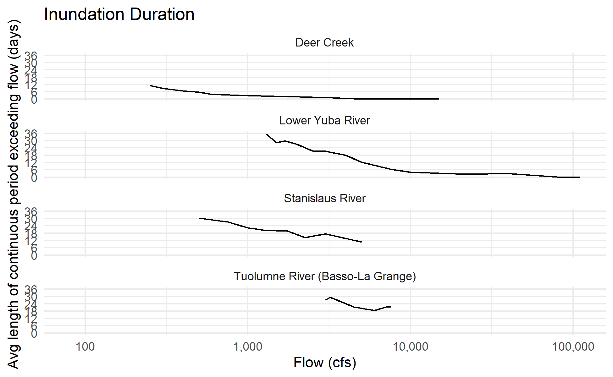<!-- -->

``` r
durhsi_by_model_q |> ggplot() +
  facet_wrap(~river, ncol=1) + 
  geom_line(aes(x = model_q, y = frac_days_inundated)) + 
  scale_x_log10(labels = scales::label_comma()) +
  scale_y_continuous(limits = c(0,1), minor_breaks=NULL) +
  xlab("Flow (cfs)") + ylab("Percent of days exceeding flow (Nov-Jun)") + ggtitle("Inundation Frequency")
```

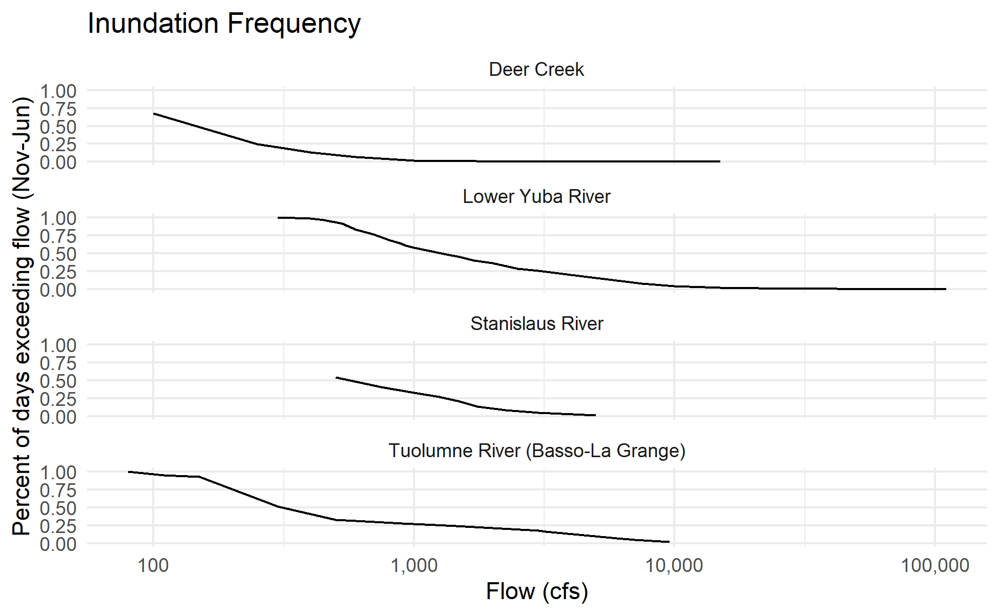<!-- -->

``` r
durhsi_by_model_q |> 
  pivot_longer(cols=c(avg_durhsi_vf, avg_durhsi_vl)) |> 
  ggplot() + 
  geom_histogram(aes(x = value)) + 
  facet_wrap(~name, ncol=1)
```

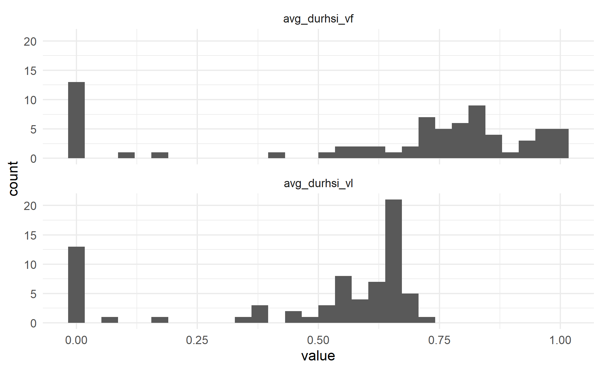<!-- -->

### Revised Version 2: Max Contiguous Days Inundated by Water Year

``` r
# simple version, for data within one water year only

calculate_days_inundated <- function(q_gauge, q_crit, stat="max") {

  n_days <- length(q_gauge)

  exceedence_intervals <-
    tibble(exceeds_q = q_gauge > q_crit,
           exceedence_event = with(rle(exceeds_q), rep(seq_along(lengths), lengths))) |>
    group_by(exceedence_event) |>
    mutate(cumulative_exceedence = if_else(exceeds_q, seq_along(exceedence_event), 0)) |>
    filter(exceeds_q) |>
    summarize(duration_days = max(cumulative_exceedence))

  if(stat=="sum"){
    return(sum(exceedence_intervals$duration_days))
  } else if(stat=="max") {
    return(pmax(max(exceedence_intervals$duration_days),0))
  }
}

# example usage
calculate_days_inundated(filter(training_cdec_data, river=="Deer Creek" & water_year==2017)$q_gauge, 500)
```

    ## [1] 30

``` r
baseflow_threshold_days <- 100

durhsi_by_model_q_wy <- 
  training_reach_gages |> 
  expand_grid(water_year = seq(1998, 2023, 1)) |>
  left_join(training_cdec_data, by=join_by(river, water_year), relationship="one-to-many") |>
  select(river, water_year, flows, date, q_gauge) |>
  nest(gauge_ts = c(date, q_gauge)) |>
  unnest(flows) |> rename(model_q = flows) |>
  mutate(max_days_inundated = map2_dbl(gauge_ts, model_q, 
                                       function(df, q) calculate_days_inundated(df$q_gauge, q, stat="max"))) |>
  select(-gauge_ts) |>
  mutate(location = case_when(
         river=="Deer Creek" ~ "Sacramento Valley",
         river=="Lower Yuba River" ~ "Sacramento Valley",
         river=="Stanislaus River" ~ "San Joaquin Valley")) |>
  inner_join(water_year_types, by=join_by(location, water_year), relationship="many-to-one") |>
    mutate(durhsi_vl = case_when(max_days_inundated == 0  ~ 0,
                                 max_days_inundated < 18  ~ 0.66,
                                 max_days_inundated < 25 ~ 1.00,
                                 max_days_inundated < baseflow_threshold_days ~ 0.66,
                                 max_days_inundated >= baseflow_threshold_days ~ 0),
           durhsi_vf = case_when(max_days_inundated <= 0  ~ 0,
                                 max_days_inundated < 10 ~ 1.00,
                                 max_days_inundated < baseflow_threshold_days ~ 0.66,
                                 max_days_inundated >= baseflow_threshold_days ~ 0)) |>
  glimpse()
```

    ## Rows: 1,375
    ## Columns: 15
    ## $ river              <chr> "Deer Creek", "Deer Creek", "Deer Creek", "Deer Cre…
    ## $ water_year         <dbl> 1998, 1998, 1998, 1998, 1998, 1998, 1998, 1998, 199…
    ## $ model_q            <dbl> 100, 250, 300, 400, 500, 600, 1000, 3000, 5000, 600…
    ## $ max_days_inundated <dbl> 27, 0, 0, 0, 0, 0, 0, 0, 0, 0, 0, 0, 0, 0, 0, 0, 0,…
    ## $ location           <chr> "Sacramento Valley", "Sacramento Valley", "Sacramen…
    ## $ runoff_maf_oct_mar <dbl> 17.65, 17.65, 17.65, 17.65, 17.65, 17.65, 17.65, 17…
    ## $ runoff_maf_apr_jul <dbl> 12.54, 12.54, 12.54, 12.54, 12.54, 12.54, 12.54, 12…
    ## $ runoff_maf_wy_sum  <dbl> 31.40, 31.40, 31.40, 31.40, 31.40, 31.40, 31.40, 31…
    ## $ wy_index           <dbl> 13.31, 13.31, 13.31, 13.31, 13.31, 13.31, 13.31, 13…
    ## $ wy_type            <fct> Wet, Wet, Wet, Wet, Wet, Wet, Wet, Wet, Wet, Wet, W…
    ## $ wy_index_official  <dbl> 12.4, 12.4, 12.4, 12.4, 12.4, 12.4, 12.4, 12.4, 12.…
    ## $ wy_type_official   <chr> "W", "W", "W", "W", "W", "W", "W", "W", "W", "W", "…
    ## $ wy_group           <fct> Wet, Wet, Wet, Wet, Wet, Wet, Wet, Wet, Wet, Wet, W…
    ## $ durhsi_vl          <dbl> 0.66, 0.00, 0.00, 0.00, 0.00, 0.00, 0.00, 0.00, 0.0…
    ## $ durhsi_vf          <dbl> 0.66, 0.00, 0.00, 0.00, 0.00, 0.00, 0.00, 0.00, 0.0…

``` r
durhsi_by_model_q_wy |>
  ggplot(aes(x=model_q, y=max_days_inundated)) +
  facet_wrap(~river, ncol=1) +
  geom_line(aes(group=water_year, color=wy_group)) +
  scale_x_log10(labels = scales::label_comma()) +
  ylab("Maximum Contiguous Days Inundated") + xlab("Flow (cfs)") +
  scale_color_manual(name="Water Year Type", values = c("Dry"="#ffae34","Normal"="#bb7693","Wet"="#8cc2ca")) + 
  theme(panel.grid.minor = element_blank())
```

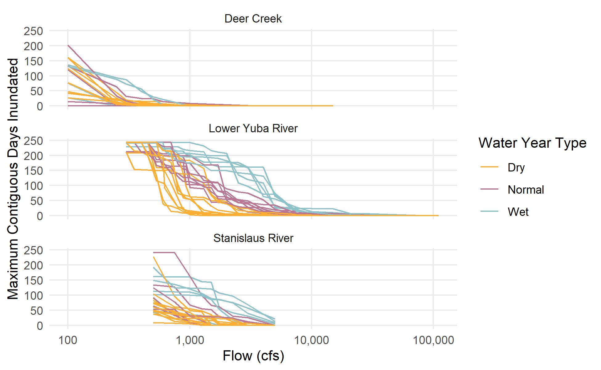<!-- -->

``` r
durhsi_by_model_q_wy |>
  filter(water_year==2017) |>
  ggplot(aes(x=model_q, y=max_days_inundated)) +
  facet_wrap(~river, ncol=1) +
  geom_line(aes(group=water_year, color=wy_group)) +
  scale_x_log10(labels = scales::label_comma()) +
  ylab("Maximum Contiguous Days Inundated") + xlab("Flow (cfs)") +
  scale_color_manual(name="Water Year Type", values = c("Dry"="#ffae34","Normal"="#bb7693","Wet"="#8cc2ca")) + 
  theme(panel.grid.minor = element_blank())
```

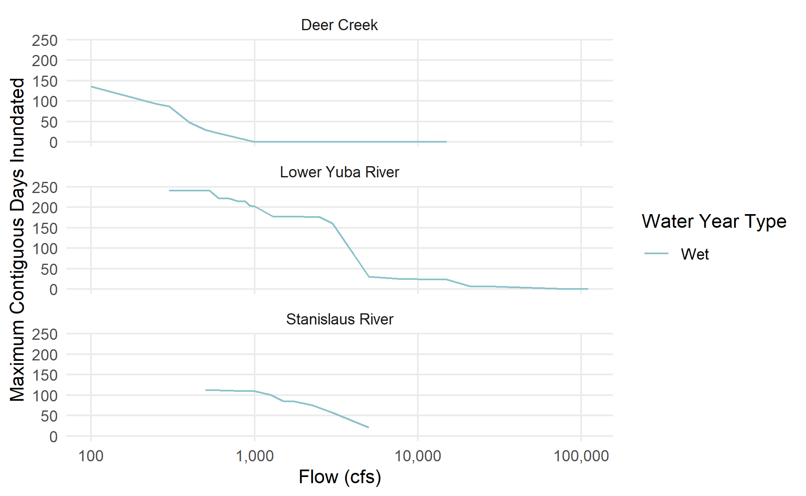<!-- -->

``` r
durhsi_by_model_q_wy |>
  filter(water_year==2017 & river=="Deer Creek") |>
  ggplot(aes(x=model_q, y=max_days_inundated)) +
  geom_line() +
  scale_x_log10(labels = scales::label_comma()) +
  ylab("Maximum Contiguous Days Inundated") + xlab("Flow (cfs)") +
  theme(panel.grid.minor = element_blank()) +
  ggtitle("Flow-to-Inundation-Duration Curve")
```

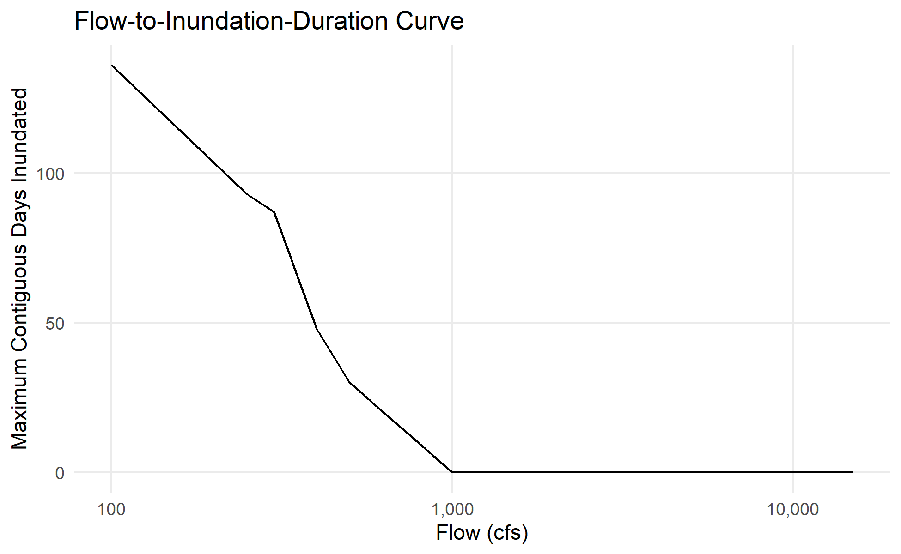<!-- -->

## Approach 1: Average/typical inundation durations by flow

*To apply this output:*

- Generate a summarized depth result raster grid or mesh table that
  indicates the first flow (model_q) at which the cell is inundated.
- Join the durhsi_by_model_q table so that we have a raster grid or mesh
  table of variable “first inundated flow” avg_durhsi values
- At each flow in the flow-to-suitable-area calculation script, multiply
  the grid/vector of “first inundated avg durhsi” value for the cell
  with a grid/vector of 1 = inundated or 0 = not inundated. The result
  is the “Duration HSI” component that is multiplied with the
  depth/velocity based HSI

For example, if a cell is first inundated at 500 cfs:

- In the 100cfs raster, DurHSI = 0
- In the 250cfs raster, DurHSI = 0
- In the 500cfs raster, DurHSI = the avg_durhsi value for 500 cfs
- In the 1000cfs raster, DurHSI = the avg_durhsi value for 500 cfs

The avg_durhsi is based on the typical duration of an individual
inundation period – this is the representative DurHSI value to use in
the HSI calculations. The avg_daily_durhsi also accounts for how
frequently inundation occurs and may be useful in other contexts.

``` r
durhsi_by_model_q |> saveRDS(here::here("data-raw", "results", "durhsi_by_model_q.Rds"))
durhsi_by_model_q_wy |> saveRDS(here::here("data-raw", "results", "durhsi_by_model_q_wy.Rds"))
```

## Approach 2: Post-hoc application of a duration-vs-flow curve to a flow-to-suitable-area curve

*Alternate method to apply this output after estimation:*

### Version 1 (skip down to “Revised Version 2”)

``` r
fractional_range_sum <- function(a, b, ind, val) {
  message(paste(a, "cfs to", b, "cfs"))
  if(b==0){
    # if range is zero, return zero:
    return(0)
  } else if (a==b) {
    # if length of range is zero, return zero:
    return(0)
  #} else if (length(ind[which(ind>a & ind<b)]) == 0) { # check this one
  #  return(0)
  } else if(b < ind[[1]]) {
    # if query range is entirely below the index range:
    return(linterp(b, 0, ind[[1]], 0, val[[1]]) - linterp(a, 0, ind[[1]], 0, val[[1]])) # is this correct or just zero
  } else if(a <= ind[[1]] & b >= ind[[length(ind)]]) {
    # if query range entirely encompasses the index range
    return(val)
  } else if(a < ind[[1]]) {
    # if query range overlaps the start of the index range:
    v2 <- val[which(ind>a & ind<b)] # within range
    v3 <- val[which(ind>=b)] #  above range
    i2 <- ind[which(ind>a & ind<b)] # within range
    i3 <- ind[which(ind>=b)] #  above range
    res <- c(linterp(b, 0, ind[[1]], 0, val[[1]]) - linterp(a, 0, ind[[1]], 0, val[[1]]), # is this correct or just zero
             v2,
             linterp(b, i2[[length(i2)]], i3[[1]], v2[[length(v2)]], v3[[1]]))
    return(sum(res))
  } else if(b > ind[[length(ind)]]) {
    # if b > ind max, include no third term (v2 encompasses it)
    v1 <- val[which(ind<=a)] #  below range
    v2 <- val[which(ind>a & ind<b)] # within range
    i1 <- ind[which(ind<=a)] #  below range
    i2 <- ind[which(ind>a & ind<b)] # within range
    message("i2[[1]]=", i2[[1]])
    res <- c(linterp(a, i1[[length(i1)]], i2[[1]], v1[[length(v1)]], v2[[1]]),
             v2) # or is there an interpolation
    return(sum(res))
  } else if(a > ind[[length(ind)]]) {
    # if a > ind max, query range is entirely outside the index range 
    return(0) # or is it an interpolation
  } else {
    # if query range is entirely within index range:
    v1 <- val[which(ind<=a)] #  below range
    v2 <- val[which(ind>a & ind<b)] # within range
    v3 <- val[which(ind>=b)] #  above range
    i1 <- ind[which(ind<=a)] #  below range
    i2 <- ind[which(ind>a & ind<b)] # within range
    i3 <- ind[which(ind>=b)] #  above range
    message("i2[[1]]=", i2[[1]])
    res <- c(linterp(a, i1[[length(i1)]], i2[[1]], v1[[length(v1)]], v2[[1]]),
             v2,
             linterp(b, i2[[length(i2)]], i3[[1]], v2[[length(v2)]], v3[[1]]))
    return(sum(res))
  }
}
```

``` r
durhsi_by_model_q |> 
  expand_grid(gradient_class = c("vf", "vl")) |>
  ggplot() +
  facet_grid(cols=vars(gradient_class), rows=vars(river)) + 
  geom_line(aes(x = model_q, y = avg_days_inundated)) + 
  scale_x_log10(labels = scales::label_comma()) +
  scale_y_continuous(limits = c(0,36), breaks = c(0,6,12,18,24,30,36), minor_breaks=NULL) +
  xlab("Flow (cfs)") + ylab("Avg length of continuous period exceeding flow (days)") + ggtitle("Inundation Duration") +
  geom_hline(aes(yintercept = if_else(gradient_class=="vf", 0, 18))) +
  geom_hline(aes(yintercept = if_else(gradient_class=="vf", 10, 25)))
```

    ## Warning: Removed 1 row containing missing values (`geom_line()`).

<!-- -->

### Revised Version 2

``` r
# simple version
apply_durations_to_fsa_curve <- function(fsa, drc, fsa_q=q, fsa_wua=wua, drc_q=q, drc_dhsi=dhsi) {
  full_join(fsa |> transmute(q={{fsa_q}}, wua={{fsa_wua}}),
            drc |> transmute(q={{drc_q}}, dhsi={{drc_dhsi}}),
            by = join_by(q)) |>
    # fill in any gaps with linear interpolation
    arrange(q) |>
    mutate(wua = zoo::na.approx(wua, q, na.rm=F),
           dhsi = zoo::na.approx(dhsi, q, na.rm=F)) |>
    drop_na() |>
    # start by computing the marginal WUA added at each step
    mutate(marginal_wua = if_else(row_number()==1, wua, wua - lag(wua))) |>
    # apply each flow's DHSI to whatever area is added or removed at that flow
### mutate(marginal_durwua = pmin(dhsi * marginal_wua, marginal_wua), 
###       # pmin is a simplification to account for loss; this will end up overestimating the magnitude of the marginal drop in habitat 
###       durwua = pmax(cumsum(marginal_durwua), 0))
    mutate(wua_added = if_else(marginal_wua > 0, marginal_wua, 0),
           marginal_durwua_added = dhsi * wua_added,
           wua_removed = (-1) * if_else(marginal_wua < 0, marginal_wua, 0), 
           marginal_durwua_removed = cummean(dhsi) * wua_removed,
###        marginal_durwua_removed = cummean.na.rm(if_else(dhsi > 0, dhsi, NA)) * wua_removed,
           marginal_durwua = marginal_durwua_added - marginal_durwua_removed,
           durwua = pmin(pmax(cumsum(marginal_durwua), 0), wua))
}

apply_durations_to_fsa_curve <- possibly(apply_durations_to_fsa_curve, otherwise=NA)
```

Example

``` r
# EXAMPLE FLOW-TO-SUITABLE-AREA CURVE

# monotonic test comid: 12075424; chaotic test comid: 12069362
fsa <- flow_to_suitable_area |>
  inner_join(flowline_attributes |> select(comid, hqt_gradient_class, reach_length_km)) |>
  mutate(wua_per_lf = area_wua_ft2 / (reach_length_km*3280.84)) |>
  filter(dataset=="Deer Creek" & comid==12075424) |>
  transmute(flow_cfs, wua=wua_per_lf) |>
  glimpse()
```

    ## Joining with `by = join_by(comid)`

    ## Rows: 18
    ## Columns: 2
    ## $ flow_cfs <dbl> 100, 250, 300, 400, 500, 600, 1000, 3000, 5000, 6000, 7000, 9…
    ## $ wua      <dbl> 6.492608, 3.428500, 3.562407, 4.455920, 5.275116, 8.739918, 1…

``` r
fsa |> ggplot() + geom_line(aes(x=flow_cfs, y=wua)) + scale_x_log10() + scale_y_log10() +
  ggtitle("Flow-to-Suitable-Area Curve") + 
  theme(panel.grid.minor = element_blank()) + xlab("Flow (cfs)") + ylab("Suitable Habitat Area (ft2) per LF")
```

<!-- -->

``` r
# EXAMPLE DURATION HSI RATING CURVE
drc <- durhsi_by_model_q_wy |>
  filter(river=="Deer Creek" & water_year==2017) |>
  transmute(model_q, dhsi = durhsi_vl) |>
  glimpse()
```

    ## Rows: 18
    ## Columns: 2
    ## $ model_q <dbl> 100, 250, 300, 400, 500, 600, 1000, 3000, 5000, 6000, 7000, 90…
    ## $ dhsi    <dbl> 0.00, 0.66, 0.66, 0.66, 0.66, 1.00, 0.00, 0.00, 0.00, 0.00, 0.…

``` r
drc |> ggplot() + geom_step(aes(x=model_q, y=dhsi), direction="vh") + 
  scale_x_log10() + scale_y_continuous(limits=c(0,1)) +
  ggtitle("Duration HSI Rating Curve") + 
  theme(panel.grid.minor = element_blank()) + xlab("Flow (cfs)") + ylab("Duration HSI")
```

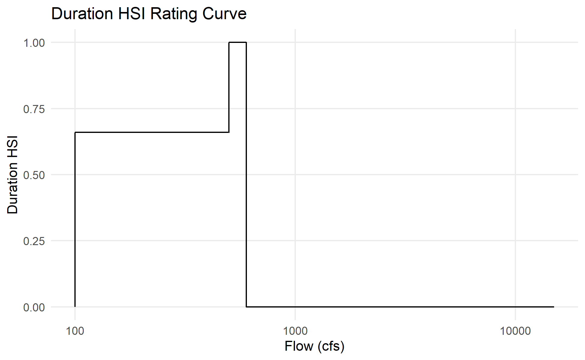<!-- -->

``` r
# APPLY 

res <- apply_durations_to_fsa_curve(fsa, drc, 
                                    # specify variable names
                                    fsa_q = flow_cfs, fsa_wua = wua,
                                    drc_q = model_q, drc_dhsi = dhsi) |>
  glimpse()
```

    ## Rows: 18
    ## Columns: 10
    ## $ q                       <dbl> 100, 250, 300, 400, 500, 600, 1000, 3000, 5000…
    ## $ wua                     <dbl> 6.492608, 3.428500, 3.562407, 4.455920, 5.2751…
    ## $ dhsi                    <dbl> 0.00, 0.66, 0.66, 0.66, 0.66, 1.00, 0.00, 0.00…
    ## $ marginal_wua            <dbl> 6.49260823, -3.06410834, 0.13390705, 0.8935127…
    ## $ wua_added               <dbl> 6.49260823, 0.00000000, 0.13390705, 0.89351276…
    ## $ marginal_durwua_added   <dbl> 0.00000000, 0.00000000, 0.08837865, 0.58971842…
    ## $ wua_removed             <dbl> 0.0000000, 3.0641083, 0.0000000, 0.0000000, 0.…
    ## $ marginal_durwua_removed <dbl> 0.000000, 1.011156, 0.000000, 0.000000, 0.0000…
    ## $ marginal_durwua         <dbl> 0.00000000, -1.01115575, 0.08837865, 0.5897184…
    ## $ durwua                  <dbl> 0.0000000, 0.0000000, 0.0000000, 0.0000000, 0.…

``` r
res |> 
  ggplot(aes(x=q)) + 
  geom_line(aes(y=wua, color="WUA"), linewidth=1) + 
  geom_line(aes(y=durwua, color="Duration-weighted WUA"), linewidth=1) +
  geom_step(aes(y=dhsi*20, color="DHSI"), direction="vh", linewidth=1) +
  ggtitle("Duration Criteria Applied to Flow-to-Suitable-Area Curve") +
  scale_y_continuous(sec.axis = sec_axis(trans = ~./20, name="Duration HSI")) + 
  theme(panel.grid.minor = element_blank()) + xlab("Flow (cfs)") + ylab("Suitable Habitat Area (ft2) per LF") +
  scale_x_log10()
```

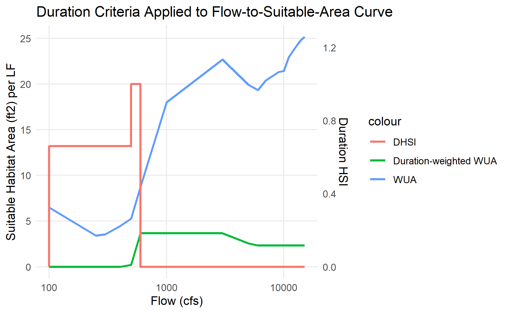<!-- -->

Batch

``` r
batch_fsa <- flow_to_suitable_area |>
  inner_join(flowline_attributes |> select(comid, hqt_gradient_class, reach_length_km)) |>
  mutate(hqt_cls = if_else(hqt_gradient_class == "Valley Lowland", "VL", "VF")) |>
  mutate(wua_per_lf = area_wua_ft2 / (reach_length_km*3280.84)) |>
  select(dataset, comid, hqt_cls, flow_cfs, wua = wua_per_lf) |>
  nest(.by=c(dataset, hqt_cls, comid), .key="tbl_fsa") |> 
  glimpse()
```

    ## Joining with `by = join_by(comid)`

    ## Rows: 183
    ## Columns: 4
    ## $ dataset <chr> "Lower Yuba River", "Lower Yuba River", "Lower Yuba River", "L…
    ## $ hqt_cls <chr> "VF", "VF", "VF", "VF", "VF", "VF", "VF", "VF", "VF", "VF", "V…
    ## $ comid   <dbl> 8061185, 8062589, 7981730, 7982892, 7983002, 8061195, 8061207,…
    ## $ tbl_fsa <list> [<tbl_df[21 x 2]>], [<tbl_df[21 x 2]>], [<tbl_df[24 x 2]>], […

``` r
batch_drc <- durhsi_by_model_q_wy |>
  pivot_longer(cols = c(durhsi_vl, durhsi_vf)) |>
  transmute(river, water_year, model_q, 
            hqt_cls = if_else(name=="durhsi_vl", "VL", "VF"), dhsi = value) |>
  nest(.by=c(river, hqt_cls, water_year), .key="tbl_drc") |> 
  glimpse()
```

    ## Rows: 150
    ## Columns: 4
    ## $ river      <chr> "Deer Creek", "Deer Creek", "Deer Creek", "Deer Creek", "De…
    ## $ hqt_cls    <chr> "VL", "VF", "VL", "VF", "VL", "VF", "VL", "VF", "VL", "VF",…
    ## $ water_year <dbl> 1998, 1998, 1999, 1999, 2000, 2000, 2001, 2001, 2002, 2002,…
    ## $ tbl_drc    <list> [<tbl_df[18 x 2]>], [<tbl_df[18 x 2]>], [<tbl_df[18 x 2]>]…

``` r
batch_res <-
  inner_join(batch_fsa, batch_drc, by=join_by(dataset==river, hqt_cls), relationship="many-to-many") |>
  mutate(result = map2(tbl_fsa, tbl_drc, 
                       function(f, d) apply_durations_to_fsa_curve(f, d, 
                       # specify variable names
                       fsa_q = flow_cfs, fsa_wua = wua,
                       drc_q = model_q, drc_dhsi = dhsi))) |>
  select(-tbl_fsa, -tbl_drc) |>
  unnest(result) |>
  glimpse()
```

    ## Rows: 92,750
    ## Columns: 14
    ## $ dataset                 <chr> "Lower Yuba River", "Lower Yuba River", "Lower…
    ## $ hqt_cls                 <chr> "VF", "VF", "VF", "VF", "VF", "VF", "VF", "VF"…
    ## $ comid                   <dbl> 8061185, 8061185, 8061185, 8061185, 8061185, 8…
    ## $ water_year              <dbl> 1998, 1998, 1998, 1998, 1998, 1998, 1998, 1998…
    ## $ q                       <dbl> 700, 800, 880, 930, 1000, 1300, 1500, 1700, 20…
    ## $ wua                     <dbl> 17.947822, 15.905079, 14.475416, 13.684917, 12…
    ## $ dhsi                    <dbl> 0.00, 0.00, 0.00, 0.00, 0.00, 0.00, 0.00, 0.00…
    ## $ marginal_wua            <dbl> 17.94782162, -2.04274306, -1.42966285, -0.7904…
    ## $ wua_added               <dbl> 17.94782162, 0.00000000, 0.00000000, 0.0000000…
    ## $ marginal_durwua_added   <dbl> 0.000000, 0.000000, 0.000000, 0.000000, 0.0000…
    ## $ wua_removed             <dbl> 0.0000000, 2.0427431, 1.4296629, 0.7904988, 0.…
    ## $ marginal_durwua_removed <dbl> 0.0000000, 0.0000000, 0.0000000, 0.0000000, 0.…
    ## $ marginal_durwua         <dbl> 0.0000000, 0.0000000, 0.0000000, 0.0000000, 0.…
    ## $ durwua                  <dbl> 0.000000, 0.000000, 0.000000, 0.000000, 0.0000…

``` r
batch_res |>
  filter(comid %in% test_comids[1:25]) |>
  filter(water_year == 2017) |> 
  ggplot(aes(x=q)) + facet_wrap(~comid, scales="free_y") +
  geom_line(aes(y=wua, color="WUA")) + 
  geom_line(aes(y=durwua, color="Duration-weighted WUA")) +
  geom_line(aes(y=wua, color="WUA"), linetype = "dashed") +
  scale_x_log10() +
  ggtitle("Duration Criteria Applied to Flow-to-Suitable-Area Curve") +
  xlab("Flow (cfs)") + ylab("Suitable habitat area per linear ft") +
  theme(axis.text.x = element_text(angle = 90, vjust = 0.5, hjust=1), 
        panel.grid.minor=element_blank(), 
        legend.position = "top")
```

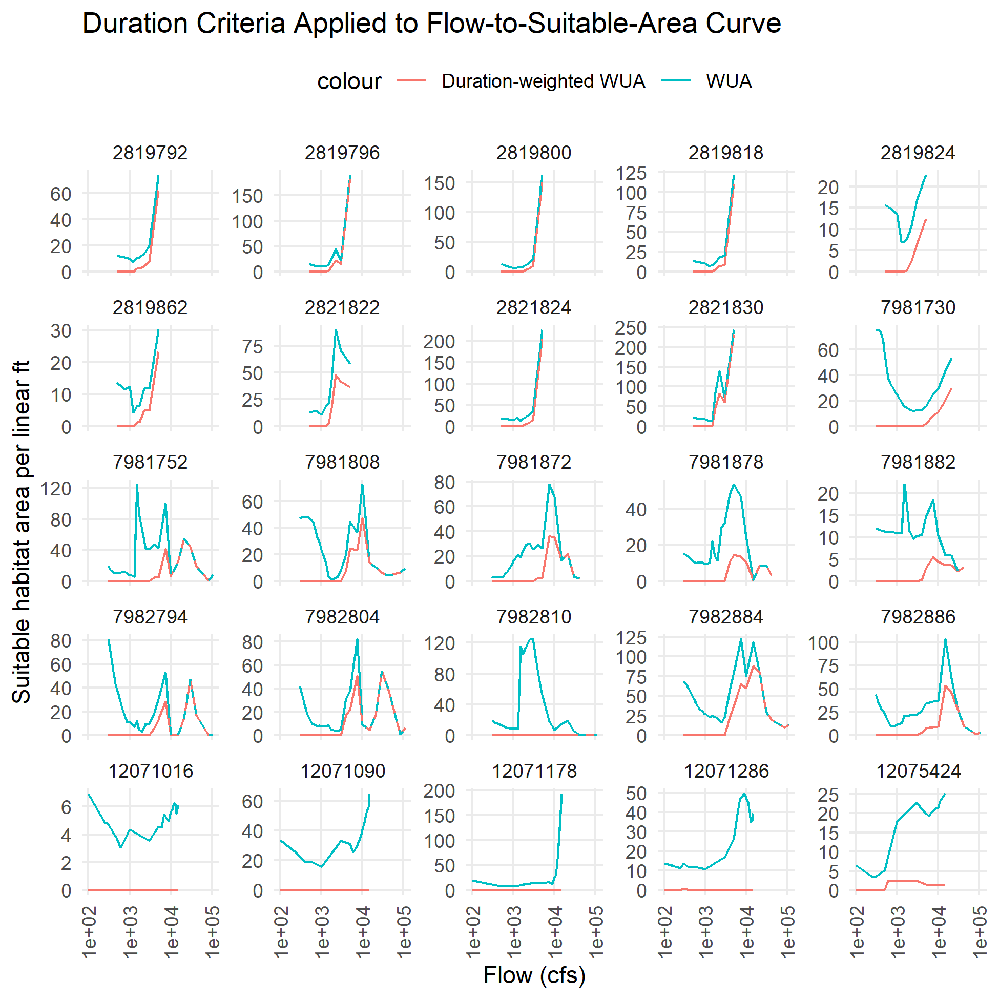<!-- -->

``` r
batch_res |> saveRDS(here::here("data-raw", "results", "durhsi_applied_to_comid.Rds"))
```

Result applied to individual dates

``` r
# apply a rating curve to a time series
extract_durwua_time_series <- function(gauge_ts, q_durwua) {
  if(!is.null(gauge_ts) & !is.null(q_durwua)) {
    full_join(gauge_ts, q_durwua, by=join_by(q)) |>
      arrange(q) |>
      mutate(durwua = zoo::na.approx(durwua, x = q, na.rm=F)) |>
      filter(!is.na(date)) |>
      arrange(date)
  } else {
    tibble(q = numeric(0), durwua = numeric(0))
  }
}

# apply all COMID's rating curves to all dates of flow time series
batch_res_ts <- full_join(
    training_cdec_data |> 
      select(river, water_year, date, q = q_gauge) |> 
      nest(gauge_ts = c(date, q)),
    batch_res |> 
      select(dataset, comid, water_year, q, durwua) |> 
      nest(q_durwua = c(q, durwua)),
    by=join_by(river==dataset, water_year)) |>
  mutate(result = map2(gauge_ts, q_durwua, extract_durwua_time_series)) |>
  select(-gauge_ts, -q_durwua) |>
  unnest(result)

batch_res_ts |>
  saveRDS(here::here("data-raw", "results", "durhsi_applied_to_comid_ts.Rds"))

# aggregate result across comids and plot
reach_lengths <- flowline_attributes |> 
  transmute(comid, length_ft = reach_length_km/0.0003048)

batch_res_ts |>
  inner_join(reach_lengths, by = join_by(comid)) |>
  filter(durwua>0) |>
  group_by(river, water_year, date, q) |>
  summarize(durwua_ac = sum(durwua * length_ft) / 43560) |>
  ggplot() +
  facet_wrap(~river, ncol=1, scales="free") +
  geom_point(aes(x = q, y = durwua_ac), size=1) +
  geom_line(data = batch_res |>
                     rename(river = dataset) |>
                     inner_join(reach_lengths, by = join_by(comid)) |>
                     group_by(river, water_year, q) |>
                     summarize(wua_ac = sum(wua * length_ft) / 43560),
            aes(x = q, y = wua_ac))
```

    ## `summarise()` has grouped output by 'river', 'water_year', 'date'. You can
    ## override using the `.groups` argument.
    ## `summarise()` has grouped output by 'river', 'water_year'. You can override
    ## using the `.groups` argument.

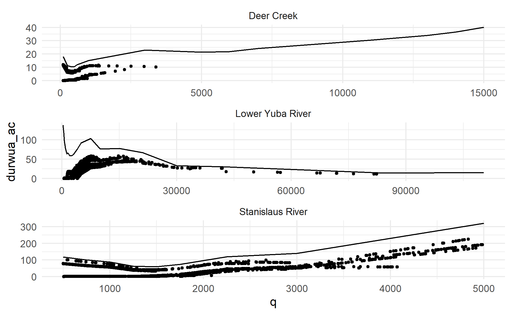<!-- -->

## Baseflow Elimination

Function for simple elimination of baseflow given a threshold flow,
without needing to know a full hydrology:

``` r
# EDIT: Moved this to inundation-duration-functions.R
# eliminate_baseflow <- function(fsa, baseflow_threshold_flow, fsa_q=q, fsa_wua=wua, ...) {
# 
#   min_q <- 0
#   max_q <- fsa |> pull({{fsa_q}}) |> max()
# 
#   baseflow_removal_drc <-
#     fsa |>
#     complete(flow_cfs = baseflow_threshold_flow) |>
#     arrange(flow_cfs) |>
#     transmute(q = flow_cfs,
#               dhsi = if_else(flow_cfs <= baseflow_threshold_flow, 0, 1))
# 
#   apply_durations_to_fsa_curve(fsa=fsa, drc=baseflow_removal_drc,
#                                fsa_q={{fsa_q}}, fsa_wua={{fsa_wua}}, ...) |>
#     transmute({{fsa_q}} := q,
#               {{fsa_wua}} := durwua)
# 
# }

test_threshold <- 330 #cfs

test_output <- fsa |> 
  eliminate_baseflow(test_threshold, fsa_q=flow_cfs, fsa_wua=wua) |>
  glimpse()
```

    ## Rows: 19
    ## Columns: 2
    ## $ flow_cfs <dbl> 100, 250, 300, 330, 400, 500, 600, 1000, 3000, 5000, 6000, 70…
    ## $ wua      <dbl> 0.0000000, 0.0000000, 0.0000000, 0.0000000, 0.6254589, 1.4446…

``` r
test_output |> 
  ggplot() + 
  geom_line(aes(x=flow_cfs, y=wua, color="original")) + 
  geom_point(aes(x=flow_cfs, y=wua, color="original")) + 
  geom_line(data=fsa, aes(x=flow_cfs, y=wua, color="baseflow removed")) +
  geom_point(data=fsa, aes(x=flow_cfs, y=wua, color="baseflow removed")) +
  geom_vline(aes(xintercept = test_threshold), linetype="dashed") +
  scale_x_log10()
```

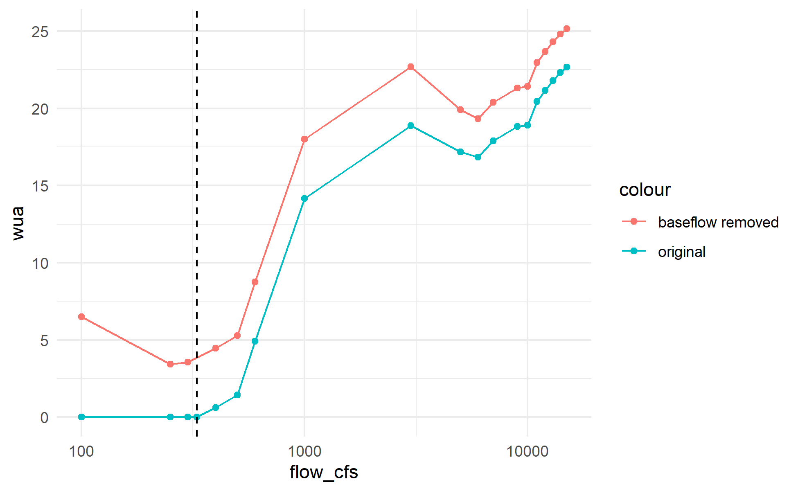<!-- -->

## Floodplain-Instream Split

(eventually move this to its own file)

Need method to determine the flow theshold (aka bankfull flow) to use to
split instream and floodplain

As a placeholder, is there a bankfull flow contained in the
flowline_attributes? Or assume some channel shape and derive from bf w
and bf d using Manning’s

``` r
fp <- function(suitable_area, flow, flow_threshold) {
  
  if (length(flow) > 0 & 
      length(suitable_area) > 0 & 
      all(!is.na(flow)) & 
      all(!is.na(suitable_area)) & 
      all(!is.na(flow_threshold))) {
    
    qt <- flow_threshold
    
    suitable_area_below_flow_threshold <- if (any(flow < qt)) suitable_area[which(flow < qt)] 
    instream_at_threshold <- if (any(flow < qt)) suitable_area_below_flow_threshold[[length(suitable_area_below_flow_threshold)]] else 0
    #suitable_area_floodplain <- if (any(flow >= qt)) suitable_area[which(flow >= qt)] - instream_at_threshold
  
    suitable_area_instream <- if_else(suitable_area <= instream_at_threshold, suitable_area, instream_at_threshold)
    
    suitable_area_floodplain <- suitable_area - suitable_area_instream # 
    
    return(list(
      flow = flow,
      suitable_area = suitable_area,
      is_floodplain = (flow >= qt),
      # habitat_instream = c(suitable_area_instream, rep(instream_at_threshold, length(suitable_area_floodplain))),
      # habitat_floodplain = c(rep(NA, length(suitable_area_instream)), suitable_area_floodplain)
      habitat_instream = suitable_area_instream,
      habitat_floodplain = suitable_area_floodplain # if_else(suitable_area_floodplain > 0, suitable_area_floodplain, NA)
      ))
    
  } else {
    return(list(
      flow = flow,
      suitable_area = suitable_area,
      is_floodplain = NA,
      habitat_instream = NA,
      habitat_floodplain = NA
      ))
  }
}
```

``` r
# rough example of instream-floodplain flow thresholds derived from bankfull width/depth
bankfull_flows <- 
  flowline_attributes |>
  transmute(comid,
            xs_area_m = bf_width_m * bf_depth_m,
            w_perim_m = 2 * bf_depth_m * bf_width_m,
            roughness = 0.03, # typical roughness for natural channels
            bf_q_m3_s = xs_area_m * (xs_area_m / w_perim_m)^(2/3) * slope^(1/2) * roughness^(-1),
            bf_q_cfs = bf_q_m3_s * 0.3048^(-3)) |>
  select(comid, bf_q_cfs) |>
  filter(!is.na(bf_q_cfs))

# apply the floodplain function
batch_res_fp <- batch_res |>
  inner_join(bankfull_flows, by=join_by(comid)) |>
  group_by(comid, water_year, bf_q_cfs) |>
  summarize(result = list(fp(durwua, q, bf_q_cfs))) |>
  ungroup() |>
  unnest_wider(result, names_sep="_") |>
  unnest(cols = starts_with("result_")) |>
  rename_with(function(x) str_replace(x, "result_", ""), starts_with("result_")) |>
  glimpse()
```

    ## `summarise()` has grouped output by 'comid', 'water_year'. You can override
    ## using the `.groups` argument.

    ## Rows: 90,700
    ## Columns: 8
    ## $ comid              <dbl> 2819786, 2819786, 2819786, 2819786, 2819786, 281978…
    ## $ water_year         <dbl> 1998, 1998, 1998, 1998, 1998, 1998, 1998, 1998, 199…
    ## $ bf_q_cfs           <dbl> 1741.525, 1741.525, 1741.525, 1741.525, 1741.525, 1…
    ## $ flow               <dbl> 500, 750, 1000, 1250, 1500, 1750, 2250, 3000, 5000,…
    ## $ suitable_area      <dbl> 0.000000, 0.000000, 0.000000, 0.000000, 0.000000, 1…
    ## $ is_floodplain      <lgl> FALSE, FALSE, FALSE, FALSE, FALSE, TRUE, TRUE, TRUE…
    ## $ habitat_instream   <dbl> 0, 0, 0, 0, 0, 0, 0, 0, 0, 0, 0, 0, 0, 0, 0, 0, 0, …
    ## $ habitat_floodplain <dbl> 0.000000, 0.000000, 0.000000, 0.000000, 0.000000, 1…

``` r
# Plotting an example
batch_res_fp |>
  filter(water_year == 2017) |> 
  filter(comid == 7981768) |>
  ggplot(aes(x=flow)) + facet_wrap(~comid, scales="free_y") +
  geom_step(aes(y=suitable_area, color="Combined"), direction="hv", linewidth=1) + 
  geom_step(aes(y=habitat_instream, color="Instream"), direction="hv", linewidth=1) +
  geom_step(aes(y=habitat_floodplain, color="Floodplain"), direction="hv", linewidth=1) +
  geom_step(aes(y=suitable_area, color="Combined"),linetype="dashed", direction="hv", linewidth=1) +
  geom_vline(aes(xintercept = bf_q_cfs, linetype = "Bankfull Flow (cfs)")) +
  #scale_x_log10(scales::label_comma +
  ggtitle("Instream/Floodplain Threshold Applied to Flow-to-Suitable-Area Curve") +
  xlab("Flow (cfs)") + ylab("Suitable habitat area per linear ft") +
  theme(axis.text.x = element_text(angle = 90, vjust = 0.5, hjust=1), 
        panel.grid.minor=element_blank(), 
        legend.position = "top")
```

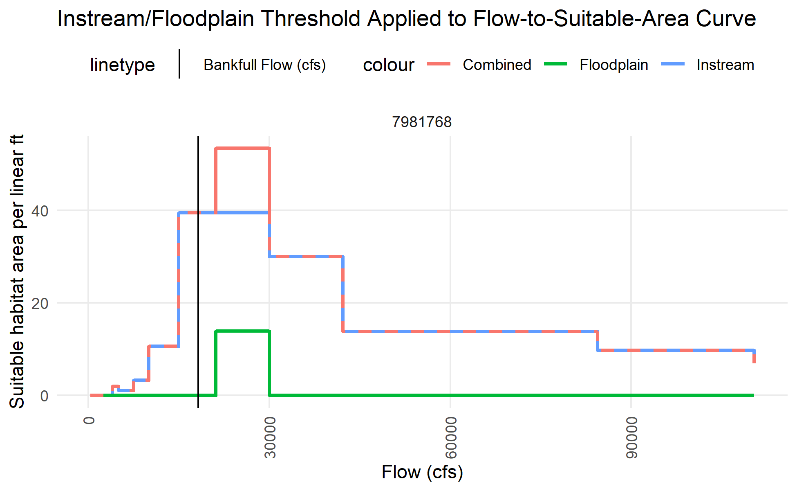<!-- -->
