Model Comparison
================
Maddee Rubenson (FlowWest)
2024-09-05

The purpose of this markdown is to explore the different model methods
and how they impact reaches differently through exploring model outputs
at different geographic scales.

**Model types:**

- Scale Dependent: non-normalized - this is the WUA (sq feet/linear
  foot) vs. flow

- Scale Normalized: normalized - this is WUA (sq feet/linear foot)
  (normalized) vs. flow (normalized)

``` r
# load the data

# wuas <- habistat::wua_predicted
# 
# hqt_gradient_class <- readRDS(here::here("data-raw", "results", "hqt_gradient_class.Rds"))
# 
# hqt_cls <- habistat::flowline_geom |>
#   st_zm() |>
#   st_transform("ESRI:102039") |> 
#   st_point_on_surface() |>
#   st_join(hqt_gradient_class) |>
#   st_drop_geometry() |> 
#   select(comid, hqt_gradient_class) |> 
#   mutate(hqt_gradient_class = coalesce(hqt_gradient_class, "Bedrock"),
#          hqt_gradient_class = factor(hqt_gradient_class, levels=c("Valley Lowland", "Valley Foothill", "Bedrock"))) 
# 
# wuas_merge <- wuas |> left_join(hqt_cls) |> glimpse()

wuas_merge <- habistat::wua_predicted |> 
  left_join(habistat::flowline_attr |> select(comid, hqt_gradient_class)) |>
  glimpse()
```

    ## Rows: 1,217,164
    ## Columns: 11
    ## $ comid              <dbl> 342455, 342455, 342455, 342455, 342455, 342455, 342…
    ## $ model_bfc          <lgl> FALSE, FALSE, FALSE, FALSE, FALSE, FALSE, FALSE, FA…
    ## $ model_name         <fct> SD, SD, SD, SD, SD, SD, SD, SD, SD, SD, SD, SD, SD,…
    ## $ flow_idx           <int> 50, 56, 63, 70, 79, 89, 100, 112, 125, 141, 158, 17…
    ## $ flow_cfs           <dbl> 50.11872, 56.23413, 63.09573, 70.79458, 79.43282, 8…
    ## $ wua_per_lf_pred    <dbl> 0.02460845, 0.02527939, 0.02587131, 0.02719230, 0.0…
    ## $ river_cvpia        <fct> NA, NA, NA, NA, NA, NA, NA, NA, NA, NA, NA, NA, NA,…
    ## $ watershed_level_3  <fct> Stanislaus River, Stanislaus River, Stanislaus Rive…
    ## $ reach_length_ft    <dbl> 291.9948, 291.9948, 291.9948, 291.9948, 291.9948, 2…
    ## $ habitat            <chr> "rearing", "rearing", "rearing", "rearing", "rearin…
    ## $ hqt_gradient_class <fct> Bedrock, Bedrock, Bedrock, Bedrock, Bedrock, Bedroc…

Explore the WUAs but different groups

## Rearing:

``` r
# SD = scale dependent
# SN = scale normalized
# TODO: i want no post-hoc baseflow removal, is this logic correct?
rearing_wua_grouped <- wuas_merge |> 
  filter(model_bfc == FALSE, # FALSE = training data does not have baseflow channel = baseflow channel was removed
         habitat == "rearing") |> 
  mutate(model_name = case_when(model_name == "SD" ~ "Scale-Dependent",
                                model_name == "SN" ~ "Scale-Normalized"),
         total_wua = wua_per_lf_pred * reach_length_ft) |> 
  group_by(model_name, flow_cfs, watershed_level_3, habitat, hqt_gradient_class) |> 
  summarise(total_wua = sum(total_wua))
```

    ## `summarise()` has grouped output by 'model_name', 'flow_cfs',
    ## 'watershed_level_3', 'habitat'. You can override using the `.groups` argument.

``` r
# all watersheds
rearing_wua_grouped |> 
  group_by(hqt_gradient_class, flow_cfs, model_name) |> 
  summarise(total_wua = sum(total_wua)) |> 
  ggplot() + 
  geom_line(aes(x = flow_cfs, y = total_wua, color = model_name)) +
  theme(legend.position = "top")+
  scale_x_log10() + annotation_logticks(sides = "b") +
  facet_wrap(~hqt_gradient_class) +
  ggtitle("Rearing: all watersheds grouped by HQT class")
```

    ## `summarise()` has grouped output by 'hqt_gradient_class', 'flow_cfs'. You can
    ## override using the `.groups` argument.

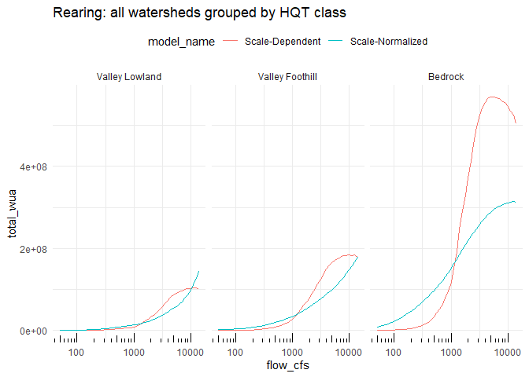<!-- -->

``` r
rearing_wua_grouped |> 
  filter(watershed_level_3 %in% c("Feather River")) |> 
  ggplot() + 
  geom_line(aes(x = flow_cfs, y = total_wua, color = model_name)) +
  theme(legend.position = "top")+
  scale_x_log10() + annotation_logticks(sides = "b") +
  facet_wrap(~hqt_gradient_class + watershed_level_3)
```

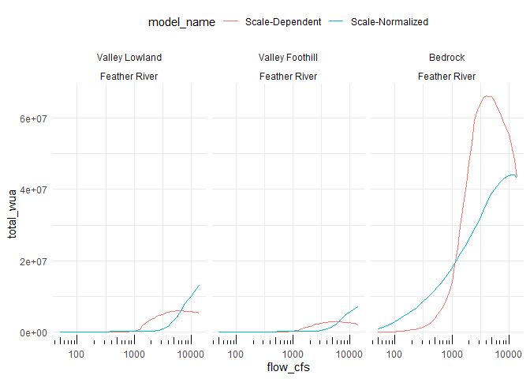<!-- -->

``` r
rearing_wua_grouped |> 
  filter(watershed_level_3 %in% c("American River")) |> 
  ggplot() + 
  geom_line(aes(x = flow_cfs, y = total_wua, color = model_name)) +
  theme(legend.position = "top")+
  scale_x_log10() + annotation_logticks(sides = "b") +
  facet_wrap(~hqt_gradient_class + watershed_level_3)
```

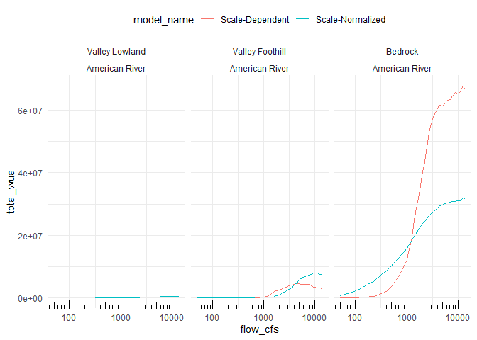<!-- -->

``` r
rearing_wua_grouped |> 
  filter(watershed_level_3 %in% c("Battle Creek")) |> 
  ggplot() + 
  geom_line(aes(x = flow_cfs, y = total_wua, color = model_name)) +
  theme(legend.position = "top")+
  scale_x_log10() + annotation_logticks(sides = "b") +
  facet_wrap(~hqt_gradient_class + watershed_level_3)
```

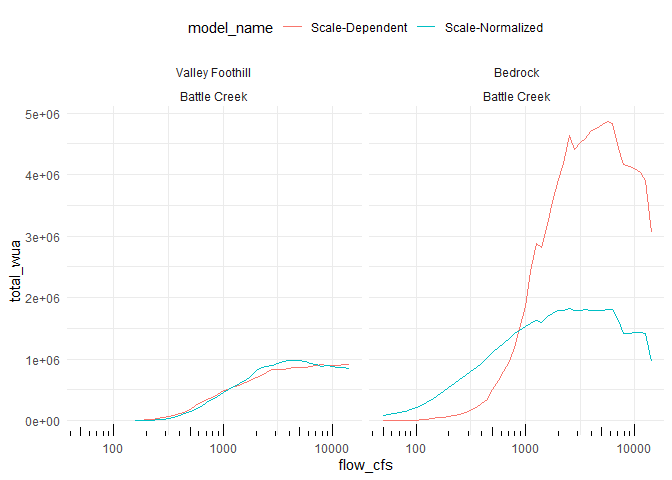<!-- -->

## Spawning:

``` r
# SD = scale dependent
# SN = scale normalized
spawning_wua_grouped <- wuas_merge |> 
  filter(model_bfc == TRUE,
         habitat == "spawning") |> 
  mutate(model_name = case_when(model_name == "SD" ~ "Scale-Dependent",
                                model_name == "SN" ~ "Scale-Normalized"),
         total_wua = wua_per_lf_pred * reach_length_ft) |> 
  group_by(model_name, flow_cfs, watershed_level_3, habitat, hqt_gradient_class) |> 
  summarise(total_wua = sum(total_wua))
```

    ## `summarise()` has grouped output by 'model_name', 'flow_cfs',
    ## 'watershed_level_3', 'habitat'. You can override using the `.groups` argument.

``` r
# all watersheds
spawning_wua_grouped |> 
  group_by(hqt_gradient_class, flow_cfs, model_name) |> 
  summarise(total_wua = sum(total_wua)) |> 
  ggplot() + 
  geom_line(aes(x = flow_cfs, y = total_wua, color = model_name)) +
  theme(legend.position = "top")+
  facet_wrap(~hqt_gradient_class) + 
  scale_x_log10() + annotation_logticks(sides = "b") +
  ggtitle("Spawning: all watersheds grouped by HQT class") 
```

    ## `summarise()` has grouped output by 'hqt_gradient_class', 'flow_cfs'. You can
    ## override using the `.groups` argument.

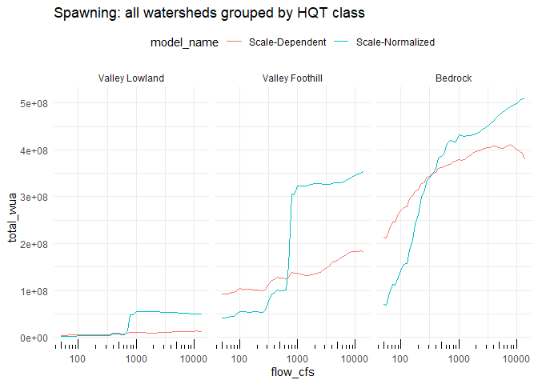<!-- -->

``` r
spawning_wua_grouped |> 
  filter(watershed_level_3 %in% c("Feather River")) |> 
  ggplot() + 
  geom_line(aes(x = flow_cfs, y = total_wua, color = model_name)) +
  theme(legend.position = "top")+
  scale_x_log10() + annotation_logticks(sides = "b") +
  facet_wrap(~hqt_gradient_class + watershed_level_3)
```

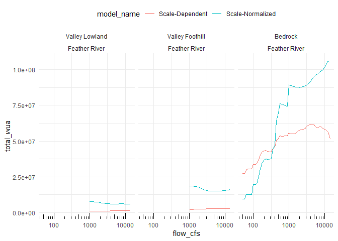<!-- -->

``` r
spawning_wua_grouped |> 
  filter(watershed_level_3 %in% c("American River")) |> 
  ggplot() + 
  geom_line(aes(x = flow_cfs, y = total_wua, color = model_name)) +
  theme(legend.position = "top")+
  scale_x_log10() + annotation_logticks(sides = "b") +
  facet_wrap(~hqt_gradient_class + watershed_level_3)
```

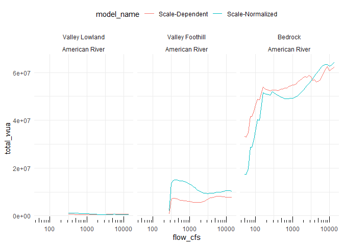<!-- -->

``` r
spawning_wua_grouped |> 
  filter(watershed_level_3 %in% c("Battle Creek")) |> 
  ggplot() + 
  geom_line(aes(x = flow_cfs, y = total_wua, color = model_name)) +
  theme(legend.position = "top")+
  scale_x_log10() + annotation_logticks(sides = "b") +
  facet_wrap(~hqt_gradient_class + watershed_level_3)
```

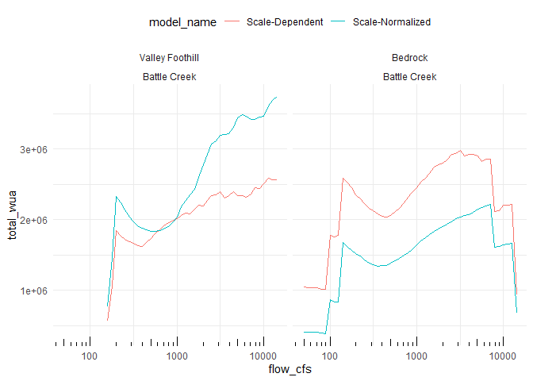<!-- -->

## Spatial Distribution

``` r
habistat::flowline_geom_proj |>
  inner_join(habistat::flowline_attr |> select(comid, da_scalar_maf)) |>
  filter(comid %in% habistat::wua_predicted$comid) |>
  ggplot() +
  geom_sf(aes(color = da_scalar_maf)) + 
  theme(legend.key.height = unit(48, "pt"),
        axis.text = element_blank()) + 
  ggtitle("Flow Scalar (Drainage Area * Mean Annual Precip)") + 
  scale_color_viridis_c(name = "Million Acre-Feet", 
                        direction = -1, 
                        trans = habistat::trans_semiIHS, 
                        breaks = c(0.1, 1, 10, 100), 
                        limits = c(0.1, 100), na.value = "darkorange")
```

    ## Joining with `by = join_by(comid)`

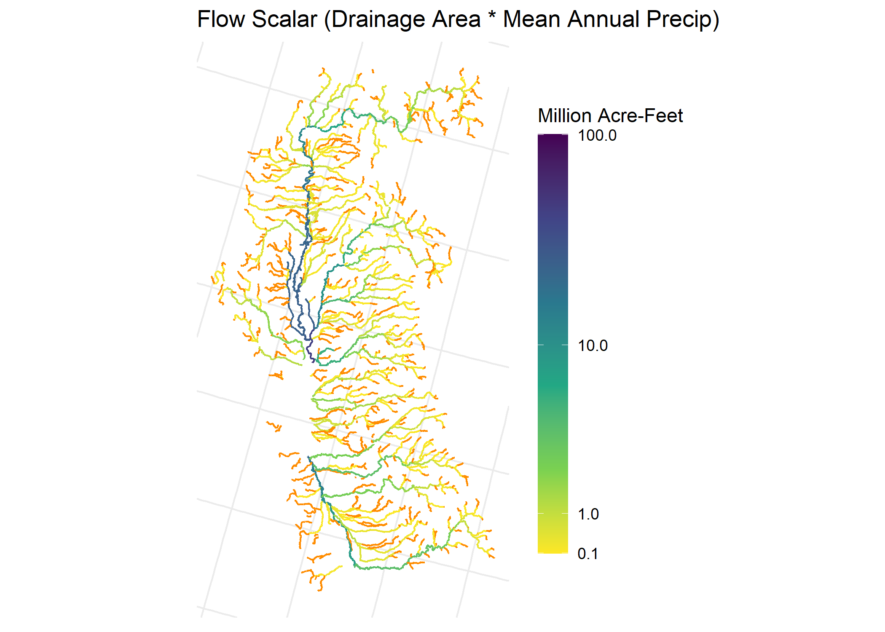<!-- -->

``` r
wua_selected_flows <- habistat::wua_predicted |> 
  group_by(comid, model_name, habitat) |>
  complete(flow_cfs = c(300, 1000, 3000, 10000)) |>
  mutate(wua_per_lf_pred = zoo::na.approx(wua_per_lf_pred, x = log(flow_cfs), na.rm=F)) |>
  filter(flow_cfs %in% c(300, 1000, 3000, 10000))

habistat::flowline_geom_proj |>
  inner_join(wua_selected_flows |> filter(habitat=="rearing"), by=join_by(comid)) |>
  ggplot() +
  facet_grid(rows = vars(model_name), cols = vars(flow_cfs), switch = "both") + 
  geom_sf(aes(color = wua_per_lf_pred)) + 
  scale_color_gradientn(name = "WUA per LF",
                        limits = c(0, 300),
                        breaks = c(0, 1, 3, 10, 30, 100, 300), 
                        trans = habistat::trans_semiIHS,
                        values = scales::rescale(habistat::semiIHS(c(0, 1, 3, 10, 30, 100, 300))),
                        colors = c("darkblue", "turquoise", "gold", "darkorange", "darkred", "violetred4", "mediumvioletred"),
                        na.value = "#ffffff00") + 
  theme(legend.key.height = unit(48, "pt"),
        axis.text = element_blank()) + 
  xlab("Flow (cfs)") + ylab("Model Type") + ggtitle("Rearing")
```

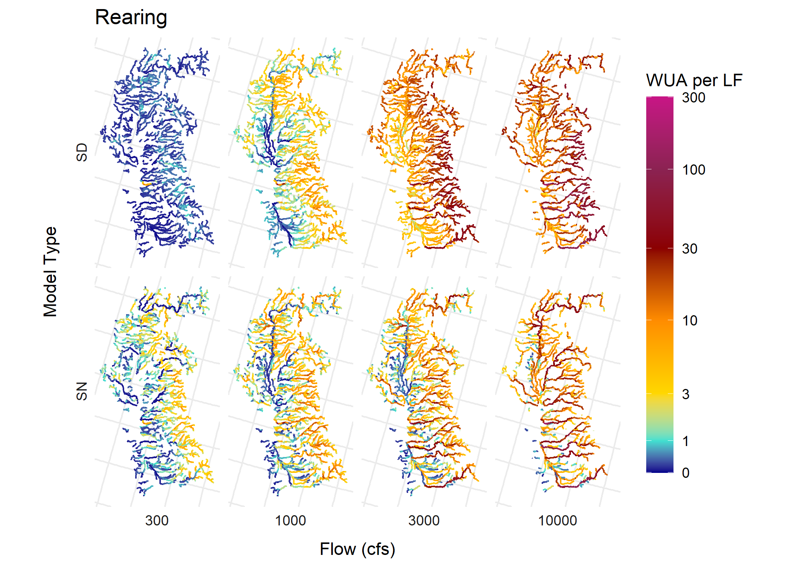<!-- -->

``` r
habistat::flowline_geom_proj |>
  inner_join(wua_selected_flows |> filter(habitat=="spawning"), by=join_by(comid)) |>
  ggplot() +
  facet_grid(rows = vars(model_name), cols = vars(flow_cfs), switch = "both") + 
  geom_sf(aes(color = wua_per_lf_pred)) + 
  scale_color_gradientn(name = "WUA per LF",
                        limits = c(0, 120),
                        breaks = c(0, 20, 40, 60, 80, 100, 120), 
                        colors = c("darkblue", "turquoise", "gold", "darkorange", "darkred", "violetred4", "mediumvioletred"),
                        na.value = "#ffffff00") + 
  theme(legend.key.height = unit(48, "pt"),
        axis.text = element_blank()) + 
  xlab("Flow (cfs)") + ylab("Model Type") + ggtitle("Spawning")
```

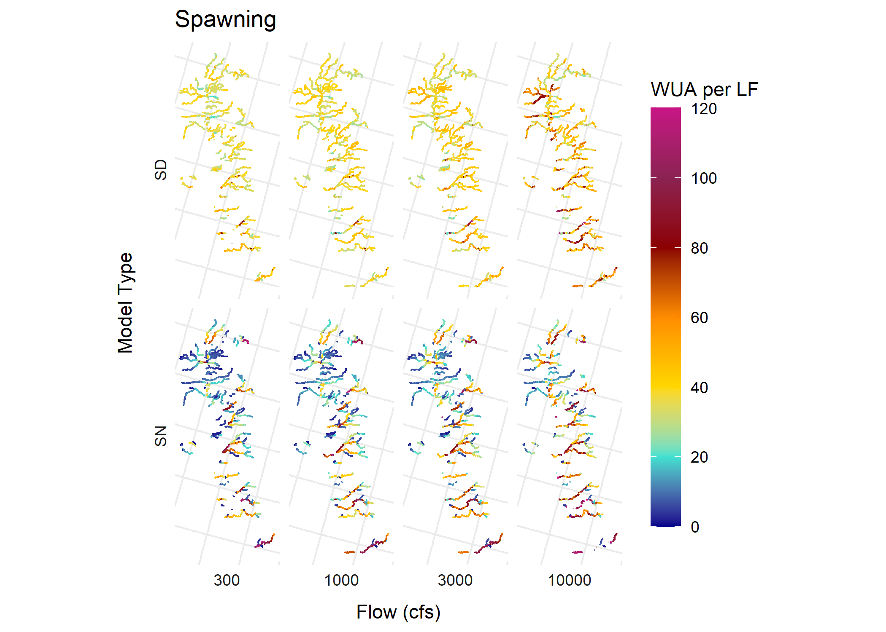<!-- -->

``` r
habistat::flowline_geom_proj |>
  inner_join(wua_selected_flows |> filter(habitat=="rearing" & model_name=="SD"), by=join_by(comid)) |>
  ggplot() +
  facet_grid(cols = vars(flow_cfs), switch = "both") + 
  geom_sf(aes(color = if_else(is.na(wua_per_lf_pred), "Out of Range", "In Range"))) + 
  theme(legend.key.height = unit(48, "pt"),
        axis.text = element_blank()) + 
  xlab("Flow (cfs)") + ggtitle("Flow Filter") + 
  scale_color_manual(name = "Result", values = c("lightblue", "darkred"))
```

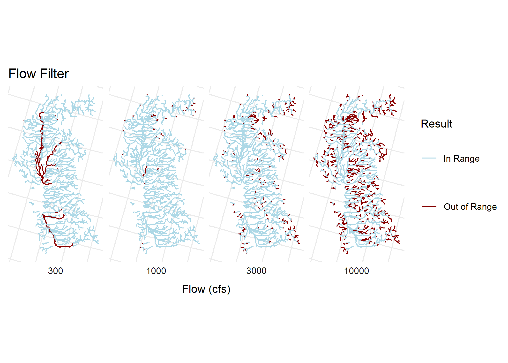<!-- -->
