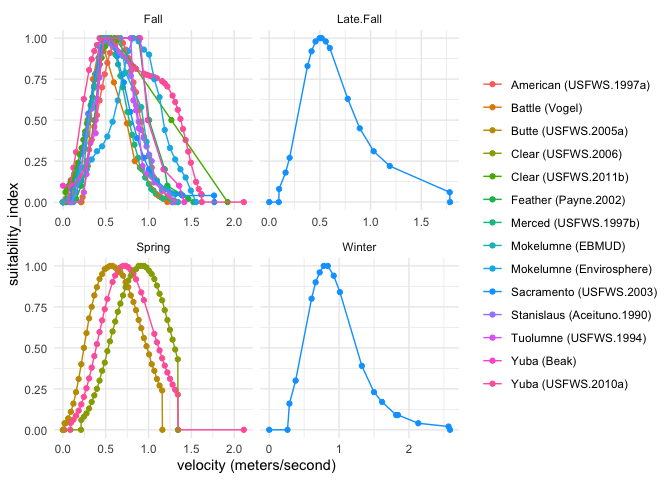

Spawning Habitat Suitability Criteria
================
[Maddee Rubenson](mailto:mrubenson@flowwest.com)
2024-07-17

- [Habitat Suitability Criteria](#habitat-suitability-criteria)
- [Objective](#objective)
- [Methods](#methods)
  - [Read in data](#read-in-data)
  - [Depth HSI](#depth-hsi)
  - [Velocity HSI](#velocity-hsi)
- [Create Suitability Data Files](#create-suitability-data-files)

## Habitat Suitability Criteria

## Objective

Develop a habitat suitability criteria that can be used across
watersheds within the HabiStat model.

## Methods

### Read in data

Data is from various sources and was compiled by Mark Gard for use in
CVPIA DSMHabitat. Within the dataset are spawning criteria for depth,
velocity, and substrate for 11 watersheds and Fall, Late Fall, Winter,
Spring for Chinook Salmon.

    ## Rows: 2,818
    ## Columns: 9
    ## $ citation           <chr> "USFWS.1997a", "USFWS.1997a", "USFWS.1997a", "USFWS…
    ## $ river              <chr> "American", "American", "American", "American", "Am…
    ## $ species            <chr> "Chinook", "Chinook", "Chinook", "Chinook", "Chinoo…
    ## $ race               <chr> "Fall", "Fall", "Fall", "Fall", "Fall", "Fall", "Fa…
    ## $ life_stage         <chr> "Spawning", "Spawning", "Spawning", "Spawning", "Sp…
    ## $ suitability_metric <chr> "Substrate", "Substrate", "Substrate", "Substrate",…
    ## $ units              <chr> "Code", "Code", "Code", "Code", "Code", "Code", "Co…
    ## $ units_si           <dbl> 0.1000000, 1.0000000, 1.2000000, 1.3000000, 1.40000…
    ## $ suitability_index  <dbl> 0.00, 0.00, 0.36, 1.00, 0.97, 0.97, 0.53, 0.28, 0.0…

| river      | race      | suitability_metric         | citation      |
|:-----------|:----------|:---------------------------|:--------------|
| American   | Fall      | Substrate; Depth; Velocity | USFWS.1997a   |
| Sacramento | Fall      | Substrate; Depth; Velocity | USFWS.2003    |
| Sacramento | Late.Fall | Substrate; Depth; Velocity | USFWS.2003    |
| Sacramento | Winter    | Substrate; Depth; Velocity | USFWS.2003    |
| Yuba       | Spring    | Substrate; Depth; Velocity | USFWS.2010a   |
| Yuba       | Fall      | Substrate; Depth; Velocity | USFWS.2010a   |
| Clear      | Spring    | Substrate; Depth; Velocity | USFWS.2006    |
| Clear      | Fall      | Substrate; Depth; Velocity | USFWS.2011b   |
| Butte      | Spring    | Substrate; Depth; Velocity | USFWS.2005a   |
| Merced     | Fall      | Substrate; Depth; Velocity | USFWS.1997b   |
| Stanislaus | Fall      | Substrate; Depth; Velocity | Aceituno.1990 |
| Tuolumne   | Fall      | Substrate; Depth; Velocity | USFWS.1994    |
| Battle     | Fall      | Substrate; Depth; Velocity | Vogel         |
| Feather    | Fall      | Substrate; Depth; Velocity | Payne.2002    |
| Yuba       | Fall      | Substrate; Depth; Velocity | Beak          |
| Mokelumne  | Fall      | Substrate; Depth; Velocity | Envirosphere  |
| Mokelumne  | Fall      | Substrate; Depth; Velocity | EBMUD         |

All habitat suitability criteria compiled by Mark Gard

### Depth HSI

<!-- --><!-- -->

### Velocity HSI

<!-- --><!-- -->

## Create Suitability Data Files

| run       | max_depth |
|:----------|----------:|
| fall      |       2.4 |
| late_fall |       0.5 |
| spring    |       2.2 |
| winter    |       0.9 |

Depth HSI - for each run, the maximum depth range suitable for spawning

    ## ✔ Setting active project to '/Users/maddeerubenson/Documents/git/HabiStat/swc-habitat-suitability'
    ## ✔ Saving 'spawning_depth_hsi' to 'data/spawning_depth_hsi.rda'
    ## • Document your data (see 'https://r-pkgs.org/data.html')

    ## `summarise()` has grouped output by 'units_si'. You can override using the
    ## `.groups` argument.

| velocity | run       | hsi |
|---------:|:----------|----:|
|      0.0 | fall      | 0.1 |
|      0.1 | fall      | 0.2 |
|      0.2 | fall      | 0.6 |
|      0.3 | fall      | 0.9 |
|      0.4 | fall      | 1.0 |
|      0.5 | fall      | 1.0 |
|      0.6 | fall      | 1.0 |
|      0.7 | fall      | 1.0 |
|      0.8 | fall      | 1.0 |
|      0.9 | fall      | 1.0 |
|      1.0 | fall      | 0.9 |
|      1.1 | fall      | 0.8 |
|      1.2 | fall      | 0.7 |
|      1.3 | fall      | 0.6 |
|      1.4 | fall      | 0.5 |
|      1.5 | fall      | 0.3 |
|      1.6 | fall      | 0.1 |
|      1.8 | fall      | 0.0 |
|      1.9 | fall      | 0.0 |
|      2.1 | fall      | 0.0 |
|      0.0 | late_fall | 0.0 |
|      0.1 | late_fall | 0.1 |
|      0.2 | late_fall | 0.3 |
|      0.4 | late_fall | 0.9 |
|      0.5 | late_fall | 1.0 |
|      0.6 | late_fall | 1.0 |
|      0.8 | late_fall | 0.6 |
|      0.9 | late_fall | 0.4 |
|      1.0 | late_fall | 0.3 |
|      1.2 | late_fall | 0.2 |
|      1.8 | late_fall | 0.1 |
|      0.0 | spring    | 0.0 |
|      0.1 | spring    | 0.2 |
|      0.2 | spring    | 0.5 |
|      0.3 | spring    | 0.8 |
|      0.4 | spring    | 0.9 |
|      0.5 | spring    | 1.0 |
|      0.6 | spring    | 1.0 |
|      0.7 | spring    | 1.0 |
|      0.8 | spring    | 1.0 |
|      0.9 | spring    | 1.0 |
|      1.0 | spring    | 1.0 |
|      1.1 | spring    | 0.9 |
|      1.2 | spring    | 0.8 |
|      1.3 | spring    | 0.6 |
|      2.1 | spring    | 0.0 |
|      0.0 | winter    | 0.0 |
|      0.3 | winter    | 0.2 |
|      0.4 | winter    | 0.3 |
|      0.6 | winter    | 0.8 |
|      0.7 | winter    | 1.0 |
|      0.8 | winter    | 1.0 |
|      0.9 | winter    | 0.9 |
|      1.0 | winter    | 0.8 |
|      1.3 | winter    | 0.4 |
|      1.5 | winter    | 0.2 |
|      1.6 | winter    | 0.2 |
|      1.8 | winter    | 0.1 |
|      2.1 | winter    | 0.0 |
|      2.6 | winter    | 0.0 |

Velocity HSI - for each run, the velocity HSI range

    ## ✔ Saving 'spawning_vel_hsi' to 'data/spawning_vel_hsi.rda'
    ## • Document your data (see 'https://r-pkgs.org/data.html')
