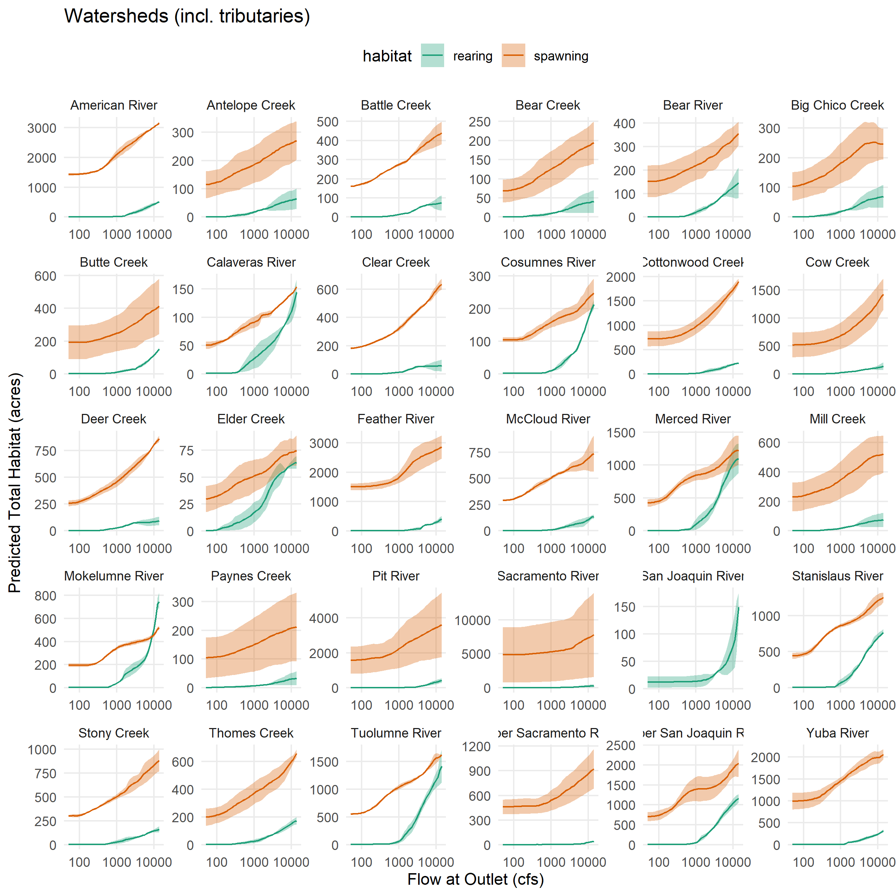
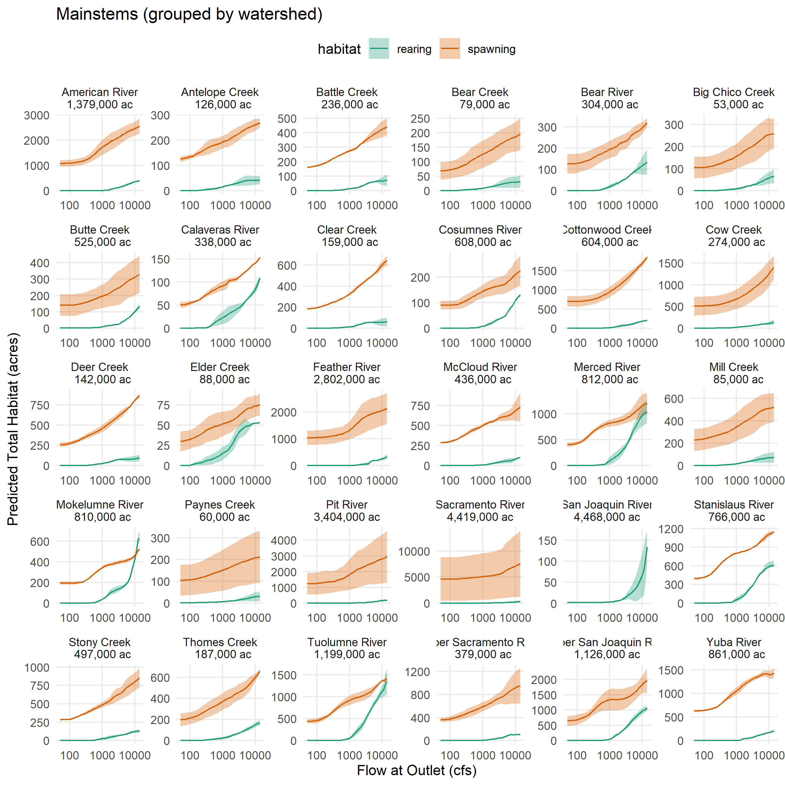
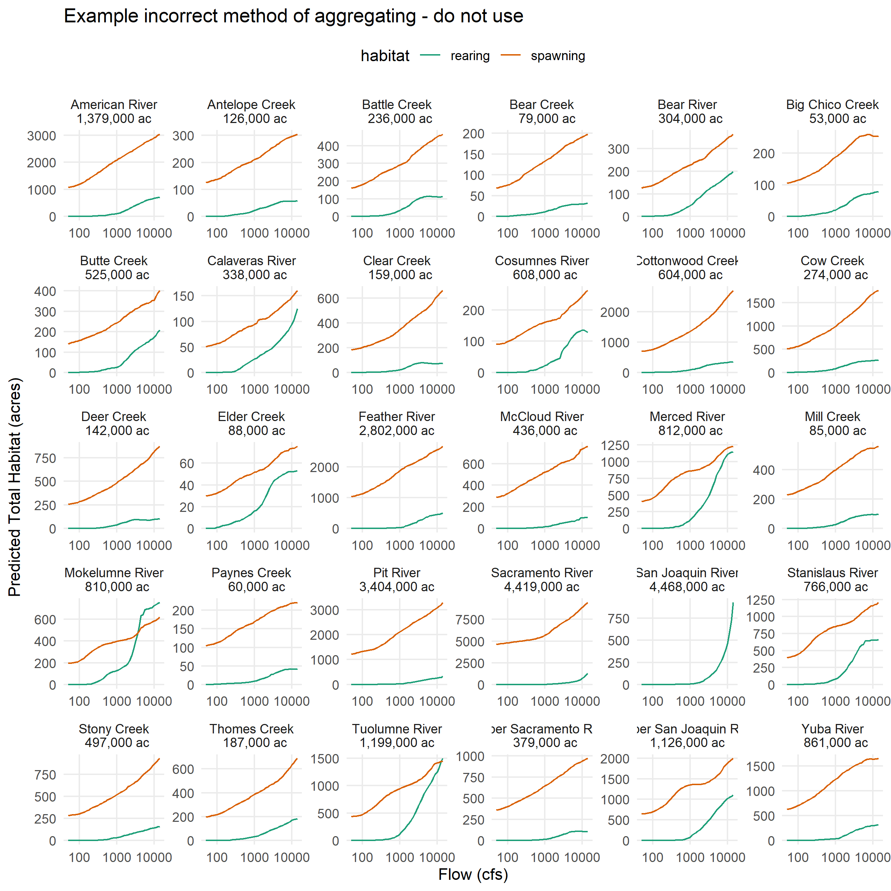
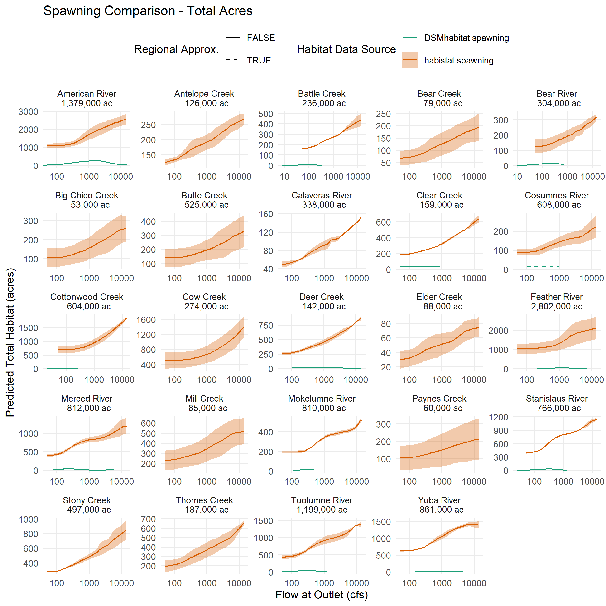
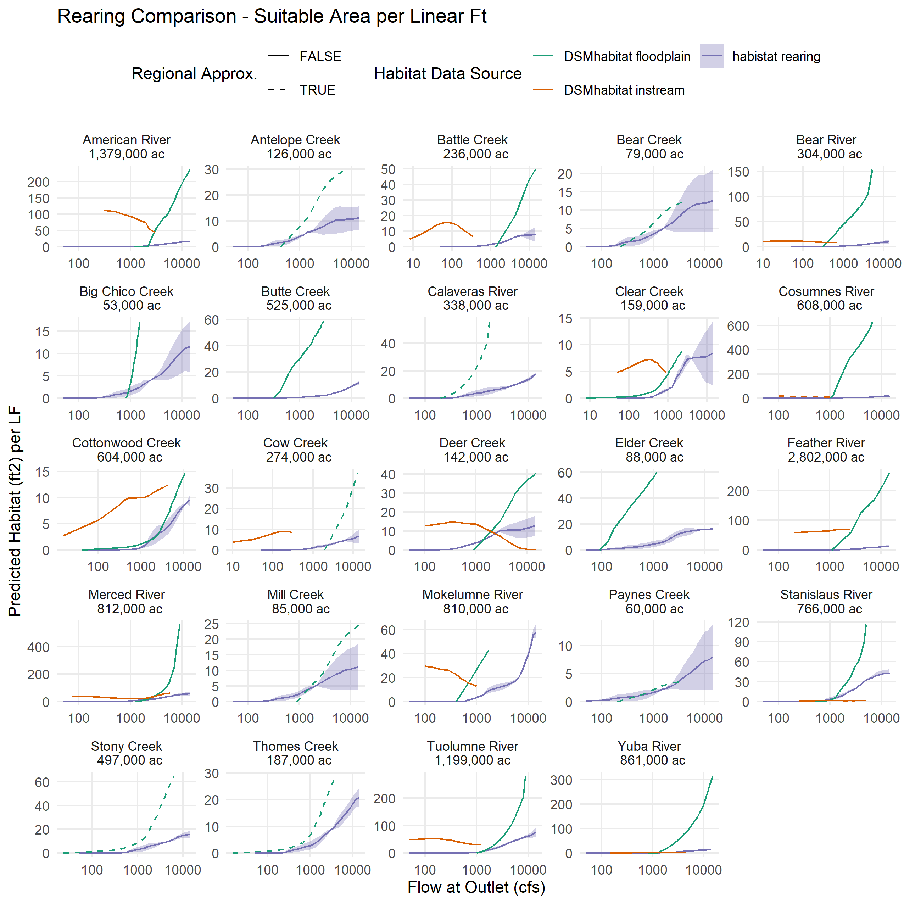
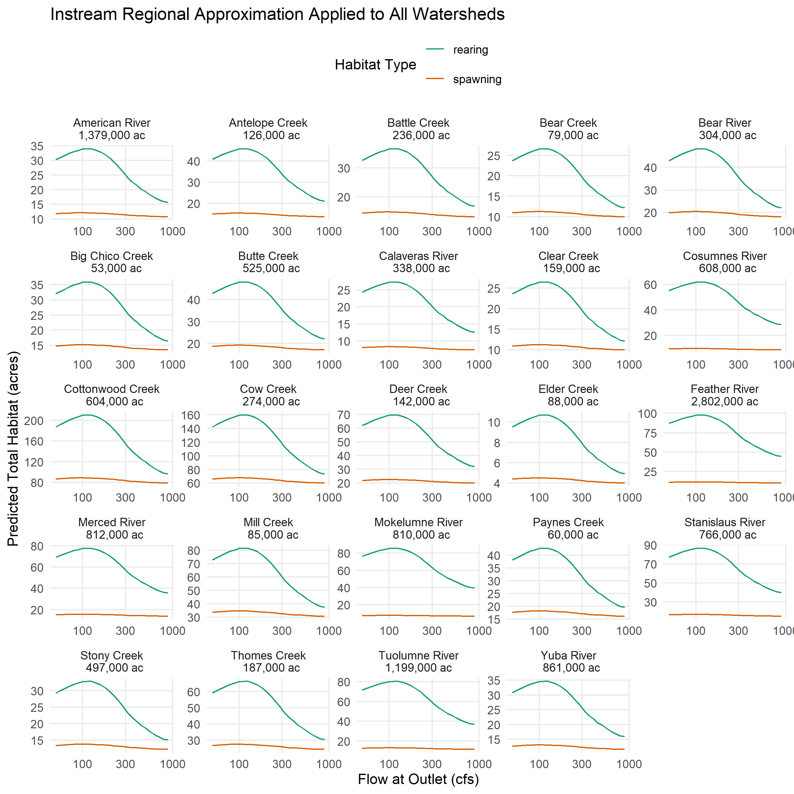
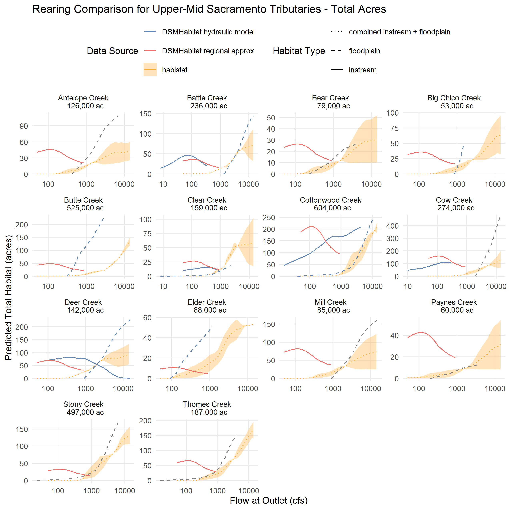
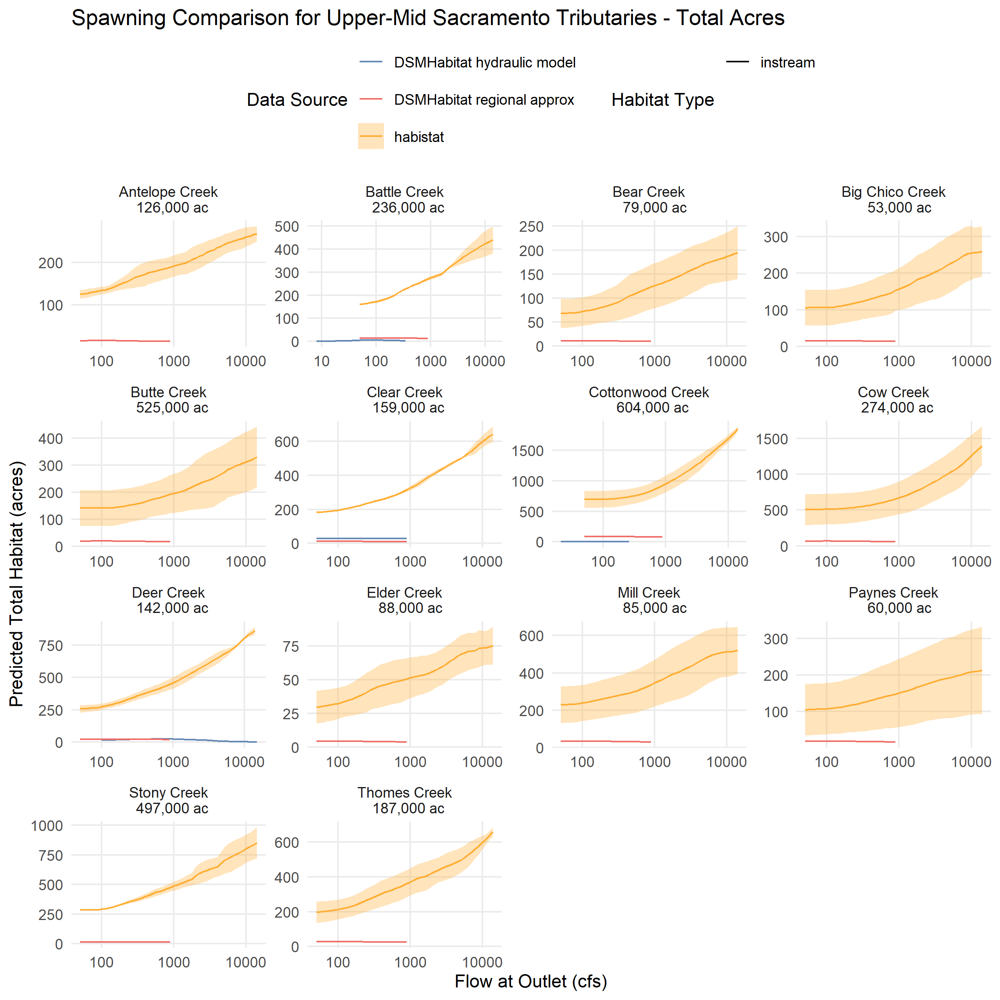

Predictor Data Preparation and Consolidation
================
[Skyler Lewis](mailto:slewis@flowwest.com)
2024-12-13

- [Basic Flow Crosswalk via Drainage Area and
  Precipitation](#basic-flow-crosswalk-via-drainage-area-and-precipitation)
  - [Applying the crosswalk to aggregate model
    results](#applying-the-crosswalk-to-aggregate-model-results)
- [DSMHabitat Comparison](#dsmhabitat-comparison)
- [Comparison with Regional Flow
  Approximation](#comparison-with-regional-flow-approximation)

``` r
library(tidyverse)
```

    ## ── Attaching core tidyverse packages ──────────────────────── tidyverse 2.0.0 ──
    ## ✔ dplyr     1.1.4     ✔ readr     2.1.5
    ## ✔ forcats   1.0.0     ✔ stringr   1.5.1
    ## ✔ ggplot2   3.5.1     ✔ tibble    3.2.1
    ## ✔ lubridate 1.9.3     ✔ tidyr     1.3.1
    ## ✔ purrr     1.0.2     
    ## ── Conflicts ────────────────────────────────────────── tidyverse_conflicts() ──
    ## ✖ dplyr::filter() masks stats::filter()
    ## ✖ dplyr::lag()    masks stats::lag()
    ## ℹ Use the conflicted package (<http://conflicted.r-lib.org/>) to force all conflicts to become errors

``` r
library(sf)
```

    ## Linking to GEOS 3.12.1, GDAL 3.8.4, PROJ 9.3.1; sf_use_s2() is TRUE

``` r
library(habistat)
library(patchwork)
theme_set(theme_minimal())
```

## Basic Flow Crosswalk via Drainage Area and Precipitation

See watershed_delineation.R for dependencies

``` r
make_flow_xw <- function(group_var) {
  habistat::flowline_attr |>
  select({{group_var}}, 
         comid = comid,
         da_reach = da_area_sq_km_tot,
         pc_reach = da_ppt_mean_mm) |>
  drop_na({{group_var}}) |>
  group_by({{group_var}}) |>
  mutate(outlet_comid = comid[which.max(da_reach)]) |>
  mutate(da_outlet = da_reach[which(comid == outlet_comid)],
         pc_outlet = pc_reach[which(comid == outlet_comid)]) |>
  mutate(multiplier = (da_reach / da_outlet) * (pc_reach / pc_outlet)) |>
  arrange({{group_var}}, -multiplier)
}

cv_watersheds_flow_xw <- make_flow_xw(watershed_level_3)
cv_watersheds_flow_xw |> usethis::use_data(overwrite=T)
```

    ## ✔ Setting active project to
    ##   "C:/Users/skylerlewis/Github/swc-habitat-suitability-parallel".

    ## ✔ Saving "cv_watersheds_flow_xw" to "data/cv_watersheds_flow_xw.rda".

    ## ☐ Document your data (see <https://r-pkgs.org/data.html>).

``` r
cv_mainstems_flow_xw <- make_flow_xw(river_cvpia)
cv_mainstems_flow_xw |> usethis::use_data(overwrite=T)
```

    ## ✔ Saving "cv_mainstems_flow_xw" to "data/cv_mainstems_flow_xw.rda".
    ## ☐ Document your data (see <https://r-pkgs.org/data.html>).

``` r
cv_mainstem_groups_flow_xw <- make_flow_xw(river_group)
cv_mainstem_groups_flow_xw |> usethis::use_data(overwrite=T)
```

    ## ✔ Saving "cv_mainstem_groups_flow_xw" to "data/cv_mainstem_groups_flow_xw.rda".
    ## ☐ Document your data (see <https://r-pkgs.org/data.html>).

``` r
habistat::flowline_geom_proj |>
  inner_join(cv_watersheds_flow_xw, by=join_by(comid)) |>
  filter(comid %in% habistat::wua_predicted$comid) |>
  ggplot() + 
  geom_sf(aes(color = multiplier)) + 
  geom_sf(data = habistat::flowline_geom_proj |> 
            filter(comid %in% cv_watersheds_flow_xw$outlet_comid) |> 
            st_line_sample(sample=1), 
          aes(color = 1)) + 
  scale_color_viridis_c(direction = -1) +
  ggtitle("Flow Multipliers by Watershed")
```

<!-- -->

``` r
habistat::flowline_geom_proj |>
  inner_join(cv_mainstems_flow_xw, by=join_by(comid)) |>
  filter(comid %in% habistat::wua_predicted$comid) |>
  ggplot() + 
  geom_sf(aes(color = multiplier)) + 
  geom_sf(data = habistat::flowline_geom_proj |> 
            filter(comid %in% cv_mainstems_flow_xw$outlet_comid) |> 
            st_line_sample(sample=1), 
          aes(color = 1)) + 
  scale_color_viridis_c(direction = -1) + 
  ggtitle("Flow Multipliers by Mainstem")
```

<!-- -->

``` r
habistat::flowline_geom_proj |>
  inner_join(cv_mainstem_groups_flow_xw, by=join_by(comid)) |>
  filter(comid %in% habistat::wua_predicted$comid) |>
  ggplot() + 
  geom_sf(aes(color = multiplier)) + 
  geom_sf(data = habistat::flowline_geom_proj |> 
            filter(comid %in% cv_mainstem_groups_flow_xw$outlet_comid) |> 
            st_line_sample(sample=1), 
          aes(color = 1)) + 
  scale_color_viridis_c(direction = -1) + 
  ggtitle("Flow Multipliers by Mainstem Group")
```

<!-- -->

### Applying the crosswalk to aggregate model results

``` r
# habistat::wua_predicted <-
#     readRDS(here::here("data-raw", "results", "habistat::wua_predicted.Rds"))
# for backwards compatibility because habistat::wua_predicted is now pivoted

# load(here::here("data", "wua_predicted.Rda")) # this contains the ensemble predictions

wua_predicted_cv_watersheds <- 
  habistat::wua_predicted |>
  inner_join(cv_watersheds_flow_xw, 
             by=join_by(watershed_level_3, comid)) |>
  expand_grid(scaled = c(FALSE, TRUE)) |>
  mutate(flow_cfs = if_else(scaled, flow_cfs * multiplier, flow_cfs)) |>
  arrange(habitat, comid, flow_cfs) |> # , model_name, 
  group_by(habitat, comid) |> # , model_name, 
  mutate(across(c(wua_per_lf_pred, wua_per_lf_pred_SD, wua_per_lf_pred_SN),
                \(v) if_else(scaled, NA, v))) |>
  mutate(across(c(wua_per_lf_pred, wua_per_lf_pred_SD, wua_per_lf_pred_SN),
                \(v) zoo::na.approx(v, x = flow_cfs, na.rm=F, rule=2))) |>
  filter(scaled) |>
  select(-scaled) |>
  ungroup() |>
  group_by(habitat, watershed_level_3, flow_idx) |> # , model_name, 
  summarize(wua_per_lf_pred = sum(wua_per_lf_pred * reach_length_ft, na.rm=T) / sum(reach_length_ft, na.rm=T),
            wua_per_lf_pred_SD = sum(wua_per_lf_pred_SD * reach_length_ft, na.rm=T) / sum(reach_length_ft, na.rm=T),
            wua_per_lf_pred_SN = sum(wua_per_lf_pred_SN * reach_length_ft, na.rm=T) / sum(reach_length_ft, na.rm=T),
            wua_acres_pred = sum(wua_per_lf_pred * reach_length_ft, na.rm=T) / 43560, 
            wua_acres_pred_SD = sum(wua_per_lf_pred_SD * reach_length_ft, na.rm=T) / 43560, 
            wua_acres_pred_SN = sum(wua_per_lf_pred_SN * reach_length_ft, na.rm=T) / 43560, 
            .groups="drop") |>
  inner_join(habistat::wua_predicted |> 
               group_by(flow_idx) |> 
               summarize(flow_cfs = first(flow_cfs), .groups="drop"),
             by = join_by(flow_idx))

# wua_predicted_cv_watersheds <- wua_predicted_cv_watersheds |>
#   pivot_wider(names_from = model_name, values_from = c(wua_per_lf_pred, wua_acres_pred)) |>
#   mutate(wua_per_lf_pred = (wua_per_lf_pred_SD + wua_per_lf_pred_SN) / 2,
#          wua_acres_pred = (wua_acres_pred_SD + wua_acres_pred_SN) / 2)

wua_predicted_cv_watersheds |> usethis::use_data(overwrite=T)
```

    ## ✔ Saving "wua_predicted_cv_watersheds" to
    ##   "data/wua_predicted_cv_watersheds.rda".

    ## ☐ Document your data (see <https://r-pkgs.org/data.html>).

``` r
wua_predicted_cv_mainstems <- 
  habistat::wua_predicted |> 
  inner_join(cv_mainstems_flow_xw, 
             by=join_by(river_cvpia, comid)) |>
  expand_grid(scaled = c(FALSE, TRUE)) |>
  mutate(flow_cfs = if_else(scaled, flow_cfs * multiplier, flow_cfs)) |>
  arrange(habitat, comid, flow_cfs) |> # , model_name, 
  group_by(habitat, comid) |>  # , model_name, 
  mutate(across(c(wua_per_lf_pred, wua_per_lf_pred_SD, wua_per_lf_pred_SN),
                \(v) if_else(scaled, NA, v))) |>
  mutate(across(c(wua_per_lf_pred, wua_per_lf_pred_SD, wua_per_lf_pred_SN),
                \(v) zoo::na.approx(v, x = flow_cfs, na.rm=F, rule=2))) |>
  filter(scaled) |>
  select(-scaled) |>
  ungroup() |>
  group_by(habitat, river_cvpia, flow_idx) |> # , model_name, 
  summarize(wua_per_lf_pred = sum(wua_per_lf_pred * reach_length_ft, na.rm=T) / sum(reach_length_ft, na.rm=T),
            wua_per_lf_pred_SD = sum(wua_per_lf_pred_SD * reach_length_ft, na.rm=T) / sum(reach_length_ft, na.rm=T),
            wua_per_lf_pred_SN = sum(wua_per_lf_pred_SN * reach_length_ft, na.rm=T) / sum(reach_length_ft, na.rm=T),
            wua_acres_pred = sum(wua_per_lf_pred * reach_length_ft, na.rm=T) / 43560, 
            wua_acres_pred_SD = sum(wua_per_lf_pred_SD * reach_length_ft, na.rm=T) / 43560, 
            wua_acres_pred_SN = sum(wua_per_lf_pred_SN * reach_length_ft, na.rm=T) / 43560, 
            .groups="drop") |>
  inner_join(habistat::wua_predicted |> 
               group_by(flow_idx) |> 
               summarize(flow_cfs = first(flow_cfs), .groups="drop"),
             by = join_by(flow_idx)) 

# wua_predicted_cv_mainstems <- wua_predicted_cv_mainstems |>
#   pivot_wider(names_from = model_name, values_from = c(wua_per_lf_pred, wua_acres_pred)) |>
#   mutate(wua_per_lf_pred = (wua_per_lf_pred_SD + wua_per_lf_pred_SN) / 2,
#          wua_acres_pred = (wua_acres_pred_SD + wua_acres_pred_SN) / 2)

wua_predicted_cv_mainstems |> usethis::use_data(overwrite=T)
```

    ## ✔ Saving "wua_predicted_cv_mainstems" to "data/wua_predicted_cv_mainstems.rda".
    ## ☐ Document your data (see <https://r-pkgs.org/data.html>).

``` r
# these are the mainstems grouped for CVPIA model comparison
wua_predicted_cv_mainstems_grouped <- 
  habistat::wua_predicted |> 
  inner_join(cv_mainstem_groups_flow_xw, 
             by=join_by(river_group, comid)) |>
  expand_grid(scaled = c(FALSE, TRUE)) |>
  mutate(flow_cfs = if_else(scaled, flow_cfs * multiplier, flow_cfs)) |>
  arrange(habitat, comid, flow_cfs) |> # , model_name, 
  group_by(habitat, comid) |> # , model_name, 
  mutate(across(c(wua_per_lf_pred, wua_per_lf_pred_SD, wua_per_lf_pred_SN),
                \(v) if_else(scaled, NA, v))) |>
  mutate(across(c(wua_per_lf_pred, wua_per_lf_pred_SD, wua_per_lf_pred_SN),
                \(v) zoo::na.approx(v, x = flow_cfs, na.rm=F, rule=2))) |>
  filter(scaled) |>
  select(-scaled) |>
  ungroup() |>
  group_by(habitat, river_group, flow_idx) |>  # , model_name, 
  summarize(wua_per_lf_pred = sum(wua_per_lf_pred * reach_length_ft, na.rm=T) / sum(reach_length_ft, na.rm=T),
            wua_per_lf_pred_SD = sum(wua_per_lf_pred_SD * reach_length_ft, na.rm=T) / sum(reach_length_ft, na.rm=T),
            wua_per_lf_pred_SN = sum(wua_per_lf_pred_SN * reach_length_ft, na.rm=T) / sum(reach_length_ft, na.rm=T),
            wua_acres_pred = sum(wua_per_lf_pred * reach_length_ft, na.rm=T) / 43560, 
            wua_acres_pred_SD = sum(wua_per_lf_pred_SD * reach_length_ft, na.rm=T) / 43560, 
            wua_acres_pred_SN = sum(wua_per_lf_pred_SN * reach_length_ft, na.rm=T) / 43560, 
            .groups="drop") |>
  inner_join(habistat::wua_predicted |> 
               group_by(flow_idx) |> 
               summarize(flow_cfs = first(flow_cfs), .groups="drop"),
             by = join_by(flow_idx))

# wua_predicted_cv_mainstems_grouped <- wua_predicted_cv_mainstems_grouped |>
#   pivot_wider(names_from = model_name, values_from = c(wua_per_lf_pred, wua_acres_pred)) |>
#   mutate(wua_per_lf_pred = (wua_per_lf_pred_SD + wua_per_lf_pred_SN) / 2,
#          wua_acres_pred = (wua_acres_pred_SD + wua_acres_pred_SN) / 2)

wua_predicted_cv_mainstems_grouped |> usethis::use_data(overwrite=T)
```

    ## ✔ Saving "wua_predicted_cv_mainstems_grouped" to
    ##   "data/wua_predicted_cv_mainstems_grouped.rda".
    ## ☐ Document your data (see <https://r-pkgs.org/data.html>).

Plotting the output

``` r
wua_predicted_cv_watersheds |>
  ggplot(aes(x = flow_cfs)) + 
  facet_wrap(~watershed_level_3, scales="free") + 
  geom_ribbon(aes(ymin = wua_acres_pred_SD, ymax = wua_acres_pred_SN, fill = habitat), alpha=0.33) +
  geom_line(aes(y = wua_acres_pred, color = habitat)) +
  scale_x_log10() +
  theme(legend.position = "top", panel.grid.minor = element_blank()) + 
  scale_color_brewer(palette = "Dark2", aesthetics = c("color", "fill")) +
  ylab("Predicted Total Habitat (acres)") + xlab("Flow at Outlet (cfs)") + 
  ggtitle("Watersheds (incl. tributaries)")
```

<!-- -->

``` r
wua_predicted_cv_mainstems |>
  ggplot(aes(x = flow_cfs)) + 
  facet_wrap(~river_cvpia, scales="free") + 
  geom_ribbon(aes(ymin = wua_acres_pred_SD, ymax = wua_acres_pred_SN, fill = habitat), alpha=0.33) +
  geom_line(aes(y = wua_acres_pred, color = habitat)) +
  scale_x_log10() +
  theme(legend.position = "top", panel.grid.minor = element_blank()) + 
  scale_color_brewer(palette = "Dark2", aesthetics = c("color", "fill")) +
  ylab("Predicted Total Habitat (acres)") + xlab("Flow at Outlet (cfs)") + 
  ggtitle("Mainstems")
```

<!-- -->

``` r
wua_predicted_cv_mainstems_grouped |>
  ggplot(aes(x = flow_cfs)) + 
  facet_wrap(~river_group, scales="free") + 
  geom_ribbon(aes(ymin = wua_acres_pred_SD, ymax = wua_acres_pred_SN, fill = habitat), alpha=0.33) +
  geom_line(aes(y = wua_acres_pred, color = habitat)) +
  scale_x_log10() +
  theme(legend.position = "top", panel.grid.minor = element_blank()) + 
  scale_color_brewer(palette = "Dark2", aesthetics = c("color", "fill")) +
  ylab("Predicted Total Habitat (acres)") + xlab("Flow at Outlet (cfs)") + 
  ggtitle("Mainstems (grouped by watershed)")
```

<!-- -->

Versus the “naive” method

``` r
wua_predicted |>
  filter(!is.na(river_group)) |>
  group_by(habitat, river_group, flow_idx, flow_cfs) |>
  summarize(wua_per_lf_pred = sum(wua_per_lf_pred * reach_length_ft, na.rm=T) / sum(reach_length_ft, na.rm=T),
            wua_acres_pred = sum(wua_per_lf_pred * reach_length_ft, na.rm=T) / 43560, .groups="drop") |>
  ggplot(aes(x = flow_cfs)) + 
  facet_wrap(~river_group, scales="free") + 
  geom_line(aes(y = wua_acres_pred, color = habitat)) +
  scale_x_log10() +
  theme(legend.position = "top", panel.grid.minor = element_blank()) + 
  scale_color_brewer(palette = "Dark2", aesthetics = c("color", "fill")) +
  ylab("Predicted Total Habitat (acres)") + xlab("Flow (cfs)") +
  ggtitle("Example incorrect method of aggregating - do not use")
```

<!-- -->

## DSMHabitat Comparison

Moved this over from model_cleaned.Rmd

``` r
mainstems_comid <- 
  read_sf(file.path("/vsizip", here::here("data-raw", "source", "rearing_spatial_data", "nhdplusv2_comid_habitat_xw.shp.zip"))) |>
  janitor::clean_names() |>
  st_zm() |>
  st_transform(st_crs(habistat::flowline_geom_proj)) |>
  mutate(length_ft = st_length(geometry) |> units::set_units("ft") |> units::drop_units()) |>
  filter(str_detect(habitat, "rearing")) |>
  left_join(habistat::flowline_attr |> 
              select(comid, hqt_gradient_class, river_group), by=join_by(comid)) |>
  filter(!(watershed %in% c("Sacramento River", "San Joaquin River")))

mainstems <-
  mainstems_comid |>
  group_by(watershed, river, hqt_gradient_class) |>
  summarize() 
```

    ## `summarise()` has grouped output by 'watershed', 'river'. You can override
    ## using the `.groups` argument.

``` r
mainstems_comid |> 
  ggplot() + 
  geom_sf(aes(group=river, color=hqt_gradient_class)) + 
  theme(legend.key.height = unit(12, "point")) +
  ggtitle("DSMhabitat reaches")
```

<!-- -->

``` r
# http://cvpia-habitat-docs-markdown.s3-website-us-west-2.amazonaws.com/watershed/Regional_Approximation.html
# These are the watersheds that use regional approximation for instream rearing habitat
regional_approx_groups <- 
  c("Antelope Creek", "Bear Creek", "Big Chico Creek", 
    "Elder Creek", "Mill Creek", "Paynes Creek", "Stony Creek", "Thomes Creek")
# These are the watersheds that use regional approximation for instream spawning habitat
regional_approx_groups_spawning <- 
  c("Antelope Creek", "Bear Creek", "Big Chico Creek", "Cow Creek",
    "Elder Creek", "Mill Creek", "Paynes Creek", "Stony Creek", "Thomes Creek")
# These are the watersheds that use scaled proxies for floodplain habitat
deer_creek_fp_proxy <-
  c("Antelope Creek", "Bear Creek", "Big Chico Creek", "Cow Creek",
    "Mill Creek", "Paynes Creek") 
cottonwood_creek_fp_proxy <- c("Stony Creek", "Thomes Creek")

#remotes::install_github("CVPIA-OSC/DSMhabitat")
watersheds <- mainstems |> pull(watershed) |> unique()
watershed_name <- tolower(gsub(pattern = "-| ", replacement = "_", x = watersheds))
watershed_rda_name <- paste(watershed_name, "floodplain", sep = "_")

dsm_habitat_floodplain <- map_df(watershed_rda_name, function(watershed) {
  df <- as.data.frame(do.call(`::`, list(pkg = "DSMhabitat", name = watershed)))
}) |> 
  select(river_group = watershed,
         flow_cfs,
         ends_with("_floodplain_acres")) |>
  pivot_longer(cols = ends_with("_floodplain_acres"), 
               names_transform = \(x) str_replace(x, "_floodplain_acres", ""),
               names_to = "run",
               values_to = "floodplain_acres") |>
  mutate(run = run |> factor(levels = c("FR", "LFR", "WR", "SR", "ST"),
                             labels = c("fall", "late fall", "winter", "spring", "steelhead")),
         hab = "floodplain" |> factor(levels = c("spawn", "fry", "juv", "adult", "floodplain")),
         floodplain_acres_suitable = DSMhabitat::apply_suitability(floodplain_acres * 4046.86) / 4046.86)
  
dsm_habitat_instream <- map_df(paste(watershed_name, "instream", sep = "_"), 
                               possibly(function(watershed) {
                                 df <- as.data.frame(do.call(`::`, list(pkg = "DSMhabitat", name = watershed)))
                                 }, otherwise = NULL)) |> 
  select(river_group = watershed,
         flow_cfs,
         ends_with("_wua")) |>
  pivot_longer(cols = ends_with("_wua"), 
               names_transform = \(x) str_replace(x, "_wua", ""),
               names_to = "run_hab",
               values_to = "wua_per_1000ft") |>
  separate_wider_delim(run_hab, names = c("run", "hab"), delim = "_") |>
  mutate(wua_per_lf = wua_per_1000ft / 1000,
         run = run |> factor(levels = c("FR", "LFR", "WR", "SR", "ST"),
                             labels = c("fall", "late fall", "winter", "spring", "steelhead")), 
         # TODO: use "labels" to align these with habistat names like "fall" instead of "FR"
         hab = hab |> factor(levels = c("spawn", "fry", "juv", "adult", "floodplain"))) |>
  drop_na() |>
  select(-wua_per_1000ft)

# flow ranges

dsm_flows <- bind_rows(dsm_habitat_floodplain, dsm_habitat_instream) |>
  group_by(river_group, flow_cfs) |>
  summarize() |>
  ungroup() |>
  arrange(river_group, flow_cfs)
```

    ## `summarise()` has grouped output by 'river_group'. You can override using the
    ## `.groups` argument.

``` r
dsm_flow_ranges <- 
  dsm_flows |> 
  group_by(river_group) |> 
  summarize(min_flow_cfs = min(flow_cfs), max_flow_cfs = max(flow_cfs))

mainstems_comid |> 
  st_zm() |> 
  filter(comid %in% mainstems_comid$comid) |>
  ggplot() + 
  geom_sf(aes(color=river_group)) + 
  theme(legend.key.height = unit(12, "point"))
```

<!-- -->

``` r
dsm_habitat_combined <-
  dsm_habitat_instream |>
  filter(hab %in% c("spawn", "juv")) |>
  full_join(dsm_habitat_floodplain |>
              select(river_group, hab, run, flow_cfs, suitable_ac = floodplain_acres_suitable),
            by = join_by(river_group, hab, run, flow_cfs)) |>
  inner_join(mainstems |> 
               mutate(length_ft = st_length(geometry) |> units::set_units("ft") |> units::drop_units()) |>
               group_by(watershed) |> 
               summarize(length_ft = sum(length_ft)) |>
               st_drop_geometry(),
             by=join_by(river_group == watershed)) |>
  arrange(river_group, hab, run, flow_cfs) |>
  group_by(river_group, hab, run) |>
  mutate(wua_per_lf = zoo::na.approx(wua_per_lf, x = flow_cfs, na.rm=F),
         suitable_ac = zoo::na.approx(suitable_ac, x = flow_cfs, na.rm=F))|>
  mutate(suitable_ac = if_else(hab == "floodplain", 
                               suitable_ac, 
                               (wua_per_lf * length_ft / 43560)),
         wua_per_lf = if_else(hab == "floodplain", 
                               (suitable_ac * 43560 / length_ft),
                               wua_per_lf)) |>
  mutate(regional_approx = 
           ((hab == "floodplain") & ((river_group %in% c(deer_creek_fp_proxy, cottonwood_creek_fp_proxy)))) |
           ((hab == "juv") & ((river_group %in% c(regional_approx_groups)))) |
           ((hab == "spawn") & ((river_group %in% c(regional_approx_groups_spawning)))))|>
  mutate(hab_type = case_when(hab == "juv" ~ "rearing",
                              hab == "spawn" ~ "spawning",
                              hab == "floodplain" ~ "rearing"),
         hab_subtype = case_when(hab == "juv" ~ "instream",
                                 hab == "spawn" ~ "instream",
                                 hab == "floodplain" ~ "floodplain"))
```

``` r
wua_predicted_cv_mainstems_grouped |>
  filter(habitat == "rearing") |>
  filter(river_group %in% dsm_habitat_combined$river_group) |>
  ggplot(aes(x = flow_cfs)) + 
  facet_wrap(~river_group, scales="free") + 
  geom_ribbon(aes(ymin = wua_acres_pred_SD, ymax = wua_acres_pred_SN, 
                  fill = paste("habistat", habitat)), alpha=0.33) +
  geom_line(aes(y = wua_acres_pred, color = paste("habistat", habitat))) +
  scale_x_log10() +
  geom_line(data=dsm_habitat_combined |>
              filter(run == "fall") |>
              filter(hab_type == "rearing") |>
              filter(flow_cfs <= 15000), 
            aes(x = flow_cfs, y = suitable_ac, color = paste("DSMhabitat", hab_subtype), linetype = regional_approx)) +
  theme(legend.position = "top", panel.grid.minor = element_blank()) + 
  scale_color_brewer(name = "Habitat Data Source", palette = "Dark2", aesthetics = c("color", "fill")) +
  scale_linetype_manual(name = "Regional Approx.", values = c("TRUE" = "dashed", "FALSE" = "solid")) +
  ylab("Predicted Total Habitat (acres)") + xlab("Flow at Outlet (cfs)") + 
    guides(color = guide_legend(nrow = 2), linetype = guide_legend(nrow = 2)) +
  ggtitle("Rearing Comparison - Total Acres")
```

<!-- -->

``` r
wua_predicted_cv_mainstems_grouped |>
  filter(habitat == "spawning") |>
  filter(river_group %in% dsm_habitat_combined$river_group) |>
  ggplot(aes(x = flow_cfs)) + 
  facet_wrap(~river_group, scales="free") + 
  geom_ribbon(aes(ymin = wua_acres_pred_SD, ymax = wua_acres_pred_SN, 
                  fill = paste("habistat", habitat)), alpha=0.33) +
  geom_line(aes(y = wua_acres_pred, color = paste("habistat", habitat))) +
  scale_x_log10() +
  geom_line(data=dsm_habitat_combined |>
              filter(run == "fall") |>
              filter(hab_type == "spawning") |>
              filter(flow_cfs <= 15000), 
            aes(x = flow_cfs, y = suitable_ac, color = paste("DSMhabitat", "spawning"), linetype = regional_approx)) +
  theme(legend.position = "top", panel.grid.minor = element_blank()) + 
  scale_color_brewer(name = "Habitat Data Source", palette = "Dark2", aesthetics = c("color", "fill")) +
  scale_linetype_manual(name = "Regional Approx.", values = c("TRUE" = "dashed", "FALSE" = "solid")) +
  ylab("Predicted Total Habitat (acres)") + xlab("Flow at Outlet (cfs)") + 
    guides(color = guide_legend(nrow = 2), linetype = guide_legend(nrow = 2)) +
  ggtitle("Spawning Comparison - Total Acres")
```

    ## Warning in scale_x_log10(): log-10 transformation introduced infinite values.

<!-- -->

``` r
wua_predicted_cv_mainstems_grouped |>
  filter(habitat == "rearing") |>
  filter(river_group %in% dsm_habitat_combined$river_group) |>
  ggplot(aes(x = flow_cfs)) + 
  facet_wrap(~river_group, scales="free") + 
  geom_ribbon(aes(ymin = wua_per_lf_pred_SD, ymax = wua_per_lf_pred_SN, 
                  fill = paste("habistat", habitat)), alpha=0.33) +
  geom_line(aes(y = wua_per_lf_pred, color = paste("habistat", habitat))) +
  scale_x_log10() +
  geom_line(data=dsm_habitat_combined |>
              filter(run == "fall") |>
              filter(hab_type == "rearing") |>
              filter(flow_cfs <= 15000), 
            aes(x = flow_cfs, y = wua_per_lf, color = paste("DSMhabitat", hab_subtype), linetype = regional_approx)) +
  theme(legend.position = "top", panel.grid.minor = element_blank()) + 
  scale_color_brewer(name = "Habitat Data Source", palette = "Dark2", aesthetics = c("color", "fill")) +
  scale_linetype_manual(name = "Regional Approx.", values = c("TRUE" = "dashed", "FALSE" = "solid")) +
  ylab("Predicted Habitat (ft2) per LF") + xlab("Flow at Outlet (cfs)") + 
    guides(color = guide_legend(nrow = 2), linetype = guide_legend(nrow = 2)) +
  ggtitle("Rearing Comparison - Suitable Area per Linear Ft")
```

<!-- -->

``` r
wua_predicted_cv_mainstems_grouped |>
  filter(habitat == "spawning") |>
  filter(river_group %in% dsm_habitat_combined$river_group) |>
  ggplot(aes(x = flow_cfs)) + 
  facet_wrap(~river_group, scales="free") + 
  geom_ribbon(aes(ymin = wua_per_lf_pred_SD, ymax = wua_per_lf_pred_SN, 
                  fill = paste("habistat", habitat)), alpha=0.33) +
  geom_line(aes(y = wua_per_lf_pred, color = paste("habistat", habitat))) +
  scale_x_log10() +
  geom_line(data=dsm_habitat_combined |>
              filter(run == "fall") |>
              filter(hab_type == "spawning") |>
              filter(flow_cfs <= 15000), 
            aes(x = flow_cfs, y = wua_per_lf, color = paste("DSMhabitat", "spawning"), linetype = regional_approx)) +
  theme(legend.position = "top", panel.grid.minor = element_blank()) + 
  scale_color_brewer(name = "Habitat Data Source", palette = "Dark2", aesthetics = c("color", "fill")) +
  scale_linetype_manual(name = "Regional Approx.", values = c("TRUE" = "dashed", "FALSE" = "solid")) +
  ylab("Predicted Habitat (ft2) per LF") + xlab("Flow at Outlet (cfs)") + 
    guides(color = guide_legend(nrow = 2), linetype = guide_legend(nrow = 2)) +
  ggtitle("Spawning Comparison - Suitable Area per Linear Ft")
```

    ## Warning in scale_x_log10(): log-10 transformation introduced infinite values.

<!-- -->

## Comparison with Regional Flow Approximation

``` r
upper_mid_sac_tribs <- DSMhabitat::modeling_exist %>% 
  left_join(DSMhabitat::watershed_regions, by = c('Watershed' = 'watershed')) %>% 
  filter(region == 'Upper-mid Sacramento River', 
         Watershed != 'Upper-mid Sacramento River'
  )
watersheds_without_modeling <- upper_mid_sac_tribs %>%
  select(watershed = Watershed, contains('spawn')) %>% 
  gather(species, spawn_modeling, -watershed) %>% 
  group_by(watershed) %>% 
  summarise(no_modeling = sum(spawn_modeling, na.rm = T) == 0) %>% 
  filter(no_modeling) %>% 
  pull(watershed)
cat(c("Watersheds without any Spawning (spawn) Model:", paste(watersheds_without_modeling, collapse = ", "), "\n"))
```

    ## Watersheds without any Spawning (spawn) Model: Antelope Creek, Bear Creek, Big Chico Creek, Cow Creek, Elder Creek, Mill Creek, Paynes Creek, Stony Creek, Thomes Creek

``` r
watersheds_with_spawn <- upper_mid_sac_tribs %>% 
  filter(!(Watershed %in% watersheds_without_modeling)) %>% 
  pull(Watershed)
cat(c("Watersheds with Spawning (FR spawn) Model:", paste(watersheds_with_spawn, collapse = ", "), "\n"))
```

    ## Watersheds with Spawning (FR spawn) Model: Battle Creek, Butte Creek, Clear Creek, Cottonwood Creek, Deer Creek

``` r
watersheds_with_fry <- upper_mid_sac_tribs %>% 
  filter(FR_fry) %>% 
  pull(Watershed)
cat(c("Watersheds with Rearing (FR fry) Model:", paste(watersheds_with_fry, collapse = ", "), "\n"))
```

    ## Watersheds with Rearing (FR fry) Model: Battle Creek, Clear Creek, Cottonwood Creek, Cow Creek

``` r
watersheds_with_juv <- upper_mid_sac_tribs %>% 
  filter(FR_juv) %>% 
  pull(Watershed)
cat(c("Watersheds with Rearing (FR juv) Model:", paste(watersheds_with_juv, collapse = ", "), "\n"))
```

    ## Watersheds with Rearing (FR juv) Model: Battle Creek, Clear Creek, Cottonwood Creek, Cow Creek, Deer Creek

``` r
river_lengths <- 
  mainstems_comid |> # note this is a general, not run-specific habitat extent dataset
  st_drop_geometry() |>
  group_by(watershed, habitat) |>
  summarize(length_ft = sum(length_ft)) |>
  pivot_wider(names_from = habitat, 
              values_from = length_ft, 
              names_repair = janitor::make_clean_names) |>
  transmute(river_group = watershed, 
            juv = coalesce(rearing, 0) + coalesce(rearing_and_spawning, 0),
            spawn = coalesce(rearing_and_spawning, 0)) |>
  pivot_longer(cols = c(juv, spawn),
               names_to = "hab",
               values_to = "length_ft") |>
  mutate(length_rm = length_ft / 5280) |>
  glimpse()
```

    ## `summarise()` has grouped output by 'watershed'. You can override using the
    ## `.groups` argument.

    ## Rows: 48
    ## Columns: 5
    ## Groups: watershed [24]
    ## $ watershed   <chr> "American River", "American River", "Antelope Creek", "Ant…
    ## $ river_group <chr> "American River", "American River", "Antelope Creek", "Ant…
    ## $ hab         <chr> "juv", "spawn", "juv", "spawn", "juv", "spawn", "juv", "sp…
    ## $ length_ft   <dbl> 118816.94, 99546.05, 160133.24, 126501.58, 127772.02, 1215…
    ## $ length_rm   <dbl> 22.50321, 18.85342, 30.32826, 23.95863, 24.19925, 23.02454…

``` r
interp_flows <- seq_log10(50, 15000, 0.05, snap=100) # to align with habistat flows

regional_approx_curve <- 
  DSMhabitat::upper_mid_sac_region_instream |>
  # select spawn and juv and convert WUA/1000LF to WUA/LF
  transmute(flow_cfs, 
            spawn = FR_spawn_wua / 1000, 
            juv = FR_juv_wua / 1000) |>
  pivot_longer(cols = c(spawn, juv), names_to = "hab", values_to = "wua_per_lf") |>
  # interpolate onto the habistat flow sequence
  group_by(hab) |>
  reframe(wua_per_lf = approx(y = wua_per_lf, x = log(flow_cfs), xout = log(interp_flows), na.rm = F)$y,
          flow_cfs = interp_flows) |>
  drop_na()

regional_approx_curve |>
  ggplot() + 
  geom_line(aes(x = flow_cfs, y = wua_per_lf, color = hab)) +
  scale_x_log10() +
  scale_y_continuous(limits = c(0, NA), 
                     breaks = scales::breaks_width(2), 
                     expand = c(0, 0)) +
  annotation_logticks(sides = "b") + 
  theme(panel.grid.minor = element_blank(),
        strip.placement = "outside",
        strip.text.y.left = element_text(angle = 0)) + 
  labs(title = "Upper-Mid Sacramento Regional Approximation",
       subtitle = "Fall Run Chinook Salmon",
       caption = paste("Spawning (spawn) based on: Battle Creek, Butte Creek, Clear Creek.",
                       "Rearing (juv) based on: Battle Creek, Butte Creek, Clear Creek, Cow Creek.",
                       sep = "\n")) +
  xlab("Flow (cfs)") +
  ylab("Suitable Habitat Area (ft2) per linear ft") +
  scale_color_brewer(name = "Habitat Type", palette = "Dark2", aesthetics = c("color", "fill")) 
```

<!-- -->

``` r
instream_regional_approx_est <- 
  river_lengths |>
  inner_join(regional_approx_curve, 
             by = join_by(hab), 
             relationship = "many-to-many") |>
  mutate(suitable_ac = wua_per_lf * length_ft / 43560,
         habitat = case_when(hab == "spawn" ~ "spawning",
                             hab == "juv" ~ "rearing"))

instream_regional_approx_est  |>
  filter(river_group %in% dsm_habitat_combined$river_group) |>
  ggplot(aes(x = flow_cfs)) + 
  facet_wrap(~river_group, scales="free") + 
  geom_line(aes(y = suitable_ac, color = habitat)) +
  scale_x_log10() +
  theme(legend.position = "top", panel.grid.minor = element_blank()) + 
  scale_color_brewer(name = "Habitat Type", palette = "Dark2", aesthetics = c("color", "fill")) +
  scale_linetype_manual(name = "Regional Approx.", values = c("TRUE" = "dashed", "FALSE" = "solid")) +
  ylab("Predicted Total Habitat (acres)") + xlab("Flow at Outlet (cfs)") + 
  guides(color = guide_legend(nrow = 2), linetype = guide_legend(nrow = 2)) +
  ggtitle("Instream Regional Approximation Applied to All Watersheds")
```

    ## Warning: No shared levels found between `names(values)` of the manual scale and the
    ## data's linetype values.

<!-- -->

``` r
wua_predicted_cv_mainstems_grouped |>
  filter(habitat == "rearing") |>
  filter(river_group %in% dsm_habitat_combined$river_group) |>
  filter(river_group %in% upper_mid_sac_tribs$Watershed) |>
  ggplot(aes(x = flow_cfs)) + 
  facet_wrap(~river_group, scales="free") + 
  geom_ribbon(aes(ymin = wua_acres_pred_SD, ymax = wua_acres_pred_SN, 
                  fill = "habistat"), alpha=0.33) +
  geom_line(aes(y = wua_acres_pred, 
                linetype = "combined instream + floodplain",
                color = "habistat")) +
  geom_line(data=dsm_habitat_combined |>
              filter(run == "fall") |>
              filter(hab_type == "rearing") |>
              filter(flow_cfs <= 15000) |>
              #filter(!regional_approx) |>
              filter(river_group %in% upper_mid_sac_tribs$Watershed), 
            aes(x = flow_cfs, 
                y = suitable_ac, 
                linetype = hab_subtype,
                color = paste("DSMHabitat", if_else(regional_approx, "regional approx", "empirical")))) +
  geom_line(data = instream_regional_approx_est |>
              filter(habitat == "rearing") |>
              filter(river_group %in% upper_mid_sac_tribs$Watershed),
            aes(y = suitable_ac,, 
                linetype = "instream",
                color = "DSMHabitat regional approx")) +
  scale_x_log10() +
  scale_linetype_manual(name = "Habitat Type", 
                     values = c("instream" = "solid", #"#6388b4",
                                "floodplain" = "dashed", #"#ef6f6a",
                                "combined instream + floodplain" = "dotted")) + ##bb7693"),) +
  scale_color_manual(name = "Data Source", 
                     values = c("habistat" = "#ffae34", 
                                "DSMHabitat empirical" = "#6388b4",
                                "DSMHabitat regional approx" = "#ef6f6a"),
                     aesthetics = c("color", "fill")) +
  theme(legend.position = "top", 
        panel.grid.minor = element_blank()) + 
  guides(color = guide_legend(nrow = 3), 
         linetype = guide_legend(nrow = 3)) +
  ylab("Predicted Total Habitat (acres)") + 
  xlab("Flow at Outlet (cfs)") + 
  ggtitle("Rearing Comparison for Upper-Mid Sacramento Tributaries - Total Acres")
```

<!-- -->

``` r
wua_predicted_cv_mainstems_grouped |>
  filter(habitat == "spawning") |>
  filter(river_group %in% dsm_habitat_combined$river_group) |>
  filter(river_group %in% upper_mid_sac_tribs$Watershed) |>
  ggplot(aes(x = flow_cfs)) + 
  facet_wrap(~river_group, scales="free") + 
  geom_ribbon(aes(ymin = wua_acres_pred_SD, ymax = wua_acres_pred_SN, 
                  fill = "habistat"), alpha=0.33) +
  geom_line(aes(y = wua_acres_pred, 
                linetype = "instream",
                color = "habistat")) +
  geom_line(data=dsm_habitat_combined |>
              filter(run == "fall") |>
              filter(hab_type == "spawning") |>
              filter(flow_cfs <= 15000) |>
              #filter(!regional_approx) |>
              filter(river_group %in% upper_mid_sac_tribs$Watershed), 
            aes(x = flow_cfs, 
                y = suitable_ac, 
                linetype = hab_subtype,
                color = paste("DSMHabitat", if_else(regional_approx, "regional approx", "empirical")))) +
  geom_line(data = instream_regional_approx_est |>
              filter(habitat == "spawning") |>
              filter(river_group %in% upper_mid_sac_tribs$Watershed),
            aes(y = suitable_ac,, 
                linetype = "instream",
                color = "DSMHabitat regional approx")) +
  scale_x_log10() +
  scale_linetype_manual(name = "Habitat Type", 
                     values = c("instream" = "solid", #"#6388b4",
                                "floodplain" = "dashed", #"#ef6f6a",
                                "combined instream + floodplain" = "dotted")) + ##bb7693"),) +
  scale_color_manual(name = "Data Source", 
                     values = c("habistat" = "#ffae34", 
                                "DSMHabitat empirical" = "#6388b4",
                                "DSMHabitat regional approx" = "#ef6f6a"),
                     aesthetics = c("color", "fill")) +
  theme(legend.position = "top", 
        panel.grid.minor = element_blank()) + 
  guides(color = guide_legend(nrow = 3), 
         linetype = guide_legend(nrow = 3)) +
  ylab("Predicted Total Habitat (acres)") + 
  xlab("Flow at Outlet (cfs)") + 
  ggtitle("Spawning Comparison for Upper-Mid Sacramento Tributaries - Total Acres")
```

<!-- -->

``` r
knitr::knit_exit()
```
