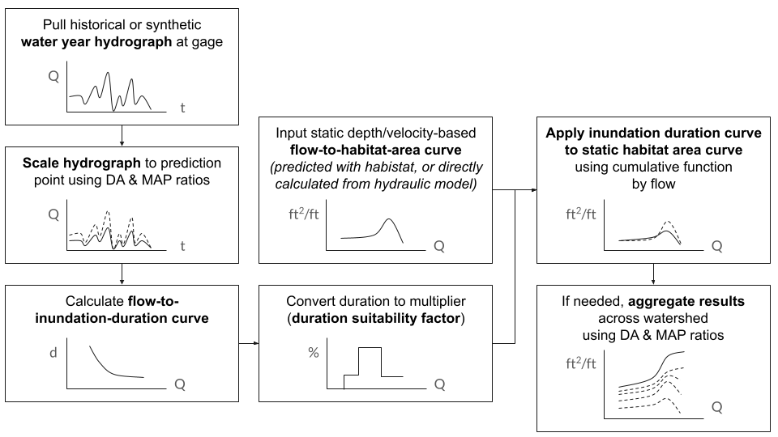

```{r setup, include = FALSE}
knitr::opts_chunk$set(
  collapse = TRUE,
  comment = "#>",
  base.dir = "./",
  base.url = "./articles",
  fig.path = "figures/duration-analysis-"
)
```

<span class="key_takeaways">
The habitat areas (flow-to-suitable-area curves) predicted by the [Statistical Model](statistical_model.html) are derived from depth- and velocity-based habitat suitability index (HSI) criteria only.
Duration of inundation was not included at the statistical model step because it does not have the same one-to-one predictable relationship with flow: the duration of inundation at a given flow will vary by local hydrology and by water year.
Sometimes we might be interested in simulating a historic hydrology, other times we might be considering a potential future hydrology, so the ability to vary the inundation duration factor is necessary.
</span>

### Spatial Method

To precisely apply suitability criteria for inundation duration, inundation duration factors would need to be applied at the individual grid cell level in the same manner as depth and velocity.

For example, a series of depth raster grids at different flows, calculated using a hydraulic model, can be used to determine the first inundating flow for a given grid cell.
(For raster models, this can be calculated using the [`raster_first_inundating_flow`](../reference/raster_first_inundating_flow.html) function in habistat.) This example is shown for the Deer Creek hydraulic model:


Given a hydrograph for a particular water year, a relationship can be derived between flow and the number of contiguous days in a water year at which that flow is exceeded.
This method is implemented in the habistat function [`duration_calc_days_inundated`](../reference/duration_calc_days_inundated.html).


Combining the previous two steps, a spatial map of inundation duration can be created for this particular water year.


These duration values can then be used, in the same manner as depth and velocity, to calculate a habitat suitability index at each model grid cell.

However, for training the statistical model in habistat, we need a single flow-to-suitable-area curve for each reach to feed into the statistical model--*not* a series of curves for every potential hydrology.

### Non-Spatial Method

To solve this issue, habistat includes a simplified method of applying inundation duration criteria to an already generated flow-to-suitable-area curve, approximating a duration-weighted estimate:



#### Input flow-to-suitable-area curve

We start with the static depth and velocity based flow-to-suitable-area curve, predicted by the habistat [Statistical Model](statistical_model.html). The same method could also be applied to a flow-to-suitable-area curve calculated through a different manner. 

#### Hydrograph Datasets

Next, we pull a hydrograph and calculate the inundation duration at each flow. To summarize the hydrology of a water year, the maximum contiguous days exceeding each given flow is calculated. 

One inundation duration curve is calculated per salmonid run, per water year type group.

##### Salmonid Runs

To capture only ecologically relevant time windows, we filter the hydrographs by relevant months for the salmonid run of interest:^[Source: CH2M Hill for the California Rice Promotion Board, via Fig. 3 in Herbold, B., Carlson, S. M., Heneray, R., Johnson, R. C., Mantua, N. McClure, M., Moyle, P. B., & Sommer, T. (2018). Managing for Salmon Resilience in California’s Variable and Changing Climate. <em>San Francisco Estuary and Watershed Science</em> 16(2): https://doi.org/10.15447/sfews.2018v16iss2art3 ]

+------------+-----------+-----------+
| Run        | Rearing   | Spawning  |
+============+===========+===========+
| Fall       | Jan - Jun | Oct - Dec |
+------------+-----------+-----------+
| Late Fall  | Apr - Dec | Jan - Apr |
+------------+-----------+-----------+
| Winter     | Jul - Mar | Apr - Aug |
+------------+-----------+-----------+
| Spring     | Nov - May | Aug - Oct |
+------------+-----------+-----------+
| Steelhead  | Jan - Dec | Jan - Mar |
+------------+-----------+-----------+

##### Water Year Type Groups

Duration calculations are conducted for as many historical water years as are available in the streamgage data, and averaged across all water years within a given [water year type](https://data.ca.gov/dataset/cdec-water-year-type-dataset). Water year type classifications are regrouped simplified into **Dry** ("Critical Dry" or "Dry"), **Normal** ("Below Normal", "Above Normal"), and **Wet** ("Wet") classes. 

#### Hydrograph Scaling

If the streamgage being used is not located at the prediction point ($comid$), then the streamgage is scaled to the prediction point using drainage area ($DA$) and mean annual precipitation ($MAP$) ratios. These variables are derived from the habistat predictor variable dataset for the nearest NHD flowline. This method is consistent with the flow scaling used for [Watershed Aggregation](watershed_aggregation.html).

$Q_{comid} = Q_{gage} * \frac{{DA}_{comid}}{{DA}_{gage}} * \frac{{MAP}_{comid}}{{MAP}_{gage}}$

Hydrograph data was obtained from [CDEC](https://cdec.water.ca.gov/) and preprocessed. All active flow gages on  [`cv_mainstems`](../reference/cv_mainstems.html) flowlines are included. Results are stored in: 

* [`streamgage_attr`](../reference/streamgage_attr.html) = attributes
* [`streamgage_geom`](../reference/streamgage_geom.html) = geometries
* [`streamgage_da_attr`](../reference/streamgage_da_attr.html) = DA and MAP information
* [`streamgage_duration_rating_curves`](../reference/streamgage_duration_rating_curves.html) = calculated duration rating curves

#### Calculating the Duration HSI

These inundation duration values calculated in the previous step are next mapped against duration HSI weighting factors, assigning zero for flows that are never reached.

We apply inundation duration suitability factors for the relevant habitat type corresponding to fish usage of the river. 

For rearing, the duration factors are defined in the Habitat Quantification Tool based on the gradient class of the river. For spawning, we assume a minimum of 12 weeks of continuous inundation is required for spawning and incubation.^[USFWS Columbia River FWCO Information and Education (2022) *Life Stage Cheat Sheet for Pacific Salmon*: "Chinook eggs hatch around 12 weeks after fertilization." https://www.fws.gov/sites/default/files/documents/06_Life%20Stage%20Cheat%20Sheet.pdf]

+---------------------------+---------------------------+--------------------+
| Rearing - Valley Lowland  | Rearing - Valley Foothill | Spawning           |
+===========================+===========================+====================+
| -   0 days: 0             | -   0 days: 0             | - 0 days: 0        |  
| -   1 to 17 days: 0.66    | -   1 to 9 days: 1.00     | - 1 to 83 days: 0  |
| -   18 to 24 days: 1.00   | -   10+ days: 0.66        | - 84+ days: 1      |
| -   25+ days: 0.66        |                           |                    |
+---------------------------+---------------------------+--------------------+

#### Applying the duration HSI to the flow-to-suitable-area curve

Finally, we combine the flow-to-suitable-area curve and the flow-to-inundation-duration curve to produce a flow-to-suitable-area curve that has been scaled down using the duration criteria. The following figure illustrates the process, which is implemented in the habistat function [`duration_apply_dhsi_to_fsa_curve`](../reference/duration_apply_dhsi_to_fsa_curve.html).


We assume that as we look at increasing flows (on the x axis), the marginal new habitat being added at each additional flow corresponds to area being newly inundated at that flow.
This is a simplification that is assumed to reflect the typical case.
So, the marginal habitat added at flow Q is multiplied by the corresponding inundation duration factor for that flow Q.

In the case where the flow-to-suitable-area curve slopes downward, the situation is different.
The loss in suitable habitat is not happening at the margin of the channel, it's happening somewhere within the channel in the area that was already inundated--most likely because the water has gotten too deep and too fast.
We don't know exactly where, so we apply an average of the previous duration factors.

The result is a scaled version of the original flow-to-suitable-area curve that accounts for the reduction in habitat suitability due to less-than-optimal duration lengths.
The scaled curve will be less than or equal to the original curve at each flow, but will never exceed it.


