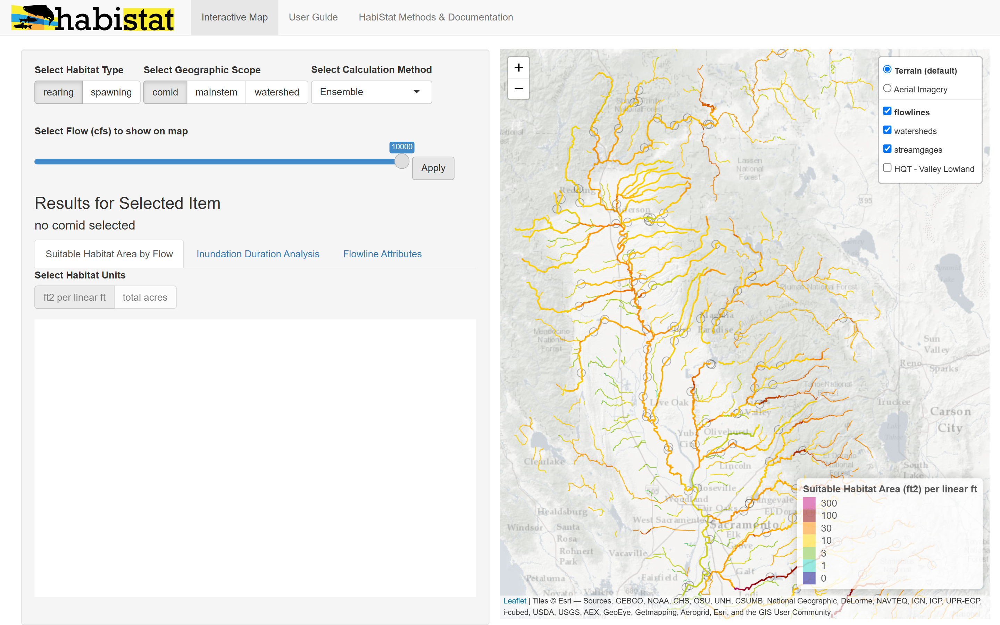

The HabiStat [interactive map](https://flowwest.shinyapps.io/habistat) application is the quickest way to explore suitable habitat model results without needing to install and load the `habistat` R package. This article describes how to navigate through the map, query results by individual reach or aggregated by mainstem or watershed, and select specific streamgage hydrology for the inundation duration suitability factor. 

## Navigation

On the home screen, you'll find the following general areas:

-   **(1) General Settings** (upper left): Options that impact both the map view and the results view.

    -   *Select Habitat Type*: ***rearing*** or ***spawning***

    -   *Select Flowline Type*: ***comid*** for individual NHD reach segments, ***mainstem*** for results aggregated across an entire mainstem stream, or ***watershed*** for results totalled for the entire watershed including the mainstem and its tributaries.

    -   *Select Calculation Method*

    -   *Select Flow (cfs) to show on map*

-   **(2) Map View** (right): Zoom and pan on the map, then click a flowline or watershed to view suitable habitat model results and other information.

-   **(3) Results for Selected Item** (lower left): This section changes dynamically based on the flowline or watershed that has been most recently clicked on the map. There are three tabs:

    -   *Suitable Habitat Area by Flow* shows the main plot of modeled suitable habitat area (y axis) versus flow (x axis). Suitable habitat area can be shown in units of square ft per linear ft (average effective habitat width) or total acres (totaled across the entire reach, mainstem, or watershed).

    -   *Inundation Duration Analysis* dives into the scaling of suitable habitat area based on inundation data, for streams that have streamgage data available. The map will highlight the streamgage being used for the calculation.

    -   *Flowline Attributes* shows the detailed attributes for the flowline, including those used in the habistat model prediction. (comid reach mode only)

## Getting Around the Map

The map allows you to view habitat estimates (in units of square feet per linear foot of stream channel) at a given flow. It also allows you to pan, zoom, and select a particular reach (`comid`), mainstem, or watershed to get detailed model estimates for.

The default view for the map shows rearing results, broken down at the individual comid (reach) scale, at 1000 cfs:

Change the **Habitat Type** from *rearing* to *spawning* to view results for spawning. Once the map view is set to *spawning*, clicking on a reach (`comid`), mainstem, or watershed will provide the detailed spawning results.

Change the **Geographic Scope** from *comid* to *mainstem* to aggregate results at the mainstem scale. As described in the [Watershed Flow Aggregation](../watershed_aggregation.html) article, **FINISH HERE DESCRIBING AGG**

Similarly, set **Geographic Scope** to *watershed* to aggregate results at the watershed scale.

Changing the **Flow (cfs) to show on map** changes the color scheme on the map display to reflect the chosen flow.

## Viewing Results by Individual Reach (ComID)

To dive into results at a particular location, select a *comid* (individual NHD reach), mainstem, or watershed on the map. In the example below, the map view was on the *comid* scale for *rearing* habitat type, so the results returned match these settings.

-   The solid line is the physical habitat estimate trained on depth and velocity criteria.

-   The shaded area is the range of estimates produced by the different HabiStat model versions.

-   The dashed line is the habitat area estimate that has been scaled for inundation duration using streamgage data at the gage indicated. The selected gage is also highlighted on the map in blue.

The "Flowline Attributes" tab shows a detailed report of the attribute variables associated with this *comid*. This includes all the variables used by the HabiStat model to predict the suitable habitat area, and some additional attributes of interest.

The "Inundation Duration Analysis" tab dives into greater detail on the duration-based scaling of the physical habitat estimate. Settings allow the user to change the time of year based on a particular salmon/steelhead run's rearing or spawning time window, as well as the water year type. The chart shows the duration exceedence curve for the streamgage, the suitability factors derived from that curve, and the resulting scaled suitable habitat estimates.

The tool defaults to the closest streamgage to the point of interest, but a different streamgage can be selected by clicking it on the map. *Flows from a selected streamgage are always scaled to the point of interest based on drainage area and mean annual precipitation.*

## Viewing Aggregated Results by Mainstem or Watershed

Let's set the **Geographic Scope** to *mainstem* mode and try another example. As with the *comid* mode, selecting a mainstem on the map will display a flow-to-suitable area curve. For mainstems and watersheds, the curve is displayed by default in units of total habitat acres rather than "square feet per linear feet."

The habitat area shown is totaled for the entire mainstem, and reported for what the flow would be at the outlet.

Let's say in an example river, whenever flow is 1,000 cfs at the outlet, flow is about 200 cfs at its farthest upstream reach. In this case, our "1,000 cfs" estimated habitat for the mainstem will include the 1,000 cfs habitat area at the outlet, the 200 cfs habitat area at the farthest upstream end, and similarly for all reaches in between. This calculation is documented further in the [Watershed Flow Aggregation](../watershed_aggregation.html) article.

The duration analysis for the mainstem is based on the nearest streamgage to the point that was clicked, but can be updated by selecting a different streamgage on the map.

It's generally recommended to select the streamgage nearest to the outlet, unless a different streamgage has a better reporting time period. Historical flow data used in the calculation are always scaled to the outlet of the mainstem.

Viewing results for a watershed works exactly the same way as for a mainstem, except that habitat area totals include habitat area on delineated tributaries in addition to the mainstem.

