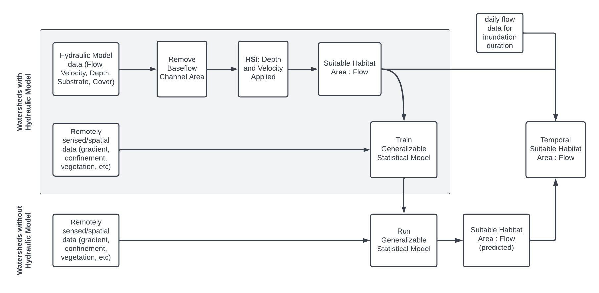

```{r setup, include = FALSE}
library(tidyverse)
library(sf)
theme_set(theme_minimal() + theme(panel.grid.minor = element_blank()))

knitr::opts_chunk$set(
  collapse = TRUE,
  comment = "#>",
  base.dir = "./",
  base.url = "./articles",
  fig.path = "figures/model-overview-"
)
```

## Rearing Model Overview

The modeling method consists of the following fundamental steps:

1.  **Predictor variable preparation**: A variety of hydrologic and geospatial attributes were collected for all stream reaches within the study area (the Sacramento and San Joaquin river basins, HUC-4 hydrologic subregions 1802 and 1804). The basis of stream reach delineation is the ComID reach as defined in [NHDPlusV2](https://nhdplus.com/NHDPlus/NHDPlusV2_home.php). Attributes include local characteristics like stream gradient, sinuosity, and depth to bedrock; upstream drainage characteristics like drainage area size, elevation, mean annual precipitation, and soil erodibility; and custom modeled confinement measures like topographic position index (mTPI) and levee confinement. These are discussed further in the [Predictor Variables](predictor_variables.html) article. 

2.  **Hydraulic model training data preparation**: Depth and velocity outputs from existing two-dimensional hydraulic models were assembled for "training reaches" within the study area, at a variety of flows. The depth and velocity raster grids (for HEC-RAS 2D models) or vector meshes (for SRH-2D models) were divided up based on ComID reach delineations. A habitat suitability index was applied based on depth and velocity values (e.g. 1 if a cell is within suitable depth and velocity range, else 0). Then, habitat suitability was summarized for each reach, at each flow, into a measure of total suitable habitat area per linear foot of channel, for each flow. The result is a flow-to-suitable-area curve for each reach in the training dataset, normalized by linear feet to be independent of arbitrary reach length. The habitat suitability process and datasets are discussed further in the [Habitat Training Data](habitat_training_data.html) article. 

3. **Training statistical model**: The hydraulically modeled flow-to-suitable-area relationships developed for reaches in Step 2 are joined to the reach predictor variable table from Step 1. This dataset (one observation per flow per reach) is then used to train a statistical model that can be used to predict flow-to-suitable-area curves for reaches that are not hydraulically modeled. Random Forest Regression, a decision tree-based machine learning approach, allows for non-linear relationships between suitable habitat, flow, and the array of predictor variables. The model development process is detailed in the [Statistical Model](statistical_model.html) article.

4. **Predicting habitat output**: The trained statistical model can now be used to predict flow-to-suitable-area relationships for other streams within the study area.
While the statistical model will produce predictions for any stream with valid predictor data, the validity and trustworthiness of predictions will depend on those streams' similarity to the training dataset. As training datasets are currently limited to foothill alluvial systems on major tributary streams, only these should be considered valid. The prediction process is detailed in the [Statistical Model](statistical_model.html) article, and *preliminary* flow-to-suitable-habitat predictions are included in the data package [Map App](https://flowwest.shinyapps.io/habistat/).  

5. **Applying duration criteria**: Suitable habitat area predictions up to this point are based only on depth and velocity factors, but inundation duration is also a relevant factor. The perennially-inundated baseflow channel lacks sufficient food (invertebrates) for rearing juveniles and should be excluded regardless of depth and velocity. Meanwhile, channel areas that are inundated for only short periods of time have reduced habitat benefit as invertebrates have not had sufficient time to develop. R functions developed for this project will apply duration-based suitability criteria to an empirically or statistically derived flow-to-suitable-area curve by inputting (a) a water year hydrograph and/or (b) a flow threshold that defines the baseflow channel. These methods are defined in the [Duration Analysis](duration_analysis.html) article.

6. **Filtering to geographic scope**: Rearing predictions are limited to perennial, natural stream channels of a certain size. The current version of HabiStat filters reaches of stream order ≥4 (or reaches of stream order ≥3 with drainage area at least 50 km²). Minor distributaries with a divergence ratio of less than 50% are also excluded.

7. **Aggregating from reach to mainstem/watershed scale:** Reach-scale predictions are aggregated to the scale of the river (mainstem) reach or watershed for usability in decision support models and other applications. Aggregating reach-scale predictions across a river or watershed extent is more complicating than adding up habitat values at a given flow, because instantaneous flows at different points in the watershed differ. The delineation of reaches and watersheds, as well as the aggregation process, are described in the [Watershed Aggregation](watershed_aggregation.html) article.

{width=100%}

## Spawning Model Overview

The spawning model follows similar methods to the rearing model, with the following distinctions.

* **Hydraulic model training data preparation**: A different depth- and velocity-based habitat suitability index is applied. Additionally, while the baseflow channel is eliminated from the hydraulic model result grid when assembling the rearing training data, it is retained in the spawning training data.

* **Training statistical model**: The same methods are used to train the statistical model, but feature selection and validation yields a different set of predictor variables.

* **Applying duration criteria**: A different duration suitability factor is applied to account for the extended minimum period of continuous inundation required for spawning and incubation. 

* **Filtering to geographic scope**: The spawning model includes a more substantial filtering of reaches into those within spawning range and likely to include spawning gravels. This analysis is documented in the [Spawning Extents](spawning_extents.html) article. The core dataset is intended to capture overall suitability for any run, so that it can be subsequently applied to a specific run based on geographic scope filters and season-specific hydrology. 

## Suitability Criteria

The following chart summarizes suitability criteria used in the model. These are designed to be generally applicable criteria across the Sacramento-San Joaquin basins, rather than tailored to individual stream reaches. Currently, criteria are also generally applied to all runs of Chinook salmon, but may be split out into different criteria for different runs in the future. Application of the depth and velocity criteria is described in the [Habitat Training Data](habitat_training_data.html) article, while application of the duration criteria is described in the [Duration Analysis](duration_analysis.html) article.

```{r hsi_summary, echo=FALSE, message=FALSE, warning=FALSE, dpi=300, height=4, width=6.5}
rearing_depth <- 
  tribble(~idx, ~hsi,
          0, 0,
          1, 1,
          3.28, 0,
          Inf, 0)

rearing_velocity <-
  tribble(~idx, ~hsi,
          0, 1,
          1.5, 0,
          Inf, 0)

spawning_depth <- 
  tribble(~idx, ~hsi,
          0, 1,
          6.56, 0,
          Inf, 0)

rearing_duration_vf <- 
  tribble(~idx, ~hsi,
          0, 1,
          10, 0,
          Inf, 0)

rearing_duration_vl <- 
  tribble(~idx, ~hsi,
          0, 0.66,
          18, 1,
          25, 0,
          Inf, 0)

spawning_duration <- 
  tribble(~idx, ~hsi,
          0, 1,
          7*12, 0,
          Inf, 0)

spawning_velocity <- 
  habistat::suitability_hsi_vel_spawning$max |> 
  transmute(idx = vel_ft_s, 
            hsi = hsi)

tribble(~type, ~habitat, ~criterion, ~gradient_class, ~data,
        "step", "rearing",  "depth",    "both", rearing_depth,
        "step", "rearing",  "velocity", "both", rearing_velocity,
        "step", "rearing",  "duration", "Valley Lowland", rearing_duration_vl,
        "step", "rearing",  "duration", "Valley Foothill", rearing_duration_vf,
        "step", "spawning", "depth",    "both", spawning_depth,
        "line", "spawning", "velocity", "both", spawning_velocity,
        "step", "spawning",  "duration", "both", spawning_duration) |>
  unnest(data) |>
  mutate(criterion = criterion |> factor(levels = c("depth", "velocity", "duration"),
                                         labels = c("depth (ft)", "velocity (ft/s)", "duration (days)"))) |>
  ggplot(aes(x = idx, color = gradient_class)) +
  facet_grid(rows = vars(str_glue("{habitat} hsi")), 
             cols = vars(criterion), 
             switch="both", scales = "free_x") + 
  geom_step(aes(y = case_when(type=="step" ~ hsi))) +
  geom_line(aes(y = case_when(type=="line" ~ hsi))) +
  xlab("") + ylab("") + 
  theme_minimal() + 
  theme(strip.placement = "outside",
        panel.grid.minor = element_blank()) 
```

