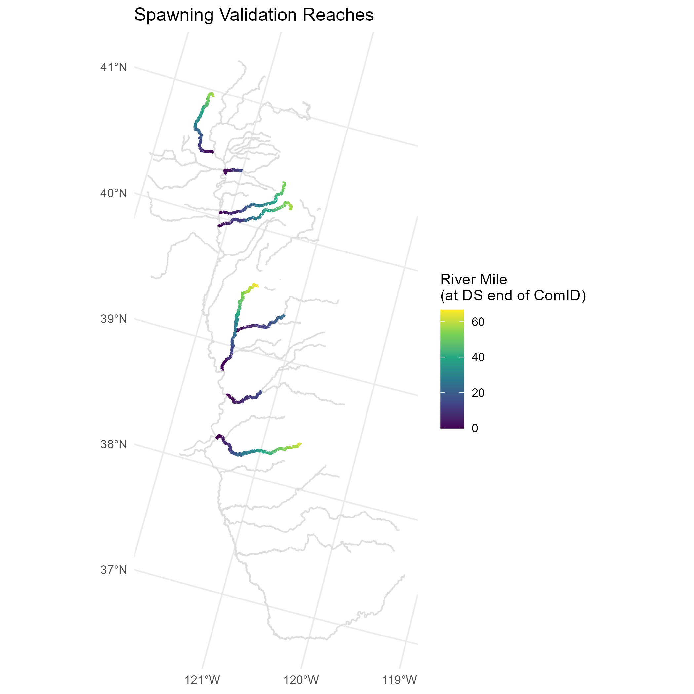
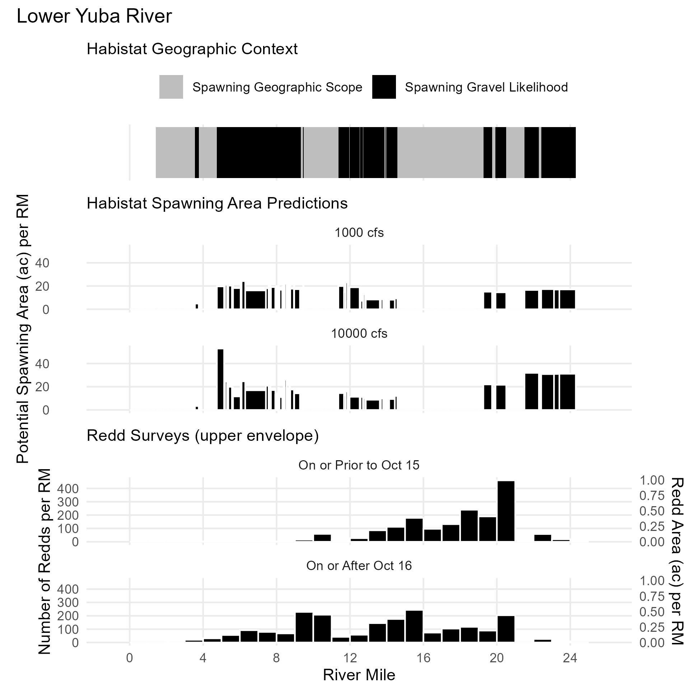
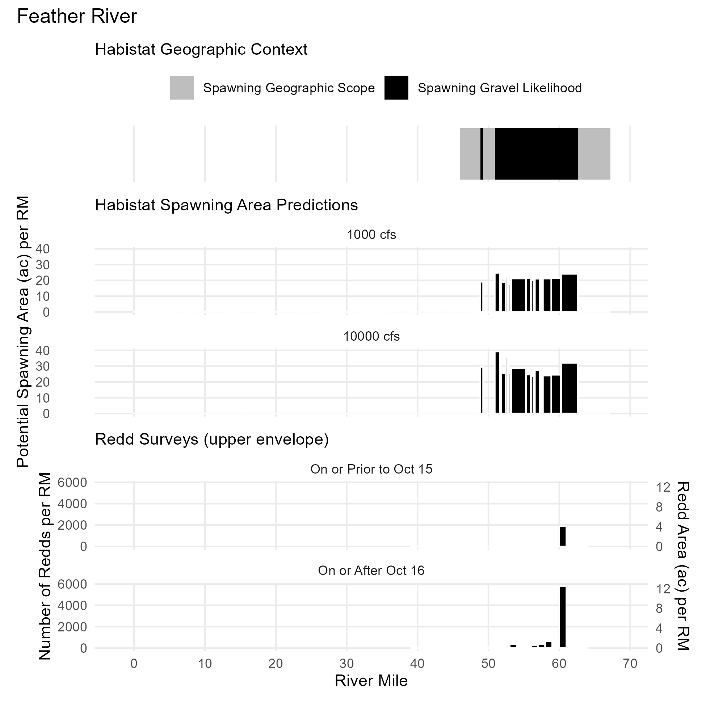
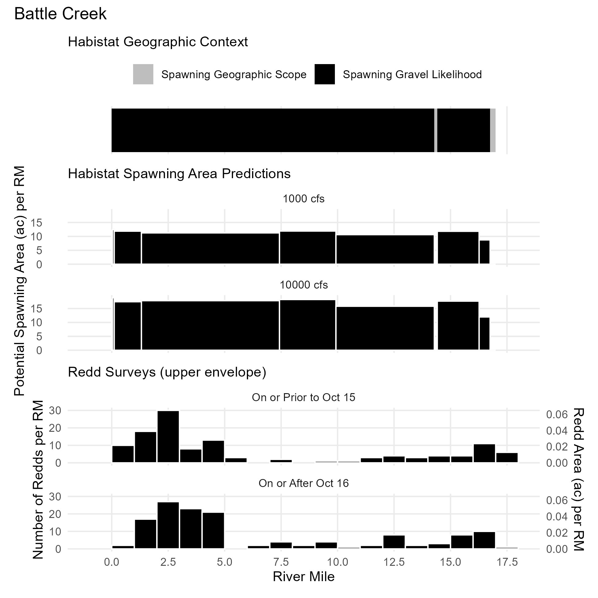
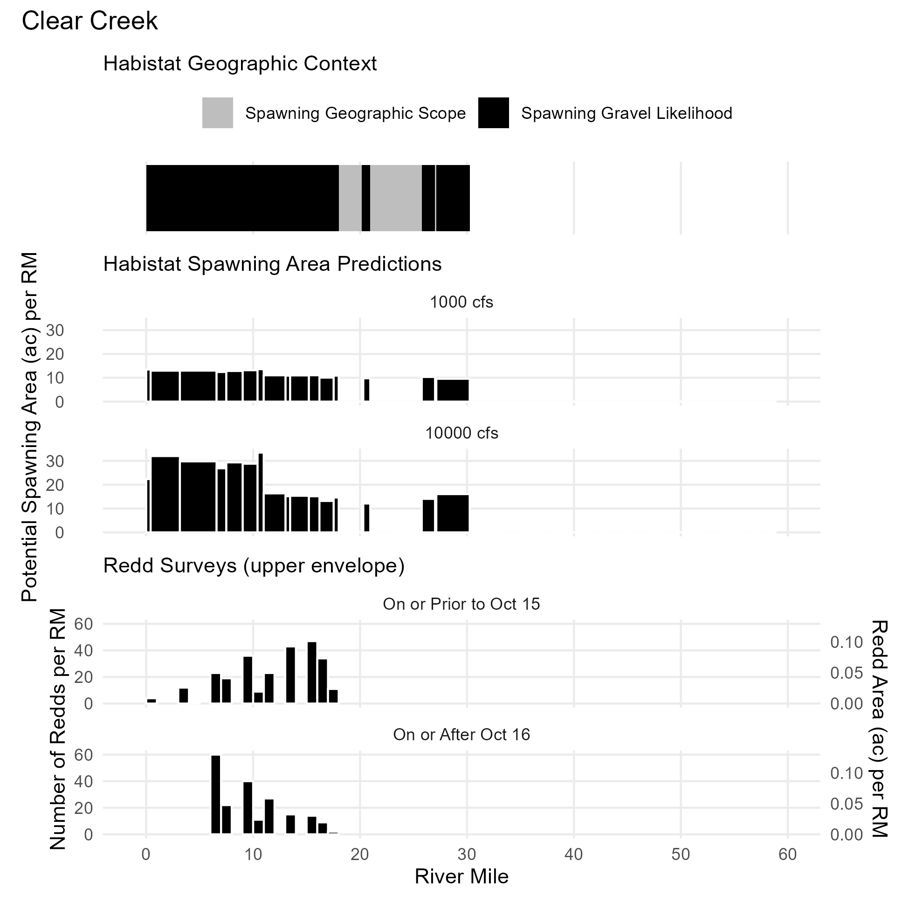
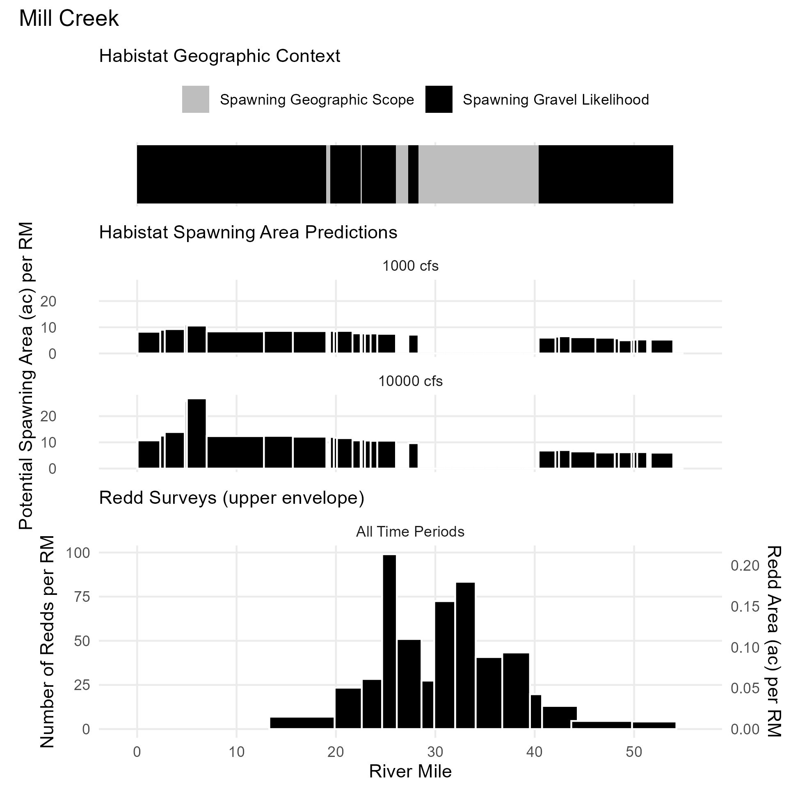

```{r setup, include = FALSE}
library(tidyverse)
library(sf)
library(ggspatial)
theme_set(theme_minimal())
knitr::opts_chunk$set(
  collapse = TRUE,
  comment = "#>",
  base.dir = "./",
  base.url = "./articles",
  fig.path = "figures/spawning-extents-"
)
knitr::opts_chunk$set(fig.width=6.5, fig.height=4, dpi=300)
```

## Reach Definitions

A core component of the spawning model is delineating the geographic extent of spawning reaches based on current/historical/potential salmonid presence and likelihood of spawning gravels. These values are used to limit the range of reaches for which the flow-to-suitable-area outputs of the habistat statistical model are applied. This is done in two steps.

- **Geographic Scope**: An expansive delineation of the upstream and downstream limits of current/historical/potential spawning. This defines the scope of the spawning dataset.

- **Spawning Gravels**: A reach-by-reach determination of the likelihood of spawning gravels, based on geomorphic and sediment transport factors. Reaches determined unlikely to contain gravels remain in the spawning dataset with a zeroed out suitability rating.

### Spawning Geographic Scope

The spawning geographic scope consists of reaches meeting *all* of the following criteria. Essentially, this analysis takes the current and historical spawning reaches delineated in the [`cv_mainstems`](../reference/cv_mainstems.html) dataset, as described in the [Watershed Aggregation](watershed_aggregation.html) article, and adds in some additional major tributaries. **The geographic scope represents maximum potential spawning habitat and does *not* take into account artificial barriers such as dams.**

- elevation > minimum known spawning elevation for the watershed
- elevation < maximum historical habitat elevation for the watershed
- upstream of a rearing stream (mainstem or tributary)
- within a subcatchment identified as historical habitat in the PISCES^[*PISCES* spatial fish range dataset, published by UC Davis Center for Watershed Sciences. Available at [https://pisces.sf.ucdavis.edu/fish-data](https://pisces.sf.ucdavis.edu/fish-data)] dataset
- outside of the valley lowland area (i.e. in valley foothill or bedrock)
- stream size: stream order ≥4, or stream order ≥3 with drainage area at least 50 km²

```{r geographic-scope, echo=FALSE, message=FALSE, warning=FALSE}
flowlines_filtered <- 
  habistat::flowline_geom_proj |>
  filter(comid %in% habistat::wua_predicted$comid) |>
  inner_join(habistat::flowline_spawning_attr, by=join_by(comid))

rearing_mainstems <-
  habistat::cv_mainstems |>
  filter(str_detect(habitat, "rearing"))

spawning_mainstems <-
  habistat::cv_mainstems |>
  filter(str_detect(habitat, "spawning")) |>
  inner_join(habistat::flowline_spawning_attr, by=join_by(comid))

spawning_flowlines <-
  flowlines_filtered |>
  filter(spawning_geographic_context)

ggplot() + 
  geom_sf(data=flowlines_filtered, aes(color = "All Habitat Reaches")) +
  geom_sf(data=rearing_mainstems, aes(color = "Rearing Mainstems")) +
  geom_sf(data=spawning_flowlines, aes(color = "Spawning Geographic Scope (Tributaries)")) +
  geom_sf(data=spawning_mainstems, aes(color = "Spawning Geographic Scope (Mainstems)")) +
  ggtitle("Spawning Geographic Scope") +
  scale_color_manual(name = "",
                     values = c("All Habitat Reaches" = "#dddddd", 
                                "Spawning Geographic Scope (Mainstems)" = "darkblue",
                                "Spawning Geographic Scope (Tributaries)"= "cornflowerblue",
                                "Rearing Mainstems" = "darkgoldenrod")) 
```

### Spawning Gravel Likelihood

Reach-by-reach identification of spawning gravels is experimental. We tested two methods. Currently, reaches are included as likely spawning gravel reaches if they pass the spawning gravel likelihood criteria under *either* method. **The spawning gravel likelihood represents potential spawning gravel availability based on geomorphic channel attributes and does *not* take into account gravel starvation nor gravel augmentation below dams.**

```{r gravel-likelihood, echo=FALSE, message=FALSE, warning=FALSE}
spawning_flowlines_filtered <- 
  spawning_flowlines |>
  filter(spawning_filter_all)

spawning_mainstems_filtered <- 
  spawning_mainstems |>
  filter(spawning_filter_all)

ggplot() +
  geom_sf(data=flowlines_filtered, aes(color = "All Habitat Reaches")) +
  geom_sf(data=spawning_flowlines, aes(color = "Spawning - Other (Tributaries)")) +
  geom_sf(data=spawning_mainstems, aes(color = "Spawning - Other (Mainstems)")) +
  geom_sf(data=spawning_flowlines_filtered, aes(color = "Spawning - Most Likely Spawning Gravels (Tributaries)")) +
  geom_sf(data=spawning_mainstems_filtered, aes(color = "Spawning - Most Likely Spawning Gravels (Mainstems)")) +
  ggtitle("Spawning Gravel Likelihood") +
  scale_color_manual(name = "",
                     values = c("All Habitat Reaches" = "#dddddd", 
                                "Spawning - Other (Mainstems)" = "darkblue",
                                "Spawning - Other (Tributaries)"= "cornflowerblue",
                                "Spawning - Most Likely Spawning Gravels (Tributaries)" = "mediumvioletred",
                                "Spawning - Most Likely Spawning Gravels (Mainstems)" = "violetred4")) 
```

#### Geomorphic Classification

This approach applies the geomorphic classifications published by the UC Davis eFlows project for the Sacramento River basin. The [dataset is available on Dryad](https://doi.org/10.25338/B8031W)^[Guillon, Hervé et al. (2020). Channel types predictions for the Sacramento River basin [Dataset]. Dryad. https://doi.org/10.25338/B8031W] and documented in Guillon et al. (2020)^[Guillon, H., Byrne, C.F., Lane, B.A., Sandoval-Solis, S., and Pasternack G.B. (2020). Machine Learning Predicts Reach-Scale Channel Types from Coarse-Scale Geospatial Data in a Large River Basin. J. of Water Resources Research. https://doi.org/10.1029/2019WR026691] and within the [California Environmental Flows Framework documentation](https://ceff.ucdavis.edu/sites/g/files/dgvnsk5566/files/media/documents/Appendix_F%20Geomorphic%20Classification%20of%20CA.pdf). Ten channel types were mapped in this dataset, from which a subset were selected  as indicators of potential spawning suitability:

- ~~**SAC01**: Unconfined, boulder-bedrock, bed-undulating~~
- ~~**SAC02**: Confined, boulder, high-gradient, step-pool/cascade~~
- ~~**SAC03**: Confined, boulder-bedrock, uniform~~
-  **SAC04**: Confined, boulder-bedrock, low-gradient step-pool
-  **SAC05**: Confined, gravel-cobble, uniform
-  **SAC06**: Partly-confined, low width-to-depth, gravel-cobble, riffle-pool
- ~~**SAC07**: Partly-confined, cobble-boulder, uniform~~
-  **SAC08**: Partly-confined, high width-to-depth, gravel-cobble, riffle-pool
-  **SAC09**: Unconfined, low width-to-depth, gravel
-  **SAC10**: Unconfined, gravel-cobble, riffle-pool

For the San Joaquin basin, we trained a simple random forest classifier on the Sacramento reaches, using a series of covariates (slope, catchment drainage area, catchment minimum elevation, catchment maximum elevation, catchment relief, catchment mean annual precipitation, reach mTPI [topographic position index], reach gradient class, and hydrologic class), and used this to estimate the classifications for the San Joaquin reaches.

#### Sediment Transport at Bankfull

This approach applies simple sediment transport relationships to estimate critical grain sizes at bankfull flow. Bankfull widths, depths, and velocities were sourced from the StreamCat NHDPlusLandscapeAttributes dataset for the NHDPlusV2 ComID reaches. 

The following criteria were applied: 

- **bed mobilization**: bankfull flows are sufficient to mobilize gravels/cobbles, but no so powerful as to be mobilizing boulders.

- **suspended transport**: bankfull flows are able to transport particles larger than silts and clays

##### Bed Mobilization

The hydraulic radius is calculated from the bankfull width $W$ and height $H$ by assuming a rectangular channel shape:

$$R = \frac{H \cdot W}{(2 \cdot H) + W}$$

We assume that the density of the sediment particles is $\rho_s$ = 2.65 g/cm3 and the density of water is $\rho$ = 1.00 g/cm3, making the specific gravity of the sediment ${SG} = \rho_s / \rho$ = 2.65, i.e. in metric units, $(\rho_s - \rho) = ({SG} - 1)$.

The bed mobilization competence was estimated by first estimating a dimensionless critical Shield's number $\tau_c^*$ for each `comid` reach using the reach's gradient (ft/ft) and the empirical relationship from Lamb et al. (2008):

$$\tau_c^* = 0.15 S^{0.25}$$

Shields' (1936) model for a uniform grain size distribution on a flat bed, expressed in CGS metric units, is

$$\tau^*[\mathrm{1}] = \frac{\rho [\mathrm{g/cm^3}] \cdot R [\mathrm{cm}] \cdot S [\mathrm{1}]}{(\rho_s - \rho) [\mathrm{g/cm^3}] \cdot D_{50} [\mathrm{cm}])}$$

This is a major simplification that assumes uniformity of particle size. Ideally, the model should account for the relative size of the individual particle being mobilized relative to the D50 of the reach--but the D50 of the reach is not known.

An additional assumption in the calculation of the depth-slope product for shear stress is that the hydraulic radius is interchangeable for mean depth, which is only true in some cases.

Rearranging Shields' equation, the maximum grain size mobilized is

$$D_{50} [\mathrm{cm}] = \frac{\rho [\mathrm{g/cm^3}] \cdot R [\mathrm{cm}] \cdot S [\mathrm{1}]}{(\rho_s - \rho) [\mathrm{g/cm^3}] \cdot \tau^*[\mathrm{1}])}$$

##### Suspended Transport

The maximum suspended load was similarly calculated by relating settling velocity to particle size. 

At bankfull flow, the settling velocity $w_s$ was assumed to equal the shear velocity $u*$, which is related to the hydraulic radius and slope by the gravitational constant. 

$$w_s [\mathrm{cm/s}] = u^* [\mathrm{cm/s}]= \sqrt{g [\mathrm{cm/s^2}] \cdot R [\mathrm{cm}] \cdot S [1]}$$

This settling velocity can be normalized by particle size to produce a dimensionless settling velocity. $nu$, the kinematic viscosity of water, is assumed to be 0.01 cm2/s.

$$w^* [\mathrm{1}] = \frac{\rho [\mathrm{g/cm^3}] \cdot (w_s [\mathrm{cm/s}])^3}{(\rho_s - \rho) [\mathrm{g/cm^3}] \cdot g [\mathrm{cm/s^2}] \cdot \nu [\mathrm{cm^2/s}]}$$
...then related to dimensionless particle size $D^*$ via Dietrich (1982) eq. 8:

$$w^* = (1.71 \cdot 10^{-4}) \cdot (D^*)^2$$
...then converted back to grain size units by rearranging the definition of dimensionless grain size,

$$D^* [\mathrm{1}]= \frac{(\rho_s - \rho) [\mathrm{g/cm^3}] \cdot g [\mathrm{cm/s^2}] \cdot (D_{50} [\mathrm{cm}])^3}{\rho [\mathrm{g/cm^3}] \cdot \nu [\mathrm{cm^2/s}]}$$

##### Classification

Output $D_{50}$ values for bed mobilization and suspended transport thresholds were reclassified into the Wentworth size classes.^[Wentworth, C. K. (1922). A Scale of Grade and Class Terms for Clastic Sediments. *The Journal of Geology* 30(5): 377-392. https://www.jstor.org/stable/30063207] The size class phi ($\phi$) is defined as the negative base 2 logarithm of the median grain size diameter (on the intermediate axis) in millimeters. 

```{r step-2-sed-transport-classes, echo=FALSE}
# DEFINE WENTWORTH SIZE CLASSES
phi_levels <- seq(-12, 14, 1)
phi_labels <- c("very large boulder", "large boulder", "medium boulder", "small boulder", # -12:-9
                "large cobble", "small cobble", "very coarse gravel", "coarse gravel", # -8:-5
                "medium gravel", "fine gravel", "very fine gravel", "very coarse sand", # -4:-1
                "coarse sand", "medium sand", "fine sand", "very fine sand", # 0:3
                "coarse silt", "medium silt", "fine silt", "very fine silt", # 4:7
                "clay", "clay", "clay", "clay", "clay", "clay", "clay") # 8:14

tibble(phi = phi_levels, label = phi_labels) |> 
  mutate(max_diam_mm = 2^-phi) |>
  mutate(max_diam_mm = format(max_diam_mm, digits=3, scientific=F, drop0trailing=T)) |>
  group_by(label) |> filter(max_diam_mm == max(max_diam_mm)) |>
  knitr::kable()
```

The following logic was applied. Both criteria must be met for a particular reach to be included. 

- **bed mobilization**: bankfull flows are sufficient to mobilize gravels/cobbles, but no so powerful as to be mobilizing boulders. Where $\phi_B$ is the size class of the maximum bed grain size mobilized,

$$-8 \leq \phi_B \leq -2$$

- **suspended transport**: bankfull flows are able to transport particles larger than silts and clays. Where $\phi_S$ is the size class of the maximum grain size suspended,

$$\phi_S \leq 3$$

## Validation

Spawning geographic extent was validated against redd surveys. Redd survey data were assembled for the following reaches. Redd counts from surveys were binned by river mile for comparison. Habistat spawning extents and predicted spawning habitat area were similarly mapped onto river miles using NHD reach lengths or published river mile standards where available. Visual comparison for alignment provided a first round of validation, which will continue to be refined and used to adapt the spawning reach delineation logic.

| Reach            | River Mile Source | Redd Survey Description |
| ---------------- | ----------------- | ----------------------- | 
| Lower Yuba River | Published (DWR)   | <mark>add here</mark> |
| Feather River    | Published (DWR)   | <mark>add here</mark> |
| Battle Creek     | NHDPlusV2         | <mark>add here</mark> |
| Clear Creek      | NHDPlusV2         | <mark>add here</mark> |
| Mill Creek       | NHDPlusV2         | <mark>add here</mark> |
<!--
| American River   | Published (DWR)   | <mark>add here</mark> |
| Mokelumne River  | Published (EBMUD) | <mark>add here</mark> |
| Deer Creek       | NHDPlusV2         | <mark>add here</mark> |
-->



The following charts compare the modeled geographic scope, the modeled habitat area, and summarized redd survey outputs.







